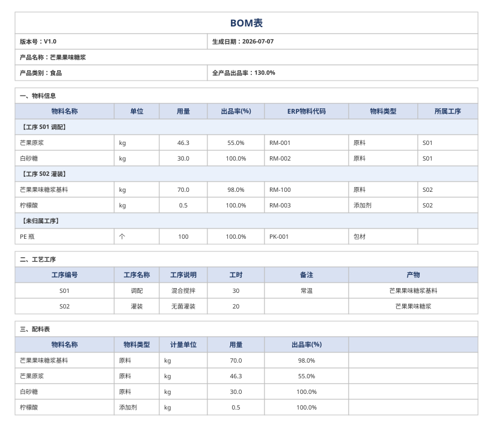

# BOM智造师（BOM Maker）使用说明

## 1. 技能简介

**一句话**：把产品的「物料信息」和「工艺工序信息」交互式采集、校验，一键生成标准 BOM 表 Excel；也支持把已有 BOM 表 Excel 逆向解析回结构化 JSON，方便重新编辑。

**适用场景**：
- 制造、工艺、采购、成本核算等需要结构化 BOM（物料清单）的场合；
- 需要把物料（名称 / 单位 / 用量 / 出品率 / 物料类型 / 所属工序）与工序（编号 / 名称 / 说明 / 工时 / 备注 / 产物）整理成标准 Excel；
- 食品类产品可自动生成仅含食用物料的「配料表」；
- 已有一份本技能导出的 BOM 表 .xlsx，想反查其内容或在其基础上「重新编辑」。

> **V2 新增**：产品类别（5 类枚举）、全产品出品率（>0 可>100）、物料类型与所属工序、工序产物与流转链校验、食品类自动配料表、Excel 7 列与分工序分组呈现。
>
> **V2.1（V3）新增**：Excel 物料区扩至 **8 列**（首列「序号」全局连续、跨工序分组不重置）；BOM 级可选字段「审批人 / 生效日期 / 执行标准」（表头行 5 单格合并拼接，空则不显示）；物料区末「合计用量」行；食品类配料表新增「用量占比%」（最大余数法保证列和恰为 100.0%）与「过敏原」两列；物料级新增「过敏原」字段（仅食品配料表展示，逆向按名回收）。
>
> **V4.0 新增**：BOM 级可选字段 `industry`（8 值枚举：食品/电子/化工/机械/纺织/家具/包装/通用，默认按 `category` 推断）；物料级专属字段——电子 `designator`/`footprint`/`part_number`/`rohs`，化工 `cas_number`/`concentration`/`ghs_hazard`；行业专属派生视图——电子「三、元件清单」（8 列，含 RoHS 红黄字标记），化工「三、配方表」（8 列，含含量(%) 数字格式）；配料表触发从 `category` 改为 `industry`（含推断，行为不变）；软校验 V8（industry 枚举）/ W2（RoHS 未标）/ W3（CAS/GHS 未填）/ 含量(%) 列和校验（±5%）；共享常量模块 `bom_constants.py`；向后完全兼容旧 JSON/Excel。
>
> **V5.0 新增（P1 全部实现，100% 向后兼容，不新增任何软校验 WARNING）**：行业专属派生视图扩充——纺织「三、面料辅料清单」（8 列）、家具「三、家具物料清单」（8 列）；电子「三、元件清单」扩列至 **14 列**（A–N，新增 manufacturer/tolerance/rated_power/rated_voltage/alternate/reflow_temp 6 个工程/合规字段）、化工「三、配方表」扩列至 **13 列**（A–M，新增 purity/physical_state/flash_point/storage_condition/hazard_class 5 个 SDS 字段）；跨行业「成本明细」视图（有行业视图时为「四、成本明细」，否则「三、成本明细」，8 列含单价/币种/总价派生 + 成本合计行），物料级新增 `unit_price`/`currency`（currency 默认 人民币(CNY)）；行业模板预设 `INDUSTRY_TEMPLATES`（仅交互引导，不写新 JSON 结构）；机械/包装本期仅出评估草案（不实现）。V5 复用 V4 同构的排除「其他」类提示，不新增任何阻断/软校验。

> **V6.0 新增（机械 / 包装行业正式落地，最小变更、100% 向后兼容，不新增任何软校验 WARNING）**：行业专属派生视图扩充——机械「三、机械物料清单」（8 列 A–H，无「物料类型」展示列，仅用于过滤/排序）、包装「三、包装物料清单」（8 列 A–H，保留「物料类型」展示列）；机械 6 专属字段 `drawing_no`/`material`/`heat_treatment`/`surface_treatment`/`weight`/`unit_weight`（weight 与 unit_weight 双字段保留不合并，主理人拍板 Q1），包装 5 专属字段 `material`/`basis_weight`/`size`/`print_process`/`eco_label`（eco_label 自由文本无受限枚举，主理人拍板 Q5）；跨行业「成本明细」双编号集合 `INDUSTRY_VIEW_SET` 由 V5 的 5 行业扩为 **7 行业**（新增机械/包装），故机械/包装带 `unit_price` 时成本视图编号为「四、成本明细」；机械 `standard` 默认 `GB/T 1804-2000`、包装 `standard` 默认 `GB/T 6543-2008`；机械/包装物料类型枚举与排除集 `MECHANICAL_TYPES`/`MECHANICAL_EXCLUDE`/`PACKAGING_TYPES`/`PACKAGING_EXCLUDE`（均排除 `{"其他"}`）；逆向 `_SPECIAL_FIELDS` 由 28 唯一键扩至 **37 唯一键**（净增 9：`drawing_no`/`material`(同名复用)/`heat_treatment`/`surface_treatment`(家具已存在)/`weight`/`unit_weight`/`basis_weight`/`size`/`print_process`/`eco_label` 去重后净增 9），`float_fields` 增 `weight`/`unit_weight`/`basis_weight` 使逆向解析为 float。机械/包装专属字段仅存 JSON、仅专属视图展示，物料区 8 列（A–H）永不变。P2-1/P2-2 本期不实现。V6 复用 V4/V5 同构范式，不新增任何阻断/软校验。

## 2. 安装 / 位置说明

- 本技能已随 WorkBuddy **用户级 Skill** 生效，无需额外安装；技能根目录位于
  `~/.workbuddy/skills/bom-zhizao-shi`（Windows：
  `C:\Users\<用户名>\.workbuddy\skills\bom-zhizao-shi`）。
- 生成 / 导入脚本依赖 [`openpyxl`](https://pypi.org/project/openpyxl/)，脚本在运行时会**自动安装**（缺失则执行 `pip install openpyxl`），无需手动配置 Python 环境。

## 3. 触发方式

| 方向 | 命中关键词 |
|------|-----------|
| 正向（生成 BOM） | `BOM生成`、`物料清单制作`、`BOM表`、`物料清单`、`工艺BOM`、`生成BOM` |
| 逆向（从 Excel 导入 BOM） | `BOM导入`、`从Excel导入BOM`、`反向导入BOM`、`导入BOM表`、`BOM表导入` |

也可在对话中以自然语言表达意图，例如「帮我生成一份 BOM 表」「把这份 BOM 表 Excel 解析成数据」。

## 4. 正向流程使用步骤

```
触发 → 阶段零(产品信息) → 阶段一(物料采集) → 阶段二(工序采集) → 数据校验 → 汇总确认 → 生成Excel → 输出
                 ↑ 任意阶段可取消(重新输入 / 退出)
```

1. **阶段零 · 产品信息**：采集产品名称（**必填**）、产品类别（**必填**，下拉 5 类）、全产品出品率（**必填**，>0 可>100）、行业标识（选填，下拉 8 类，默认按 category 推断）、版本号（默认 V1.0）、生成日期（默认当天）。
2. **阶段一 · 物料采集**：逐条录入物料，每条 7 个基础字段 + 按行业动态追加专属字段（电子：位号/型号/封装/RoHS/制造商/容差/额定功率/额定电压/替代料/封装温度；化工：CAS号/含量(%)/GHS标识/纯度/物态/闪点/存储条件/危险等级；纺织：成分比例/纱支/克重/幅宽/色号；家具：材质等级/尺寸规格/表面处理/色号花色；食品：过敏原；跨行业可选成本字段：单价/币种）。
   - 支持逐字段回复，也支持按格式整段回复；支持多条批量录入。
   - 每条校验通过后才存入临时列表；可随时「继续添加 / 结束」。
3. **阶段二 · 工序采集**：逐条录入工序，每条 6 个字段（工序编号、工序名称、工序说明、工时、备注、**产物 output（必填）**）。
   - 工序编号可自动建议（上一条 +1）；允许 0 道工序（纯物料 BOM）。
   - 多道工序时，下一道工序的物料清单须包含上一道工序的「产物」（名称精确匹配），构成流转链（R3）。
4. **数据校验**：用量必须为正数、物料出品率须为 0–100 的正数、工时数值须 ≥0、工序编号不可重复、产品名称/类别/出品率必填、流转链完整等，逐项即时校验。
5. **汇总确认**：输出结构化汇总（食品类含配料表预览；电子含 14 列元件清单预览（含 W2 告警）；化工含 13 列配方表预览（含 W3 告警）；纺织含面料辅料清单预览；家具含家具物料清单预览；任一物料含 `unit_price` 时含跨行业成本明细预览），确认后生成。
6. **生成 Excel**：调用 `scripts/generate_bom.py` 生成 .xlsx，返回文件绝对路径。
   - **双语**：需要英文版 / 对外交付 / 双语对照时，加 `--bilingual`，在「BOM表」后追加「BOM表(英)」工作表（区块标题「中文 (English)」合并行、中英双行表头、`standard` 等编码不翻译）；不加（默认）则主表与 V6 逐字节一致。
   - **空白模板（B1）**：`--blank-templates --out-dir <目录> [--industries 食品,电子]` 按行业生成 `template_<行业>.xlsx`（默认全 8 行业）。
   - **批量生成（B2）**：`--batch-dir <输入目录> --out-dir <输出目录>` 或 `--batch f1.json,f2.json --out-dir <输出目录>` 逐文件生成 `BOM_<产品名>_<日期>.xlsx`，单文件失败不中断，有失败整体退出码 2。

**交互示例**：
```
用户：帮我生成一份 BOM 表
BOM智造师：请输入产品名称（如：芒果果味糖浆）：
用户：芒果果味糖浆
BOM智造师：请选择产品类别：食品 / 工业品 / 日化化妆品 / 医药 / 其他
用户：食品
BOM智造师：请输入全产品出品率(%)（必填，>0，可>100）：
用户：130
...（采集物料、工序）...
BOM智造师：确认生成？(y / 修改 / 退出)
用户：y
BOM智造师：已生成：/path/to/BOM_2026-07-07.xlsx
```

## 5. 逆向流程使用步骤

```
触发(导入类关键词) → 接收Excel路径 → 逆向解析(import_bom.py) → 展示/导出JSON → [重新生成Excel / 退出]
```

1. 用导入类关键词触发（如「把这份 BOM 表导入」），提供 .xlsx 文件路径（B3 合并可多个）。
2. 调用逆向解析脚本（按列头文本定位，向后兼容旧版 5 列 Excel）：
   ```
   # 单文件 / 多文件无 --merge：按首个处理（V6 向后兼容）
   python3 <skill_dir>/scripts/import_bom.py --in BOM_2026-07-07.xlsx [--out data.json]

   # B3 多文件合并（必填 --out）
   python3 <skill_dir>/scripts/import_bom.py --in f1.xlsx f2.xlsx ... --merge --out merged.json
   ```
3. 查看结构化汇总（版本号、日期、物料条数、工序条数及关键字段；B3 合并含 `merged_from` 与 `merge_notes`）。
4. 提供后续选项：
   ```
   [1] 重新生成 Excel（把这份 JSON 作为 --data 传回 generate_bom.py，可先编辑）
   [2] 导出 JSON 文件（方便二次处理）
   [3] 退出
   ```
   - 选 1：进入正向后处理，可先编辑再重新生成，实现「导入 → 编辑 → 重新生成」闭环；
   - 选 2：执行 `import_bom.py --in <xlsx> --out <data.json>`，把文件落盘；
   - 选 3：终止流程。
   - **B3 合并**：`--in` 多个文件 + `--merge` 顺序合并为单 JSON（materials/processes 按文件 `extend` 不去重）；`step_no` 跨文件重复仅记 `merge_notes` 不重命名；`industry` 取首个非空；顶层写入 `merged_from`（各文件 industry）与 `merge_notes`（冲突/失败说明）；单文件解析失败跳过并记 `merge_notes`；全部失败 `MERGE_FAILED`（退出码 2）。单 `--in` 无 `--merge` 维持 V6 行为（无合并字段）。

> 逆向导入是「重新编辑已有 BOM」的入口：导出的 JSON 可直接重新喂给正向流程。**注意**：「三、配料表/元件清单/配方表/面料辅料清单/家具物料清单」及「成本明细」均为派生区块，逆向不重建实体；仅按物料名回收专属字段（过敏原/电子10字段/化工8字段/纺织5字段/家具4字段/成本2字段）回写到物料对象，重新生成时按 `industry` 重新派生。V5 逆向对电子识别 14 列、化工识别 13 列（按列头文本定位，向后兼容旧版 8 列 Excel）。逆向输出 JSON 含 `industry` 字段（从区块标记或 category 推断）+ 全部专属字段（默认空串补全）；`total_price` 不入库（派生展示），`unit_price`/`currency` 入库（currency 缺省 人民币(CNY)）。

## 6. 数据校验规则速查表

| 字段 | 必填 | 校验规则 |
|------|------|----------|
| 产品名称 | **是** | 非空（R1）；留空触发 VALIDATION_FAILED |
| 产品类别 | **是** | ∈ {食品,工业品,日化化妆品,医药,其他}（R1/R4） |
| 行业标识(industry) | 否 | ∈ {食品,电子,化工,机械,纺织,家具,包装,通用}；默认按 category 推断；非法值 V8 WARNING 回退推断（非阻断） |
| 全产品出品率(output_rate) | **是** | 数值 `> 0`，允许 `> 100`（无硬上限）（R2） |
| 物料名称 | 是 | 非空 |
| 计量单位 | 是 | 非空 |
| 用量 | 是 | 正数（>0），数值 |
| 出品率(%)（物料级 yield_rate） | 是 | 正数（>0）且 ≤100，数值 |
| ERP物料代码 | 否 | 无，可留空 |
| 物料类型 | 否 | 默认 `其他`；食品：原料/添加剂/香精香料/包材/其他；电子：电阻/电容/IC/连接器/二极管/三极管/晶振/其他；化工：主料/溶剂/催化剂/添加剂/包材/其他 |
| 所属工序 | 否 | 引用有效工序 `step_no`，首道可选填，默认空 |
| 工序编号 | 是 | 非空，不可重复 |
| 工序名称 | 是 | 非空 |
| 工序说明 | 否 | 文本 |
| 工时 | 否 | 若填数值须 ≥0 |
| 备注 | 否 | 文本 |
| 产物(output) | **是** | 非空；须为下一道工序物料清单中的一条（R3 流转链） |
| 审批人 | 否 | 默认 `""`；非空才在表头行 5 显示 |
| 生效日期 | 否 | 默认 `""`；非空才在表头行 5 显示 |
| 执行标准 | 否 | 默认 `""`；行业建议：食品→GB 7718-2025，电子→GB/T 39560，化工→GB/T 16483-2008，纺织→FZ/T 80004，家具→QB/T 1951.1，机械→GB/T 1804-2000，包装→GB/T 6543-2008；非空才在表头行 5 显示 |
| 过敏原(materials[].allergen) | 否 | 逗号分隔，∈ 八大类+其他；默认 `""`；仅食品配料表展示；标签非法仅 WARNING 不阻断 |
| 位号(designator) | 否 | 默认 `""`；仅电子元件清单展示；V4 新增 |
| 封装(footprint) | 否 | 默认 `""`；仅电子元件清单展示；V4 新增 |
| 型号(part_number) | 否 | 默认 `""`；仅电子元件清单展示；V4 新增 |
| RoHS(rohs) | 否 | ∈ {是,否,未知}；默认 `""`（等价未知）；仅电子元件清单展示；空→W2 软告警+黄字，否→红字；V4 新增 |
| CAS号(cas_number) | 否 | 默认 `""`；仅化工配方表展示；空→W3 软告警；V4 新增 |
| 含量(%)(concentration) | 否 | 默认 `""`；仅化工配方表展示；列和校验 ±5%；V4 新增 |
| GHS标识(ghs_hazard) | 否 | 默认 `""`；仅化工配方表展示；空→W3 软告警；V4 新增 |
| 制造商(manufacturer) | 否 | 默认 `""`；仅电子元件清单（14 列）展示；V5 新增 |
| 容差(tolerance) | 否 | 默认 `""`；仅电子元件清单（14 列）展示；V5 新增 |
| 额定功率(rated_power) | 否 | 默认 `""`；仅电子元件清单（14 列）展示；V5 新增 |
| 额定电压(rated_voltage) | 否 | 默认 `""`；仅电子元件清单（14 列）展示；V5 新增 |
| 替代料(alternate) | 否 | 默认 `""`；仅电子元件清单（14 列）展示；V5 新增 |
| 封装温度(reflow_temp) | 否 | 默认 `""`；仅电子元件清单（14 列）展示；V5 新增 |
| 纯度(purity) | 否 | 默认 `""`；仅化工配方表（13 列）展示；V5 新增 |
| 物态(physical_state) | 否 | 默认 `""`；仅化工配方表（13 列）展示；V5 新增 |
| 闪点(flash_point) | 否 | 默认 `""`；仅化工配方表（13 列）展示；V5 新增 |
| 存储条件(storage_condition) | 否 | 默认 `""`；仅化工配方表（13 列）展示；V5 新增 |
| 危险等级(hazard_class) | 否 | 默认 `""`；仅化工配方表（13 列）展示；V5 新增 |
| 成分比例(composition) | 否 | 默认 `""`；仅纺织面料辅料清单展示；V5 新增 |
| 纱支(yarn_count) | 否 | 默认 `""`；仅纺织面料辅料清单展示；V5 新增 |
| 克重(g/m²)(fabric_weight) | 否 | 默认 `""`；数值；仅纺织面料辅料清单展示；V5 新增 |
| 幅宽(width) | 否 | 默认 `""`；仅纺织面料辅料清单展示；V5 新增 |
| 色号(color_no) | 否 | 默认 `""`；纺织面料辅料清单 / 家具物料清单展示；V5 新增 |
| 材质等级(material_grade) | 否 | 默认 `""`；仅家具物料清单展示；V5 新增 |
| 尺寸规格(spec_size) | 否 | 默认 `""`；仅家具物料清单展示；V5 新增 |
| 表面处理(surface_treatment) | 否 | 默认 `""`；仅家具物料清单展示；V5 新增 |
| 单价(unit_price) | 否 | 数值；默认 `""`（不填则不进成本视图）；仅成本明细展示；`total_price` 不入库、按 `用量×单价` 派生；V5 新增 |
| 币种(currency) | 否 | 默认 `人民币(CNY)`；仅成本明细展示；V5 新增 |
| 图号(drawing_no) | 否 | 默认 `""`；仅机械物料清单展示（「三、机械物料清单」，8 列，V6 新增）；零部件图纸编号（如 DW-2026-011） |
| 材质(material) | 否 | 默认 `""`；机械/包装物料清单展示（V6 新增）；机械如 Q235/45#钢/铝合金6061，包装如 瓦楞纸/PET/BOPP（机械与包装同名 key，JSON 仅一份） |
| 热处理(heat_treatment) | 否 | 默认 `""`；仅机械物料清单展示；如 淬火+回火/退火/无；V6 新增 |
| 表面处理(surface_treatment) | 否 | 默认 `""`；机械物料清单展示（与家具同名 key）；如 镀锌/喷塑/阳极氧化；V6 新增（家具 V5 已存在） |
| 重量(weight) | 否 | 默认 `""`；数值；仅机械物料清单展示；单件总重量（kg）；与 unit_weight 双字段保留不合并（主理人拍板 Q1）；V6 新增 |
| 单重(unit_weight) | 否 | 默认 `""`；数值；仅机械物料清单展示；单位重量（kg/件）；V6 新增 |
| 克重(basis_weight) | 否 | 默认 `""`；数值；仅包装物料清单展示（「三、包装物料清单」，8 列，V6 新增）；纸张/薄膜克重（g/m²） |
| 尺寸(size) | 否 | 默认 `""`；仅包装物料清单展示；如 400×300×200mm；V6 新增 |
| 印刷工艺(print_process) | 否 | 默认 `""`；仅包装物料清单展示；如 胶印/柔印/数码印刷；V6 新增 |
| 环保标识(eco_label) | 否 | 默认 `""`；仅包装物料清单展示；自由文本，无受限枚举（主理人拍板 Q5）；如 FSC/可回收/可降解；V6 新增 |

> **R3 流转链校验（阻断级）**：仅当工序数 ≥2 时触发。上一工序 `output` 必填；下一道工序的物料清单（按 `process == 该工序.step_no` 过滤）必须包含上一工序 `output` 作为一条物料（名称精确匹配），否则生成失败（退出码 2）并提示「流转链不完整」。
>
> **V4 软校验（非阻断，退出码 0）**：
> - **V8**：`industry` 非空但不在枚举内 → WARNING + 回退推断值。
> - **W2**：电子行业，元件清单内物料未标 `rohs` → WARNING。
> - **W3**：化工行业，配方表内物料未填 `cas_number` 或 `ghs_hazard` → WARNING。
> - **含量和**：化工行业，所有配方原料均填 concentration 时校验列和 ≈ 100%（±5%）→ 偏差超阈值 WARNING。

## 7. Excel 结构说明

生成的 BOM 表为单工作表（标题 `BOM表`，**8 列 A–H**），含：合并标题行、版本号/生成日期行、**产品名称行（必填，整行）**、产品类别/全产品出品率行、可选的**审批人/生效日期/执行标准行（行 5，单格 A5:H5 合并，仅拼接非空段）**、「一、物料信息」物料区（**8 列表头**：`序号/物料名称/单位/用量/出品率(%)/ERP物料代码/物料类型/所属工序`，首列「序号」按输入顺序全局连续、跨工序分组不重置；有工序且存在归属时分工序分组，含 `【工序 Sxx 名称】` 与 `【未归属工序】` 子标题（浅蓝底+左侧色条+加粗））、物料区末**「合计用量」行（A=合计，D=全部物料用量求和）**、「二、工艺工序」工序区（含产物列）；V4 按行业派生专属视图：

- **食品（industry=="食品"）**：「三、配料表」（7 列 A–G），仅含 原料/添加剂/香精香料，按用量降序；表头 `物料名称/物料类型/计量单位/用量/出品率(%)/用量占比%/过敏原`；用量占比% 经最大余数法补差使列和恰为 100.0%。
- **电子（industry=="电子"）**：「三、元件清单」（**V5 扩列至 14 列 A–N**），排除"其他"类物料，按 (物料类型, 位号) 升序排序；表头 `序号/位号(Designator)/型号(Part#)/封装(Footprint)/物料名称/数量/物料类型/RoHS/制造商/容差/额定功率/额定电压/替代料/封装温度`；RoHS 着色：否→红字 FF0000，未知/空→黄字 BF8F00，是→默认。
- **化工（industry=="化工"）**：「三、配方表」（**V5 扩列至 13 列 A–M**），排除"包材"类物料，按含量(%) 降序排序；表头 `序号/物料名称/CAS号/含量(%)/GHS标识/物料类型/计量单位/用量/纯度/物态/闪点/存储条件/危险等级`；含量(%) 数字格式 `0.0"%"`，空值留空。
- **纺织（industry=="纺织"）**：「三、面料辅料清单」（8 列 A–H），排除"其他"类物料，按 (物料类型, 名称) 升序排序；表头 `序号/物料名称/物料类型/成分比例/纱支/克重(g/m²)/幅宽/色号`。
- **家具（industry=="家具"）**：「三、家具物料清单」（8 列 A–H），排除"其他"类物料，按 (物料类型, 名称) 升序排序；表头 `序号/物料名称/物料类型/材质等级/尺寸规格/表面处理/用量/色号/花色`。
- **成本明细（跨行业，任一物料 `unit_price` 非空即生成）**：有行业专属视图（食品/电子/化工/纺织/家具/机械/包装）→「四、成本明细」（A–H，位于行业视图之后），否则 →「三、成本明细」（A–H）；表头 `序号/物料名称/物料类型/用量/单位/单价/币种/总价`；单价/总价数字格式 `0.00`，总价 = 用量×单价 实时派生（不入库）；末行「成本合计」= Σ总价（纯展示，逆向跳过）。
- **机械（industry=="机械"）**：「三、机械物料清单」（8 列 A–H），排除"其他"类物料，按 (物料类型, 名称) 升序排序；表头 `序号/物料名称/图号/材质/热处理/表面处理/重量(kg)/单重(kg/件)`（**不单列「物料类型」展示列**，物料类型仅用于过滤/排序，主理人拍板 Q2）；列宽 `[6,18,16,12,13,13,12,12]`。
- **包装（industry=="包装"）**：「三、包装物料清单」（8 列 A–H），排除"其他"类物料，按 (物料类型, 名称) 升序排序；表头 `序号/物料名称/物料类型/材质/克重(g/m²)/尺寸/印刷工艺/环保标识`（**保留「物料类型」展示列**，主理人拍板 Q2）；列宽 `[6,18,10,12,12,18,13,13]`。
- **其他行业（通用）**：不生成「三、」行业专属视图；仅当含 `unit_price` 时生成「三、成本明细」。

出品率/全产品出品率/用量占比%/含量(%) 单元格数字格式 `0.0"%"`。

> 说明：「序号」「用量占比%」「合计用量」「总价」「成本合计」均为派生展示，**不写入 JSON**；逆向导入时这些列被忽略。V4 逆向从「三、元件清单」按物料名回收 designator/footprint/part_number/rohs，从「三、配方表」回收 cas_number/concentration/ghs_hazard，从「三、配料表」回收过敏原；V5 逆向扩展：从「三、元件清单」（14 列）回收 manufacturer/tolerance/rated_power/rated_voltage/alternate/reflow_temp，从「三、配方表」（13 列）回收 purity/physical_state/flash_point/storage_condition/hazard_class，从「三、面料辅料清单」回收 composition/yarn_count/fabric_weight/width/color_no，从「三、家具物料清单」回收 material_grade/spec_size/surface_treatment/color_no，从「成本明细」回收 unit_price/currency；V6 逆向扩展：从「三、机械物料清单」（8 列）回收 drawing_no/material/heat_treatment/surface_treatment/weight/unit_weight（按物料名匹配，机械视图无「物料类型」展示列故不回收该列），从「三、包装物料清单」（8 列）回收 material/basis_weight/size/print_process/eco_label（按物料名匹配）；所有物料对象补全专属字段默认空串（含机械 6 / 包装 5，合计 37 唯一 JSON 键）。

演示图（还原 Excel 视觉，无 GUI 环境生成）：



完整的「输入 JSON Schema」「Excel 输出结构」「逆向导入解析规则」见 **[`references/bom-spec.md`](references/bom-spec.md)**。

## 8. 已知限制（旧版数据回灌）

- 旧版 5 列 Excel / 旧版 5 字段 JSON **逆向导入不会报错**（缺列自动取默认），但解析得到的 `category` / `output_rate` / `processes[].output` 为空。
- 将这类旧数据重新喂给 `generate_bom.py` 时，会触发 V2 校验（V1/V2/V3/V5），打印 `VALIDATION_FAILED` 并以退出码 2 结束——这是 R5「待补」的**固有结果而非缺陷**，需用户补全 `product_name` / `category` / `output_rate` / 工序 `output` 后方可重新生成。
- 食品类若未给物料标注 `material_type`，配料表无法正确过滤（默认 `其他` 会被排除）。
- **V2.1（V3）向后兼容**：旧版 7 列 / 5 列 Excel 逆向导入完全兼容——缺「序号 / 用量占比% / 过敏原 / 审批人 / 生效日期 / 执行标准」列时自动取默认（`approver`/`effective_date`/`standard`/`allergen` 为空），不报错。`序号`、`用量占比%`、`合计用量` 为纯派生展示，**不写入 JSON**。
- **V4 向后兼容**：旧 JSON 缺 `industry` → 按 `category` 推断（行为零变化）；旧 JSON 缺 7 个专属物料字段 → 默认空串；旧 Excel 无「三、元件清单」/「三、配方表」区块 → 按 category 推断 industry → 完全兼容。V4 新增字段均为选填，不影响阻断级校验。
- **V5 向后兼容**：旧 JSON/Excel 缺 V5 专属字段（电子 10/化工 8/纺织 5/家具 4/成本 2）→ 默认空串，行为零变化；旧 8 列电子/化工 Excel 逆向仍可正确解析（按列头文本定位，max_col 向后兼容）；V5 不新增任何阻断/软校验，回归风险最低。
- **V6 向后兼容（机械/包装正式落地）**：旧 JSON/Excel 缺 V6 专属字段（机械 6：drawing_no/material/heat_treatment/surface_treatment/weight/unit_weight；包装 5：material/basis_weight/size/print_process/eco_label）→ 默认空串，行为零变化；旧 Excel 无「三、机械物料清单」/「三、包装物料清单」区块 → `_infer_industry_from_blocks` 不识别机械/包装（无对应 marker）→ 按 `category` 推断 industry → 完全兼容（机械/包装旧数据回退通用兜底）；`INDUSTRY_VIEW_SET` 扩至 7 行业（含机械/包装），旧 V5 机械/包装带 `unit_price` 的 Excel 成本块编号由「三」变为「四」为预期行为变更（数据一致，逆向按关键字 `成本明细` 兼容前缀识别，无需迁移）；`_SPECIAL_FIELDS` 最终为 37 唯一 JSON 键（V5 实际 28 唯一键 + 净增 9），逆向补全默认空串。V6 不新增任何阻断/软校验，回归风险最低。P2-1/P2-2 本期不实现。

## 9. 目录文件清单

```
bom-zhizao-shi/
├── SKILL.md                  # 技能定义、触发与正/逆向流程说明
├── README.md                 # 本使用说明
├── CHANGELOG.md              # 版本变更记录
├── scripts/
│   ├── bom_constants.py      # V4/V5/V6 共享常量模块（INDUSTRIES/CATEGORY_TO_INDUSTRY/过滤集/EDIBLE/ALLERGEN_*/MECHANICAL_*/PACKAGING_*/INDUSTRY_TEMPLATES/INDUSTRY_VIEW_SET）
│   ├── generate_bom.py       # 正向：JSON -> BOM 表 Excel（V6，8 列 + 配料表/元件清单(14)/配方表(13)/面料辅料清单/家具物料清单/机械物料清单/包装物料清单/成本明细双编号）
│   └── import_bom.py         # 逆向：BOM 表 Excel -> JSON（V6，按列头文本定位 + 全部专属字段回收 + _SPECIAL_FIELDS=37 唯一键 + 机械/包装 marker 识别）
├── references/
│   ├── bom-spec.md           # BOM 表 Excel 结构与输入 JSON Schema 规范（V6）
│   ├── bom-demo.svg          # BOM 表 Excel 视觉演示图（含电子/化工/纺织/家具/机械/包装/成本专属区块）
│   └── mechanical-packaging-draft-v5.md  # P2 机械/包装评估草案（V6 已实现，见 incremental-prd-v6.md / incremental-design-v6.md）
└── examples/
    ├── sample_bom_v2.json    # 合法样例（V2，食品类，多工序，触发配料表 + 流转链）
    ├── sample_bom_v2.xlsx    # 由样例生成的演示 Excel（V2，7 列）
    ├── sample_bom_v3.json    # 合法样例（V2.1，食品类，多工序 + 过敏原 + 审批人 + 执行标准）
    ├── sample_bom_v3.xlsx    # 由样例生成的演示 Excel（V2.1，8 列 + 占比%/过敏原/合计行）
    ├── sample_bom_v4_electronic.json  # V4 电子行业示例（含 designator/footprint/part_number/rohs）
    ├── sample_bom_v4_electronic.xlsx  # 由示例生成的演示 Excel（V4，含元件清单 + RoHS 着色）
    ├── sample_bom_v4_chemical.json    # V4 化工行业示例（含 cas_number/concentration/ghs_hazard）
    ├── sample_bom_v4_chemical.xlsx    # 由示例生成的演示 Excel（V4，含配方表 + 含量% 格式）
    ├── sample_bom_v5_textile.json     # V5 纺织行业示例（含 composition/yarn_count/fabric_weight/width/color_no）
    ├── sample_bom_v5_textile.xlsx     # 由示例生成的演示 Excel（V5，含面料辅料清单）
    ├── sample_bom_v5_furniture.json   # V5 家具行业示例（含 material_grade/spec_size/surface_treatment/color_no）
    ├── sample_bom_v5_furniture.xlsx   # 由示例生成的演示 Excel（V5，含家具物料清单）
    ├── sample_bom_v5_electronic.json  # V5 电子行业示例（14 列扩列 + unit_price/currency）
    ├── sample_bom_v5_electronic.xlsx  # 由示例生成的演示 Excel（V5，含 14 列元件清单 + 成本明细）
    ├── sample_bom_v5_chemical.json    # V5 化工行业示例（13 列扩列 + 包材排除）
    ├── sample_bom_v5_chemical.xlsx    # 由示例生成的演示 Excel（V5，含 13 列配方表）
    ├── sample_bom_v5_cost.json        # V5 通用行业成本示例（industry=通用，含 unit_price/currency）
    ├── sample_bom_v5_cost.xlsx        # 由示例生成的演示 Excel（V5，含「三、成本明细」）
    ├── sample_bom_v6_mechanical.json  # V6 机械行业示例（含 drawing_no/material/heat_treatment/surface_treatment/weight/unit_weight，含"其他"类验证过滤）
    ├── sample_bom_v6_mechanical.xlsx  # 由示例生成的演示 Excel（V6，含「三、机械物料清单」8 列无物料类型列）
    ├── sample_bom_v6_packaging.json   # V6 包装行业示例（含 material/basis_weight/size/print_process/eco_label，含"其他"类验证过滤）
    ├── sample_bom_v6_packaging.xlsx   # 由示例生成的演示 Excel（V6，含「三、包装物料清单」8 列保留物料类型列）
    ├── sample_bom_v6_mechanical_cost.json  # V6 机械行业带成本示例（含 unit_price/currency，验证「四、成本明细」）
    └── sample_bom_v6_mechanical_cost.xlsx  # 由示例生成的演示 Excel（V6，含「四、成本明细」双编号）
```

## 10. 本地命令行直接调用示例

> 将 `<skill_dir>` 替换为技能实际根目录，例如
> `~/.workbuddy/skills/bom-zhizao-shi`（Windows：`C:\Users\<用户名>\.workbuddy\skills\bom-zhizao-shi`）。

**正向：生成 BOM 表**
```bash
python3 <skill_dir>/scripts/generate_bom.py --data bom.json --out BOM_2026-07-07.xlsx
# 成功输出：OK:BOM_2026-07-07.xlsx
# 数据非法输出：VALIDATION_FAILED + 错误列表（退出码 2）
```

`bom.json` 示例（食品类，S01→S02 流转链成立，触发配料表）：
```json
{
  "product_name": "芒果果味糖浆",
  "category": "食品",
  "industry": "食品",
  "output_rate": 130,
  "version": "V1.0",
  "date": "2026-07-07",
  "approver": "张三",
  "effective_date": "2026-07-10",
  "standard": "GB 7718-2025",
  "materials": [
    {"name":"芒果原浆","unit":"kg","usage":46.3,"yield_rate":55,"erp_code":"RM-001","material_type":"原料","process":"S01","allergen":"大豆,乳","designator":"","footprint":"","part_number":"","rohs":"","cas_number":"","concentration":"","ghs_hazard":""},
    {"name":"白砂糖","unit":"kg","usage":30.0,"yield_rate":100,"erp_code":"RM-002","material_type":"原料","process":"S01"},
    {"name":"芒果果味糖浆基料","unit":"kg","usage":70.0,"yield_rate":98,"erp_code":"RM-100","material_type":"原料","process":"S02"},
    {"name":"柠檬酸","unit":"kg","usage":0.5,"yield_rate":100,"erp_code":"RM-003","material_type":"添加剂","process":"S02"},
    {"name":"PE 瓶","unit":"个","usage":100,"yield_rate":100,"erp_code":"PK-001","material_type":"包材","process":""}
  ],
  "processes": [
    {"step_no":"S01","name":"调配","desc":"混合搅拌","work_hours":30,"note":"常温","output":"芒果果味糖浆基料"},
    {"step_no":"S02","name":"灌装","desc":"无菌灌装","work_hours":20,"note":"","output":"芒果果味糖浆"}
  ]
}
```
说明：S01 产物 = 芒果果味糖浆基料；S02 物料含「芒果果味糖浆基料」→ 流转链成立。`industry` 选填（默认按 category 推断：食品→食品）。`approver`/`effective_date`/`standard` 为可选字段，表头行 5 仅拼接非空段显示。`allergen` 标于 芒果原浆（大豆,乳），仅食品配料表展示。V4 专属字段（designator 等）食品类留空。配料表（食品）收录 芒果原浆/白砂糖/芒果果味糖浆基料/柠檬酸（按用量降序），用量占比% 经补差修正列和恰为 100.0%；PE 瓶（包材）排除。

> V4 电子行业示例见 `examples/sample_bom_v4_electronic.json`（含 designator/footprint/part_number/rohs，触发元件清单 + RoHS 着色）；
> V4 化工行业示例见 `examples/sample_bom_v4_chemical.json`（含 cas_number/concentration/ghs_hazard，触发配方表 + 含量% 格式）。

**逆向：导入 BOM 表**
```bash
# 解析并打印 JSON
python3 <skill_dir>/scripts/import_bom.py --in BOM_2026-07-07.xlsx
# 解析并导出 JSON 文件
python3 <skill_dir>/scripts/import_bom.py --in BOM_2026-07-07.xlsx --out bom_back.json
# 成功输出：OK:bom_back.json
# 非 BOM 格式 / 标记缺失输出：PARSE_ERROR（退出码 2）
# B3 多文件合并（必填 --out）
python3 <skill_dir>/scripts/import_bom.py --in f1.xlsx f2.xlsx --merge --out merged.json
# 成功输出：OK:merged.json；顶层含 merged_from / merge_notes
```

**闭环：逆向结果重新生成 Excel**
```bash
python3 <skill_dir>/scripts/import_bom.py --in BOM_2026-07-07.xlsx --out bom_back.json
python3 <skill_dir>/scripts/generate_bom.py --data bom_back.json --out BOM_v2.xlsx
```

**V7 增量命令一览**
```bash
# 双语 BOM（追加「BOM表(英)」工作表，主表与 V6 逐字节一致）
python3 <skill_dir>/scripts/generate_bom.py --data bom.json --out BOM_2026-07-07.xlsx --bilingual

# B1 空白模板（默认全 8 行业；可指定 --industries）
python3 <skill_dir>/scripts/generate_bom.py --blank-templates --out-dir ./templates
python3 <skill_dir>/scripts/generate_bom.py --blank-templates --out-dir ./templates --industries 食品,电子 --bilingual

# B2 批量生成（按目录或显式文件列表）
python3 <skill_dir>/scripts/generate_bom.py --batch-dir ./inputs --out-dir ./outputs
python3 <skill_dir>/scripts/generate_bom.py --batch f1.json,f2.json --out-dir ./outputs --bilingual
# 结束打印：成功 N / 失败 M；有失败则整体退出码 2
```

## 11. 仓库地址

GitHub：<https://github.com/planover/bom-zhizao-shi>

变更记录详见 **[`CHANGELOG.md`](CHANGELOG.md)**。
