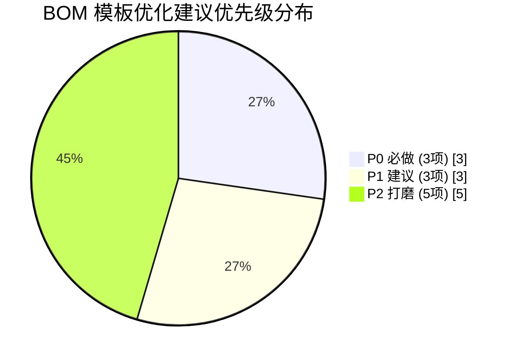

# BOM 表市场/竞品调研与模板优化分析（V2 → V3 依据）

> 作者：许清楚（BOM智造师 产品经理）
> 日期：2026-07-08
> 目的：通过网络公开调研，覆盖多行业 BOM 实例与规范，提炼通用最佳字段；明确「配料表新增用量占比%」需求；产出可落地的模板优化清单与草图，供架构师实现。
> 方法：全部字段来自下方「来源链接」的真实公开资料，未凭空编造。

---

## 0. 已确定的新需求（用户指定，直接采纳）

| 项 | 内容 |
|----|------|
| 需求 | 食品「配料表」新增 **「用量占比%」** 列 |
| 取值 | `该物料用量 ÷ 配料表内全部食用物料用量合计 × 100`，**保留 1 位小数** |
| 示例 | 70.0 ÷ 146.8 ≈ 47.7%（146.8 = 芒果原浆46.3 + 白砂糖30.0 + 基料70.0 + 柠檬酸0.5，即食用类物料用量合计，与现有配料表范围一致）|
| 性质 | **派生展示列**，不改变现有数据模型；逆向导入（`import_bom.py`）**不回写** |
| 优先级 | **P0（必做）** |

---

## 1. 调研发现：多行业公开 BOM 表常见字段

下表按行业列出公开 BOM 实例/规范中的常见字段，并对照 **我们 V2 是否已覆盖**。

### 1.1 制造业 / 工程 BOM（MBOM / eBOM）

| 字段名 | 说明 | V2 是否覆盖 | 来源 |
|--------|------|------------|------|
| 序号 / 层级 | 物料在结构树中的位置（1、1.1）或连续序号 | **否**（物料区无序号列） | 百度文库《BOM专业核心模板》；博客园《标准采购BOM单整理规范》 |
| 物料编码 / 图号 | 唯一物料编码 | 部分（ERP物料代码） | Odoo BOM；采购BOM规范 |
| 名称 / 描述 | 物料名称 | 是 | — |
| 规格 / 型号 | 规格参数（阻值/耐压/尺寸） | 部分（并入「物料名称」） | 采购BOM规范（规格、型号分列）|
| 数量 / 单机用量 | 单台产品用量 | 是（用量） | — |
| 单位 | kg / 个 / 米 | 是 | — |
| 损耗率 / 良率 | 损耗或产出比率 | 部分（有「出品率」=yield，损耗可派生 100−yld） | Odoo 组件含 **Scrap（损耗率）** 字段 |
| 备注 | 补充说明 | 部分（仅工序区有「备注」） | — |
| 版本 | BOM 版本 | 是（表头「版本号」） | Odoo；采购BOM规范（文件名 Vx.x）|
| 审批 / 生效日期 | 审批人、编制人、生效日 | **否** | 采购BOM规范（编制人/日期/版本归档）|

### 1.2 食品行业 配料表（Food Ingredient List）

| 字段名 | 说明 | V2 是否覆盖 | 来源 |
|--------|------|------------|------|
| 名称 | 配料名称 | 是 | GB 7718-2025 |
| 用量 | 添加量 | 是 | — |
| 占比 % | 占总用量比例 | **否（本次 P0 新增）** | — |
| 添加剂 | 食品添加剂标示 | 部分（物料类型=「添加剂」） | GB 7718-2025 食品添加剂标示 |
| 过敏原 | 八大类致敏物质强制标示 | **否** | **GB 7718-2025（2025-03-16 发布，2027-03-16 实施）** |
| 执行标准 | GB 7718 / GB 28050 等 | **否** | GB 7718-2025；GB 28050-2025 |
| 复合配料展开 | 复合配料原始配料展开（加入量<25%且有国标可不展开） | **否** | GB 7718-2025 |
| 菌种 | 菌种标示（新增要求） | **否** | GB 7718-2025 |

> **GB 7718-2025 八大类强制标示致敏物质**：含麸质的谷物及其制品、甲壳纲类动物及其制品、鱼类及其制品、蛋类及其制品、花生及其制品、大豆及其制品、乳及其制品、坚果及其果仁类制品。标示形式：配料表中加粗/下划线强调，或临近独立框示。

### 1.3 电子 / 软件 EBOM（PCB BOM）

| 字段名 | 说明 | V2 是否覆盖 | 来源 |
|--------|------|------------|------|
| 位号 / Designator | 器件与图纸对应位置号（R201、C100、U1） | **否** | **嘉立创(JLC) BOM 文件格式说明** |
| 型号 / Comment | 器件型号、规格（100nF 50V） | 部分（并入「物料名称」） | JLC；采购BOM规范 |
| 封装 / Footprint | 封装尺寸（0402、0805、SOT-23） | **否** | JLC；采购BOM规范 |
| 数量 | 用料数量 | 是 | — |
| 版本 | BOM 版本 | 是（表头） | — |
| 厂家 / 品牌 | 生产厂商（三星、TI、ST） | **否** | 采购BOM规范（厂家） |
| 技术参数 | 电气/物理参数 | **否** | 采购BOM规范（技术参数） |

### 1.4 成本 BOM（Cost BOM）

| 字段名 | 说明 | V2 是否覆盖 | 来源 |
|--------|------|------------|------|
| 单价 | 单位价格 | **否** | 百度百科《成本核算物料清单》；微信/百家号成本核算BOM模板 |
| 金额 | 单价 × 用量 | **否** | 同上 |
| 币种 | 货币种类 | **否** | 同上 |
| 损耗（含边角料） | 用量含损耗（如 1.05m 含5%损耗） | 部分（出品率可派生） | 百家号《成本BOM表小白也能一次做对》|
| 合计 / 单位成本 | 汇总与单位成本 | **否** | 同上 |

---

## 2. 可引用的真实公开样例（1–3 个）

1. **Odoo 18.0 开源 ERP 物料清单（BoM）文档**
   - 链接：<https://www.odoo.com/documentation/18.0/zh_CN/applications/inventory_and_mrp/manufacturing/basic_setup/bill_configuration.html>
   - 关键字段：组件(Components) 含 **产品 / 数量 / 单位 / Scrap（损耗率）/ 应用于变体 / 消耗于操作**；操作(Operations) 含 操作 / 工作中心 / 持续时间；BoM 表头含 产品 / 数量 / 版本（变体、公司）。
   - 用途：证明「损耗率」「版本」「单位」是通用 ERP BOM 标配。

2. **GB 7718-2025《预包装食品标签通则》（国家强制性标准）**
   - 公告链接：<https://www.gov.cn/zhengce/zhengceku/202503/content_7015830.htm>
   - 解读链接（含八大类致敏物质）：<http://www.chnfn.com/shengchanbiaozhun/putongshipin/2026/0703/38196.html>
   - 关键要求：配料表强制标示；**八大类致敏物质强制标示**；食品添加剂标示；复合配料展开规则；定量标示；新增菌种标示；禁用「不添加/不使用」话术。2027-03-16 实施。
   - 用途：证明食品配料表「过敏原」「执行标准」是法规驱动字段。

3. **嘉立创(JLC) BOM 文件格式说明（真实厂商 BOM）**
   - 链接：<https://www.jlc.com/portal/server_guide_4070.html>
   - 关键字段（列顺序）：**Comment（型号/规格）→ Description（名称）→ Designator（位号，如 R201/C100/U1）→ Footprint（封装，如 0402/0805）→ LibRef → Pins（焊盘数）→ Quantity（数量）→ 编号**。位号支持区间表达（R1-4 = R1,R2,R3,R4）。
   - 用途：证明电子 BOM 的「位号 / 封装 / 型号 / 厂家」是行业专属标配。

> 补充参考：博客园《标准采购BOM单整理规范》<https://www.cnblogs.com/WIRO/p/20940409>（九大字段：序号、数量、丝印、规格、封装、型号、厂家、技术参数、嘉立创ID）；知乎《物料清单(BOM)完整指南》<https://zhuanlan.zhihu.com/p/13096234415>（BOM 分类 eBOM/pBOM/mBOM/sBOM 与成本/工序信息）。

---

## 3. 现状对比：V2 已有哪些、缺哪些

### 3.1 V2 已具备字段

- **表头区**：版本号、生成日期、产品名称、产品类别、全产品出品率
- **物料区（7 列 A–G）**：物料名称、计量单位、用量、出品率(%)、ERP物料代码、物料类型、所属工序（分工序分组呈现）
- **工序区（6 字段）**：工序编号、工序名称、工序说明、工时、备注、产物
- **配料表（5 列，仅食品）**：物料名称、物料类型、计量单位、用量、出品率(%)（按用量降序，排除包材/其他）

### 3.2 缺失的「通用且实用」字段（Gap）

| 缺口 | 行业依据 | 重要性 |
|------|----------|--------|
| 物料 **序号** 列 | 制造业/采购 BOM 均为连续序号 | 高（通用标配，提升对账/溯源）|
| 配料表 **用量占比%** | 用户指定 + 食品标签定量惯例 | **最高（P0 已定）** |
| 配料表 **过敏原** 标记 | GB 7718-2025 强制 | 高（法规驱动）|
| 配料表/表头 **执行标准** | GB 7718 / GB 28050 | 中（追溯/合规）|
| 表头 **审批人 / 生效日期** | 采购BOM 版本归档 | 中（规范化）|
| 物料区 **合计用量** 汇总行 | 成本BOM 合计 | 中 |
| 成本（单价/金额/币种） | 成本BOM | 中（可选）|
| 损耗率显式列 | Odoo Scrap | 低（可由出品率派生）|
| 电子专属（位号/封装/厂家） | JLC / 采购BOM | 低（行业专属，非通用）|

---

## 4. 模板优化建议（可落地清单）

每条标注 **P0 / P1 / P2** 与 **是否采纳建议**。

### 4.1 P0（必做）

| 编号 | 建议 | 是否采纳 | 说明 |
|------|------|----------|------|
| P0-1 | **配料表新增「用量占比%」列** | ✅ 采纳（已定） | 派生列 = 用量 ÷ 配料表内食用物料用量合计 ×100，保留 1 位小数；逆向不回写 |
| P0-2 | **物料区新增「序号」列**（置于首列，全局连续编号，跨工序组不重置） | ✅ 建议采纳 | 通用 BOM 标配，提升可读性、跨表对账与问题溯源 |
| P0-3 | **配料表新增「过敏原」标记列**（多选标签：含麸质谷物/甲壳类/鱼类/蛋类/花生/大豆/乳/坚果） | ✅ 建议采纳 | GB 7718-2025 强制；仅在使用相关配料的食品上标记，非强制全填 |

> P0 共 3 项；其中 P0-1 为锁定的用户需求，P0-2/P0-3 为产品经理建议的最该补项。损耗率不单列（由出品率派生，见 P2-2）。

### 4.2 P1（建议）

| 编号 | 建议 | 是否采纳 | 说明 |
|------|------|----------|------|
| P1-1 | **成本视图（可选）**：物料区加「单价(元)」「金额(元)」列；表头加「币种」；金额 = 用量 × 单价 | ✅ 建议采纳（**默认关闭**） | 成本BOM 通用字段；默认不显示，汇总确认时询问是否启用，避免干扰非成本用户 |
| P1-2 | **表头加「审批人」「生效日期」** | ✅ 建议采纳 | 与现有「版本号/生成日期」并列，使 BOM 表头更规范（采购BOM 版本归档惯例）|
| P1-3 | **物料区「合计用量」汇总行**（成本启用时附「合计金额」） | ✅ 建议采纳 | 物料区末尾插入合计行，便于快速核对总量 |

### 4.3 P2（打磨）

| 编号 | 建议 | 是否采纳 | 说明 |
|------|------|----------|------|
| P2-1 | 视觉细节：分组子标题样式统一、表头配色、列宽优化、空行节奏 | ✅ 采纳 | 提升可读性，不改动数据模型 |
| P2-2 | **损耗率派生展示**（损耗率 = 100 − 出品率） | ⚠️ 建议不单列，仅作派生/提示 | 避免与「出品率」语义重复；如需明示可放备注或悬浮提示 |
| P2-3 | 配料表排序稳定性：用量相同时按「物料名称」稳定排序 | ✅ 采纳 | 避免每次生成顺序抖动 |
| P2-4 | 非食品也提供「合计用量」汇总行（不生成配料表） | ✅ 采纳 | 通用汇总价值，成本低 |
| P2-5 | 电子专属字段（位号/封装/厂家）作为**可选扩展包** | ⏸️ 暂缓 | 行业专属，建议后续独立增强，不纳入 V3 通用模板 |

---

## 5. 输出模板草图（ASCII，优化后 Excel 布局）

> 标记：`★` = 本版新增；`[新增 Px]` = 对应优先级。列由 7 列扩为 8 列（物料区加序号）。

```
行1  ┌──────────────────────────────────────────────────────── A1:H1 合并 ┐
     │                       BOM表（标题 16pt 深蓝加粗居中）               │
行2  ├────────────────────────┬──────────────────────────────────────────┤
     │ 版本号：V1.0 (A2:C2)   │ 生成日期：2026-07-07 (D2:H2)              │
行3  ├────────────────────────┼──────────────────────────────────────────┤
     │ 产品名称：芒果果味糖浆 (A3:H3 合并)                                │
行4  ├────────────────────────┬──────────────────────────────────────────┤
     │ 产品类别：食品 (A4:C4) │ 全产品出品率：130% (D4:H4)                │
★行5  ├────────────────────────┴──────────────────────────────────────────┤  ← [新增 P1-2]
     │ 审批人：____   生效日期：____   币种：CNY (A5:H5 合并)              │     (币种仅成本启用时)
行6  ├─────────────────────────────────────────────────────────────────┤  ← 空行
行7  │ 一、物料信息 (A7:H7 合并, label_font)                              │
行8  ├────┬──────────┬──────┬──────┬──────────┬──────────┬────────┬────────┤
★    │ 序号│ 物料名称 │ 单位 │ 用量 │ 出品率(%) │ ERP物料代码│ 物料类型│ 所属工序│  ← [新增 P0-2 序号] 表头(蓝底)
     ├────┼──────────┼──────┼──────┼──────────┼──────────┼────────┼────────┤
行9  │【工序 S01 调配】(A9:H9 合并, 分组子标题浅底)                      │
行10 │ 1  │ 芒果原浆  │ kg  │ 46.3 │ 55%     │ RM-001   │ 原料   │ S01    │
行11 │ 2  │ 白砂糖    │ kg  │ 30.0 │ 100%    │ RM-002   │ 原料   │ S01    │
     ├────┼──────────┼──────┼──────┼──────────┼──────────┼────────┼────────┤
行12 │【工序 S02 灌装】(分组子标题)                                     │
行13 │ 3  │ 芒果果味糖浆基料│ kg │ 70.0 │ 98%    │ RM-100   │ 原料   │ S02    │
行14 │ 4  │ 柠檬酸    │ kg  │ 0.5  │ 100%    │ RM-003   │ 添加剂  │ S02    │
★行15 ├────┼──────────┼──────┼──────┼──────────┼──────────┼────────┼────────┤  ← [新增 P1-3]
     │ 合计│         │     │146.8 │         │          │        │        │     (成本启用加 合计金额)
     └────┴──────────┴──────┴──────┴──────────┴──────────┴────────┴────────┘
行16 │ 二、工艺工序 (A16:H16 合并)  —— 表头：工序编号|工序名称|工序说明|工时|备注|产物|(H空) │
行17 │ S01 │ 调配 │ 混合搅拌 │ 30 │ 常温 │ 芒果果味糖浆基料 │          │
行18 │ S02 │ 灌装 │ 无菌灌装 │ 20 │      │ 芒果果味糖浆     │          │
行19 ├─────────────────────────────────────────────────────────────────┤  ← 空行
行20 │ 三、配料表 (A20:H20 合并, label_font, 仅 category==食品)          │
行21 ├──────────┬────────┬────────┬──────┬──────────┬──────────┬────────┤
★    │ 物料名称 │ 物料类型│ 计量单位│ 用量 │ 出品率(%) │ 用量占比(%)│ 过敏原标记│  ← [新增 P0-1 占比%] + [P0-3 过敏原] 表头(蓝底)
行22 │ 芒果原浆 │ 原料   │ kg    │ 46.3 │ 55%     │ 31.5%   │  —      │
行23 │ 白砂糖   │ 原料   │ kg    │ 30.0 │ 100%    │ 20.4%   │  —      │
行24 │ 芒果果味糖浆基料│ 原料│ kg  │ 70.0 │ 98%     │ 47.7%   │  —      │
行25 │ 柠檬酸   │ 添加剂│ kg    │ 0.5  │ 100%    │ 0.3%    │  —      │
     └──────────┴────────┴────────┴──────┴──────────┴──────────┴────────┘
```

> 占比% 校验：31.5+20.4+47.7+0.3 = 99.9 ≈ 100.0（1 位小数舍入误差，可接受；如要求严格可末位补差）。

---

## 6. 待确认 / 歧义点（需用户拍板，附推荐默认）

| # | 歧义点 | 推荐默认 | 理由 |
|---|--------|----------|------|
| Q1 | **成本字段（单价/金额/币种）是否默认开启？** | **默认关闭**，汇总确认时询问「是否启用成本视图」 | 多数食品/轻工用户不需要，避免表格臃肿；启用后才显示 P1-1 列 |
| Q2 | **损耗率是否要单列并校验？** | **不单列**；损耗率 = 100 − 出品率 作为派生提示 | 与「出品率」语义重复，单列易混淆；现有出品率已覆盖 |
| Q3 | **过敏原标记的实现方式？** | 配料表（及物料区）加「过敏原」多选标签列，提供八大类下拉；仅对相关食品标记，非强制全填 | 贴合 GB 7718-2025，且不增加非食品用户负担 |
| Q4 | **用量占比% 分母口径？** | = **配料表内食用物料（原料/添加剂/香精香料）用量合计**（即用户示例 146.8），与配料表范围一致 | 用户示例已验证；包材/其他不计入（本就不进配料表）|
| Q5 | **非食品是否也提供「合计用量」汇总？** | 提供（P2-4），但不生成配料表 | 通用汇总价值高、实现成本低 |
| Q6 | **序号是否跨工序组连续编号？** | 是，全局连续（1,2,3…），分组子标题不占号 | 符合采购BOM「连续自然数、无跳号」惯例，便于对账 |
| Q7 | **执行标准是否进 V3？** | 建议作为 **P1 表头可选字段「执行标准」**（如 GB 7718-2025），默认空 | 法规追溯有用，但非所有用户需要，故默认空、可选填 |

---

## 7. 优先级分布（Mermaid）



## 8. 优化后结构总览（Mermaid）

```mermaid
flowchart TD
    H[表头区<br/>版本号/生成日期/产品名称/类别/出品率<br/>★审批人/生效日期/币种 P1] --> M
    M[一、物料信息<br/>★序号 P0 | 名称|单位|用量|出品率|ERP代码|类型|工序<br/>★合计用量 P1 | ★单价/金额 P1可选]
    M --> P[二、工艺工序<br/>编号|名称|说明|工时|备注|产物]
    P --> F{类别==食品?}
    F -->|是| I[三、配料表<br/>名称|类型|单位|用量|出品率<br/>★用量占比% P0 | ★过敏原 P0]
    F -->|否| X[不生成配料表<br/>★仍提供合计用量 P2]
```
