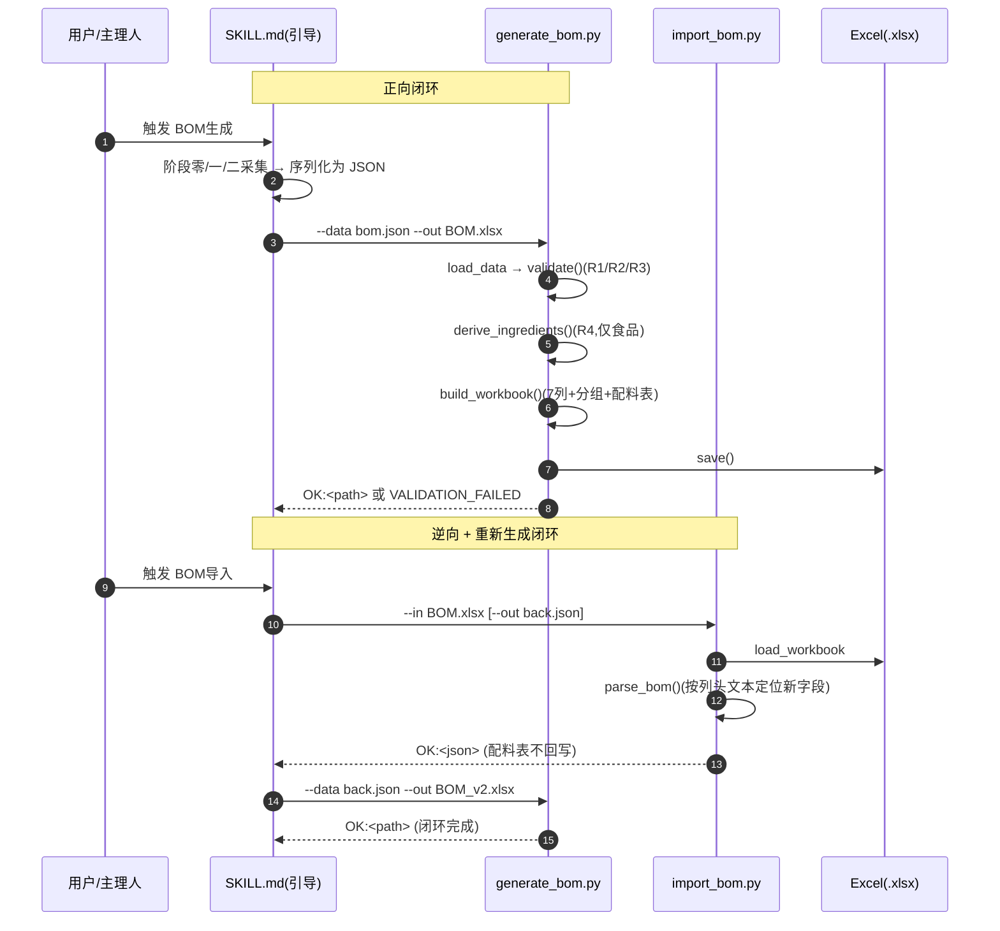
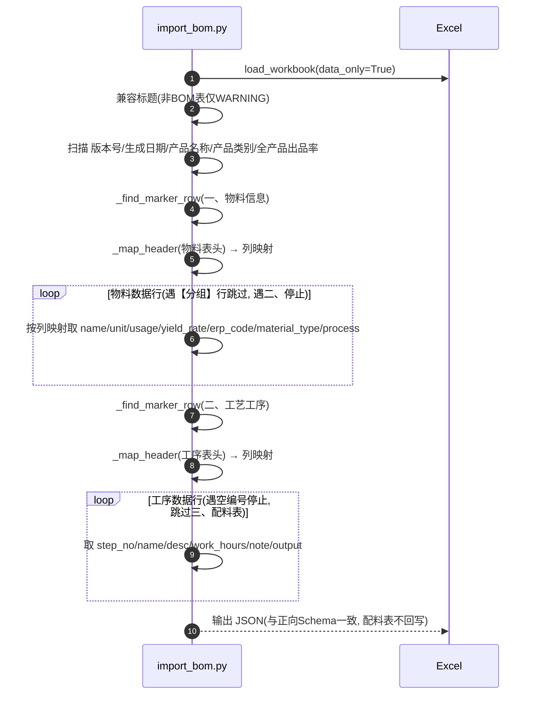
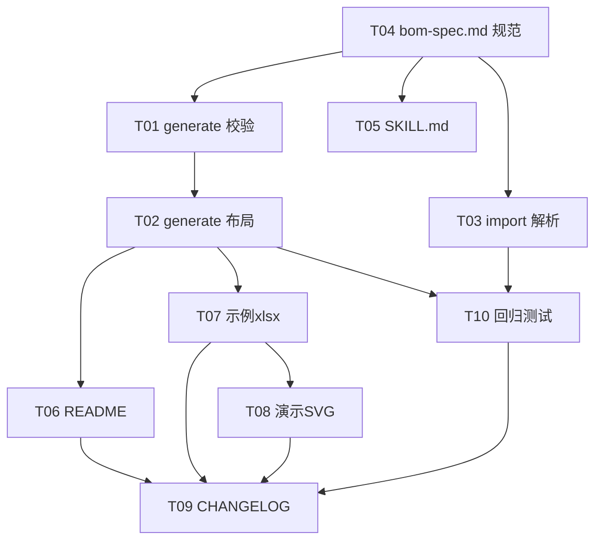

# BOM 智造师 · 增量增强 V2 — 架构设计与任务分解

> 文档类型：架构设计 + 任务分解（增量开发，作用于现有 Skill）
> 作者：软件架构师（高见远）
> 适用范围：`generate_bom.py`（正向）、`import_bom.py`（逆向）、`bom-spec.md`、`SKILL.md`、`README.md` 的 V2 增强
> 决策基线：已采纳主理人拍板的 5 个默认决策（见 §8 备注），PM《数据字段定义与业务规则》其余结论照单全收

---

## 1. 实现方案 + 框架选型

### 1.1 技术难点与选型

| 难点 | 方案 | 理由 |
|------|------|------|
| 产品级元数据（名称/类别/出品率）与工序级流转链建模 | 沿用现有「平铺物料单数组 + `process` 字段归属工序」数据模型，仅**增量加字段**，不引入新结构 | 不破坏现有 JSON / Excel 闭环；改动最小、风险最低 |
| Excel 列扩展（物料 +2 列、工序 +1 列）且保持向后兼容 | 整表统一扩展到 **7 列（A–G）**；逆向解析**改为按列头文本定位**（不再硬编码 A–E 列号） | 列头文本定位对旧版 5 列 Excel 天然兼容（缺列即取默认），降低脆弱性 |
| 工序流转链（R3）校验 | 在 `validate()` 中按 `process[i-1].output` 是否被 `process[i]` 物料清单包含做字符串精确匹配 | 主理人决策 #2：用 `name == output` 精确匹配，不引入 `output_id` |
| 配料表派生（R4，仅食品） | 新增纯函数 `derive_ingredients(data)`，生成时派生、逆向时**不回写** | 主理人决策 #5：派生数据，按 `category` 重新生成 |
| 分工序分组呈现（决策 #3） | `build_workbook` 内按 `processes` 顺序输出「【工序 Sxx 名称】」分组子标题；无工序/全空则平铺 | 分组为视觉呈现，数据仍平铺，逆向靠「所属工序」列还原 |

### 1.2 框架选型（明确结论）

- **语言/运行时**：Python 3（沿用）。
- **依赖库**：仅 `openpyxl`（沿用，缺失自装机制不变）。**不引入任何新依赖**（无 jsonschema/pandas 等）。
- **CLI 接口保持不变**：
  - 正向：`python3 generate_bom.py --data <file.json> --out <file.xlsx>`
  - 逆向：`python3 import_bom.py --in <file.xlsx> [--out <data.json>]`
- **Excel 列数结论**：**从 5 列扩展到 7 列（A–G）**。物料区 = 5 现有列 +「物料类型」+「所属工序」；工序区 = 5 现有列 +「产物」（第 7 列 G 留空）；整表统一 7 列，标题与各区标题合并 A–G。

### 1.3 程序调用流（Mermaid sequenceDiagram）



---

## 2. 数据模型（输入 JSON Schema）

> 约定：正向 `--data` 输入与逆向 `--out` 输出 **Schema 完全一致**（闭环可回写）。
> 以下为数据契约（工程师在 `validate()` 中以 Python 实现，不引入 jsonschema 库）。

### 2.1 完整示例（食品类，多工序，触发配料表 + 流转链）

```json
{
  "product_name": "芒果果味糖浆",
  "category": "食品",
  "output_rate": 130,
  "version": "V1.0",
  "date": "2026-07-07",
  "materials": [
    {
      "name": "芒果原浆",
      "unit": "kg",
      "usage": 46.3,
      "yield_rate": 55,
      "erp_code": "RM-001",
      "material_type": "原料",
      "process": "S01"
    },
    {
      "name": "白砂糖",
      "unit": "kg",
      "usage": 30.0,
      "yield_rate": 100,
      "erp_code": "RM-002",
      "material_type": "原料",
      "process": "S01"
    },
    {
      "name": "柠檬酸",
      "unit": "kg",
      "usage": 0.5,
      "yield_rate": 100,
      "erp_code": "RM-003",
      "material_type": "添加剂",
      "process": "S02"
    },
    {
      "name": "PE 瓶",
      "unit": "个",
      "usage": 100,
      "yield_rate": 100,
      "erp_code": "PK-001",
      "material_type": "包材",
      "process": ""
    }
  ],
  "processes": [
    {
      "step_no": "S01",
      "name": "调配",
      "desc": "混合搅拌",
      "work_hours": 30,
      "note": "常温",
      "output": "芒果果味糖浆基料"
    },
    {
      "step_no": "S02",
      "name": "灌装",
      "desc": "无菌灌装",
      "work_hours": 20,
      "note": "",
      "output": "芒果果味糖浆"
    }
  ]
}
```

### 2.2 字段约束总表（数据契约）

| JSON 路径 | 类型 | 必填 | 约束 / 默认值 | 说明 |
|-----------|------|------|--------------|------|
| `product_name` | string | **必填** | 非空（R1）；默认 `""` → 空则 VALIDATION_FAILED | 现改必填 |
| `category` | string(enum) | **必填** | ∈ {食品,工业品,日化化妆品,医药,其他}；默认 `其他` | R1/R4；仅 `食品` 触发配料表 |
| `output_rate` | number | **必填** | `> 0`；允许 `> 100`（无硬上限）；默认 `""` 待补 | R2 |
| `version` | string | 选填 | 默认 `V1.0` | 未变 |
| `date` | string | 选填 | 默认当天 `YYYY-MM-DD` | 未变 |
| `materials[]` | array | **必填** | 至少 1 条 | 未变 |
| `materials[].name` | string | 必填 | 非空 | 未变 |
| `materials[].unit` | string | 必填 | 非空 | 未变 |
| `materials[].usage` | number | 必填 | `> 0` | 未变 |
| `materials[].yield_rate` | number | 必填 | `0 < 值 ≤ 100` | R2 |
| `materials[].erp_code` | string | 选填 | 默认 `""` | 未变 |
| `materials[].material_type` | string(enum) | 选填 | ∈ {原料,添加剂,香精香料,包材,其他}；默认 `其他` | 新增（R4 过滤用） |
| `materials[].process` | string | 选填 | 引用有效 `step_no`；首道可选填；默认 `""` | 新增（工序归属） |
| `processes[]` | array | 选填 | 可 0 条（纯物料 BOM） | 未变 |
| `processes[].step_no` | string | 必填 | 唯一不重复 | 未变 |
| `processes[].name` | string | 必填 | 非空 | 未变 |
| `processes[].desc` | string | 选填 | — | 未变 |
| `processes[].work_hours` | number/string | 选填 | 数值须 `≥ 0` | 未变 |
| `processes[].note` | string | 选填 | — | 未变 |
| `processes[].output` | string | **必填** | 非空；该工序产物（R3 流转链源头） | 新增 |

### 2.3 向后兼容默认（R5，旧数据/旧文件）

- 旧 JSON 缺 `category` → `其他`（不生成配料表）。
- 旧 JSON 缺 `output_rate` → `""`（重新生成时触发 VALIDATION_FAILED，需用户补全，见 §9）。
- 旧 JSON 缺 `material_type` → `其他`；缺 `process` → `""`。
- 旧 JSON 缺 `processes[].output` → `""`（有工序时触发 VALIDATION_FAILED）。

### 2.4 数据模型关系（Mermaid classDiagram）

```mermaid
classDiagram
    class BOM {
        +string product_name  «必填非空 R1»
        +enum category  «必填,5类 R1/R4»
        +number output_rate  «必填,>0 R2»
        +string version  «默认V1.0»
        +string date  «默认当天»
    }
    class Material {
        +string name «必填»
        +string unit «必填»
        +number usage «必填>0»
        +number yield_rate «0<值≤100 R2»
        +string erp_code «选填»
        +enum material_type «选填,5类»
        +string process «选填,引用step_no»
    }
    class Process {
        +string step_no «必填唯»
        +string name «必填»
        +string desc
        +work_hours «≥0»
        +string note
        +string output «必填,产物 R3»
    }
    class BOMGenerator {
        +validate(data) errors
        +derive_ingredients(data) (ingredients, excluded)
        +build_workbook(data) wb
    }
    class BOMImporter {
        +parse_bom(path) data
    }
    BOM "1" o-- "0..*" Material : materials[]
    BOM "1" o-- "0..*" Process : processes[]
    Material "..>" Process : process 引用 step_no
    Process "output→下道物料name" Process : 流转链 R3
    BOMGenerator ..> BOM : 读/写
    BOMImporter ..> BOM : 重建
```

---

## 3. Excel 输出结构（7 列 A–G，固定行号）

> 因 `product_name` 现必填非空，新格式 Excel **行号固定**（见下表）。旧版 5 列 Excel 无「产品名称/产品类别/出品率」行，导入时整体上移 1 行，但逆向解析**不依赖固定行号**（按标记/列头文本定位），故完全兼容。

### 3.1 ASCII 框图（固定行，食品类有工序分组 + 配料表）

```
行1  ┌─────────────────────────────────────────────────────── A1:G1 合并 ┐
     │                       BOM表（标题 16pt 深蓝加粗居中）               │
行2  ├────────────────────────┬──────────────────────────────────────────┤
     │ 版本号：V1.0 (A2:C2 合并)│ 生成日期：2026-07-07 (D2:G2 合并)        │
行3  ├────────────────────────┴──────────────────────────────────────────┤
     │ 产品名称：芒果果味糖浆 (A3:G3 合并, label_font 加粗)                │
行4  ├────────────────────────┬──────────────────────────────────────────┤
     │ 产品类别：食品 (A4:C4 合并)│ 全产品出品率：130% (D4:G4 合并)         │
行5  ├────────────────────────┴──────────────────────────────────────────┤  ← 空行间隔
行6  │ 一、物料信息 (A6:G6 合并, label_font)                              │
行7  ├──────────┬──────┬──────┬──────────┬──────────┬────────┬────────┤
     │ 物料名称 │ 单位 │ 用量 │ 出品率(%) │ ERP物料代码│ 物料类型│ 所属工序│  ← 表头(蓝底)
行8  ├──────────┼──────┼──────┼──────────┼──────────┼────────┼────────┤
     │【工序 S01 调配】(A8:G8 合并, 分组子标题浅底, 仅分工序呈现时出现)    │
行9  │ 芒果原浆  │ kg  │ 46.3 │ 55%     │ RM-001   │ 原料   │ S01    │
行10 │ 白砂糖    │ kg  │ 30.0 │ 100%    │ RM-002   │ 原料   │ S01    │
行11 ├──────────┴──────┴──────┴──────────┴──────────┴────────┴────────┤
     │【工序 S02 灌装】(分组子标题)                                     │
行12 │ 柠檬酸    │ kg  │ 0.5  │ 100%    │ RM-003   │ 添加剂  │ S02    │
行13 ├──────────┴──────┴──────┴──────────┴──────────┴────────┴────────┤
     │【未归属工序】(仅当存在 process 为空/无效的物料时出现)             │
行14 │ PE 瓶     │ 个  │ 100  │ 100%    │ PK-001   │ 包材   │        │
行15 ├─────────────────────────────────────────────────────────────────┤  ← 空行间隔
行16 │ 二、工艺工序 (A16:G16 合并, label_font)                          │
行17 ├──────────┬──────┬──────┬──────┬────────┬──────────┬────────┤
     │ 工序编号 │ 工序名称│工序说明│ 工时 │ 备注  │ 产物     │ (G 留空)│  ← 表头(蓝底)
行18 │ S01     │ 调配  │混合搅拌│ 30  │ 常温  │ 芒果果味糖浆基料│      │
行19 │ S02     │ 灌装  │无菌灌装│ 20  │       │ 芒果果味糖浆  │      │
行20 ├─────────────────────────────────────────────────────────────────┤  ← 空行间隔
行21 │ 三、配料表 (A21:G21 合并, label_font, 仅 category==食品 出现)    │
行22 ├──────────┬────────┬────────┬──────┬──────────┬────────┬────────┤
     │ 物料名称 │ 物料类型│ 计量单位│ 用量 │ 出品率(%) │(F/G 留空)        │  ← 表头(蓝底)
行23 │ 芒果原浆 │ 原料  │ kg    │ 46.3 │ 55%     │                │
行24 │ 白砂糖   │ 原料  │ kg    │ 30.0 │ 100%    │                │
行25 │ 柠檬酸   │ 添加剂│ kg    │ 0.5  │ 100%    │                │
     └──────────┴──────┴──────┴──────┴────────┴────────┴────────┘
```

### 3.2 区块规则（精确说明）

- **表头区（行 1–4）固定**：行 1 标题；行 2 版本号(左)+生成日期(右)；行 3 产品名称(整行)；行 4 产品类别(左)+全产品出品率(右，数字格式 `0.0"%"`，允许 >100 如 `130%`)。
- **「一、物料信息」（行 6 起）**：
  - 表头 7 列：`物料名称|单位|用量|出品率(%)|ERP物料代码|物料类型|所属工序`。
  - **有工序且存在 `process` 归属时分工序分组**：按 `processes` 的 `step_no` 升序，每组前插一行分组子标题 `【工序 Sxx 名称】`（A–G 合并，浅色填充）。
  - **未归属物料**（无 `process` 或引用无效）归入 `【未归属工序】` 组（仅当该类物料存在时出现）。
  - **无工序 或 所有物料 `process` 全空** → 物料平铺，不插任何分组子标题（决策 #3）。
  - 物料行内：`物料类型` 取自 `material_type`（缺省空），`所属工序` 取自 `process`（缺省空）。
- **「二、工艺工序」（物料区后空行起）**：表头 7 列 `工序编号|工序名称|工序说明|工时|备注|产物|(G空)`；`产物` 列（F）取值 `processes[].output`。
- **「三、配料表」（仅 `category=="食品"`，工序区后空行起）**：派生区块。表头 5 列 `物料名称|物料类型|计量单位|用量|出品率(%)`（F/G 留空）。内容为 `derive_ingredients()` 结果，**按 `usage` 降序排列**（食品标签惯例）。非食品类**不输出此区块**。
- **样式沿用**：标题 16pt 深蓝加粗居中；区标题 10pt 加粗；表头蓝底加粗居中带边框；数据单元格带边框，文本列左对齐、数值列居中；出品率/全产品出品率数字格式 `0.0"%"`.

### 3.3 列宽建议

| 列 | A 物料名称 | B 单位 | C 用量 | D 出品率(%) | E ERP物料代码 | F 物料类型/产物 | G 所属工序 |
|----|-----------|--------|--------|------------|--------------|----------------|-----------|
| 宽 | 18 | 10 | 10 | 12 | 16 | 14 | 12 |

> 工序区第 6 列复用 F 显示「产物」，第 7 列 G 留空；配料表区仅用 A–E。

---

## 4. 逆向导入解析规则（增量）

### 4.1 总策略（关键：按列头文本定位，不硬编码列号）

`import_bom.py` 的 `parse_bom()` 改为**两阶段定位**：
1. **区块定位**：按首列标记 `一、物料信息` / `二、工艺工序` / `三、配料表` 找区块起始行（沿用现有 `_find_marker_row`，兼容旧版缺 `三、`）。
2. **列定位**：读取各区块表头行，用**表头文本 → 列号**映射（而非固定 A–E），缺列则视为「旧版，取默认」。

### 4.2 列头映射表

| 区块 | 表头文本 | 映射键 | 旧版缺列时默认 |
|------|----------|--------|----------------|
| 物料 | 物料名称 | name | —（必存在） |
| 物料 | 单位 / 计量单位 | unit | — |
| 物料 | 用量 | usage(float) | — |
| 物料 | 出品率(%) | yield_rate(float) | — |
| 物料 | ERP物料代码 | erp_code | `""` |
| 物料 | 物料类型 | material_type | `其他` |
| 物料 | 所属工序 | process | `""` |
| 工序 | 工序编号 | step_no | — |
| 工序 | 工序名称 | name | — |
| 工序 | 工序说明 | desc | `""` |
| 工序 | 工时 | work_hours(float/原值) | `""` |
| 工序 | 备注 | note | `""` |
| 工序 | 产物 | output | `""` |

> 实现提示：写一个 `_map_header(ws, header_row)` → `{text: col_index}`，再 `_col_of(map, candidates)`（如单位兼容「单位」「计量单位」）。映射到 JSON 键后在数据行取值。

### 4.3 产品级字段解析（表头区）

| 字段 | 定位方式 | 默认 |
|------|----------|------|
| `product_name` | 扫描含 `产品名称` 的单元格，提取冒号后内容 | `""` |
| `category` | 扫描含 `产品类别` 的单元格，提取冒号后内容 | `其他` |
| `output_rate` | 扫描含 `全产品出品率` 的单元格，提取数字（去 `%`）转 float | `""` |
| `version` | 含 `版本号` | `V1.0` |
| `date` | 含 `生成日期` | `""` |

### 4.4 分组子标题与配料表的逆向处理

- **分组子标题**（`【工序 ...】` / `【未归属工序】` 合并行）：解析物料数据行时，若某行首列以 `【` 开头则**跳过**（非物料行）。物料的 `process` 以「所属工序」列（G）值为准，子标题仅为视觉，不参与还原。
- **「三、配料表」区块**：**不解析、不回写**。逆向在定位到 `三、配料表` 标记（或到 `ws.max_row`）即停止物料/工序读取；输出 JSON **不包含**配料表（派生数据，重新生成时按 `category` 重新派生，决策 #5）。

### 4.5 旧版 Excel 兼容（向后兼容 R5）

- 旧版 5 列无「物料类型/所属工序/产物/产品类别/全产品出品率」→ 列头映射缺失 → 取默认（material_type=`其他`, process=`""`, output=`""`, category=`其他`, output_rate=`""`）。
- 旧版无「产品名称」行 → `product_name=""`（但新 `validate` 会因此报错，提示补全，见 §9）。
- 解析失败的容错与退出码**不变**：缺 `一、物料信息`/`二、工艺工序` 标记 → `PARSE_ERROR` 退出码 2；文件不可读 → `FILE_ERROR` 退出码 2。

### 4.6 逆向解析流（Mermaid sequenceDiagram）



---

## 5. 校验逻辑清单（generate_bom.py · validate()）

> `validate(data)` 返回 `errors` 列表（非空即 `VALIDATION_FAILED` 退出码 2）。R4 不报错，仅由 `derive_ingredients()` 产生非阻断 WARNING（见下）。

### 5.1 新增 / 修改校验项

| 编号 | 规则 | 校验内容 | 错误文案（中文） |
|------|------|----------|------------------|
| V1（R1） | `product_name` 必填非空 | `str(data.get("product_name") or "").strip()` 为空 | `产品名称为必填，且不可为空` |
| V2（R1） | `category` 必填且枚举 | 空 或 不在 {食品,工业品,日化化妆品,医药,其他} | `产品类别为必填，且须为：食品/工业品/日化化妆品/医药/其他` |
| V3（R2） | `output_rate` 必填 >0，允许 >100 | 缺失 / 非数值 / ≤0 | `全产品出品率(output_rate)为必填，且须为正数（可大于100，如干香菇泡发增重）` |
| V4（R2，沿用） | `yield_rate` 0<值≤100 | 沿用现有逻辑 | `物料#{i} 出品率须为 0-100 的正数` |
| V5（R3） | 工序流转链完整性 | 见 §5.2 伪代码 | `工序 {Sxx} 的物料清单未包含上一工序 {Syy} 的产物『{output}』，流转链不完整` |
| V6（沿用） | 工序编号唯一 / 名称非空 / 工时≥0 | 沿用现有 | 沿用现有文案 |
| V7（沿用） | 物料 name/unit 非空、usage>0 | 沿用现有 | 沿用现有文案 |

### 5.2 R3 流转链校验伪代码

```python
# 在 validate() 末尾追加（仅当 len(processes) >= 2 时触发）
procs = data.get("processes", [])
if len(procs) >= 2:
    for i in range(1, len(procs)):
        prev = procs[i - 1]
        cur = procs[i]
        prev_out = str(prev.get("output") or "").strip()
        if not prev_out:
            errors.append(f"工序 {prev['step_no']} 的产物(output)为必填")
            continue
        # cur 工序归属的物料集合
        cur_materials = [m for m in data.get("materials", [])
                         if str(m.get("process") or "").strip() == str(cur.get("step_no") or "").strip()]
        names = {str(m.get("name") or "").strip() for m in cur_materials}
        if prev_out not in names:
            errors.append(
                f"工序 {cur['step_no']} 的物料清单未包含上一工序 "
                f"{prev['step_no']} 的产物『{prev_out}』，流转链不完整"
            )
```

> 说明：匹配依据为「物料 `name` == 上一工序 `output`」精确字符串匹配（决策 #2）。仅 0–1 道工序不触发。建议 R3 为**阻断级**错误（纳入 `errors`）；若主理人希望降级为告警，可改为打印 WARNING 并放行（见 §9 待明确）。

### 5.3 R4 配料表（仅生成，不校验，汇总提示）

- `derive_ingredients(data)` 在 `build_workbook` 与汇总阶段调用：
  ```python
  EDIBLE = {"原料", "添加剂", "香精香料"}
  def derive_ingredients(data):
      ingredients, excluded = [], []
      for m in data.get("materials", []):
          mt = str(m.get("material_type") or "其他").strip() or "其他"
          (ingredients if mt in EDIBLE else excluded).append(m)
      if str(data.get("category") or "其他") != "食品":
          return [], excluded          # 非食品不生成配料表
      ingredients.sort(key=lambda x: float(x.get("usage") or 0), reverse=True)
      return ingredients, excluded
  ```
- 当 `category=="食品"` 且 `excluded` 非空时，`generate_bom.py` 打印 **WARNING**（非阻断）：
  `WARNING: 配料表已排除 {n} 条非食用物料（包材/其他/未分类）：{名称列表}`
- SKILL.md 汇总阶段同样基于该函数提示用户（见 §6 T05）。

---

## 6. 任务分解列表（有序、含依赖）

> 覆盖主理人要求的 10 项；按实现依赖排序。T04（规范）先行，供后续任务对齐。

| 任务 | 名称 | 负责文件 | 改什么 | 依赖 | 优先级 |
|------|------|----------|--------|------|--------|
| **T01** | `generate_bom.py` 数据模型 + 校验增强 | `scripts/generate_bom.py` | ① `validate()` 新增 V1–V5（R1/R2/R3）；② 新增 `derive_ingredients(data)` 与默认补全 helper；③ 保留 V6/V7 沿用逻辑 | T04 | P0 |
| **T02** | `generate_bom.py` Excel 布局重构（7 列 + 分组 + 配料表） | `scripts/generate_bom.py` | 重写 `build_workbook()`：7 列、行 1–4 表头区、物料分工序分组子标题、工序区加「产物」列、食品类追加「三、配料表」派生区块、列宽 | T01 | P0 |
| **T03** | `import_bom.py` 逆向解析增强 | `scripts/import_bom.py` | `parse_bom()` 改为列头文本映射（`_map_header`）；解析产品类别/全产品出品率/物料类型/所属工序/产物；跳过 `【分组】` 行与「三、配料表」区块（不回写）；旧版缺列取默认 | T04 | P0 |
| **T04** | `bom-spec.md` 规范更新 | `references/bom-spec.md` | 重写「输入 JSON Schema」（含全部新旧字段/约束/默认）、「Excel 输出结构」（7 列固定行 + 配料表）、「逆向导入」（列头定位 + 配料表不回写 + 兼容） | — | P0 |
| **T05** | `SKILL.md` 交互更新 | `SKILL.md` | 阶段零加 `category`(下拉必填)/`output_rate`(数值必填>0可>100)；阶段一物料加 `material_type`(下拉)/`process`(引用 step_no)；阶段二工序加 `output`(必填)；数据校验补 R1/R2/R3 文案；汇总确认加配料表预览与排除提示 | T04 | P1 |
| **T06** | `README.md` 更新 | `README.md` | 更新字段校验速查表（新增 4 字段）、Excel 结构说明（7 列/配料表/分组）、`bom.json` 示例（食品多工序）、新增「演示截图」占位指向 SVG | T04, T02 | P1 |
| **T07** | 生成示例 BOM xlsx | `examples/bom_food_sample.json` + 运行 `generate_bom.py` | 构造食品类多工序样例 JSON（触发配料表 + 流转链），生成 `examples/BOM_食品示例.xlsx` | T02 | P1 |
| **T08** | 生成演示 SVG（还原 BOM 视觉图） | `references/bom-demo.svg` | 用 SVG 还原 §3.1 布局（含分组/配料表），供 README 内嵌（无 Excel GUI 环境） | T02, T07 | P2 |
| **T09** | `CHANGELOG.md` | `CHANGELOG.md`（新增） | 记录 V2 变更：新增 4 字段、7 列布局、配料表、流转链校验、向后兼容说明 | T01–T08 | P2 |
| **T10** | 回归测试（旧样例仍可用） | `tests/regression_old.py`（新增）+ 旧样例 | 用旧版 5 列 Excel / 旧 JSON 跑 import→generate 闭环，断言不报错、字段兼容默认；新增流转链断链负例断言 VALIDATION_FAILED | T01, T02, T03 | P1 |

### 6.1 任务依赖图（Mermaid graph）



---

## 7. 依赖包列表

```
- openpyxl  # 唯一依赖，沿用；声明兼容即可（建议 >=3.0），无需 pin；缺失时脚本自动 pip install
```

> 不引入任何新依赖（无 jsonschema / pandas / 额外 GUI 库）。演示图用 SVG 文本文件，无需运行时库。

---

## 8. 共享知识（跨文件约定）

- **JSON 键名（全局统一）**：`product_name` / `category` / `output_rate` / `version` / `date`；`materials[]`：`name`/`unit`/`usage`/`yield_rate`/`erp_code`/`material_type`/`process`；`processes[]`：`step_no`/`name`/`desc`/`work_hours`/`note`/`output`。
- **错误/状态前缀（沿用 + 新增）**：
  - `VALIDATION_FAILED`（正向校验失败，退出码 2，后跟 ` - 错误文案` 列表）
  - `PARSE_ERROR`（逆向标记缺失，退出码 2）
  - `FILE_ERROR`（Excel 不可读，退出码 2）
  - `WARNING`（非阻断：标题非「BOM表」、配料表排除非食用物料等）
  - `OK:<path|json>`（成功）
- **数字格式**：Excel 中 `yield_rate` 与 `output_rate` 均用 `0.0"%"`；JSON 中存原始数值（如 `130` 而非 `"130%"`）。
- **枚举文案（精确字符串，勿加空格）**：
  - `category` ∈ {`食品`,`工业品`,`日化化妆品`,`医药`,`其他`}
  - `material_type` ∈ {`原料`,`添加剂`,`香精香料`,`包材`,`其他`}
- **派生函数名**：`derive_ingredients(data) -> (ingredients, excluded)`（T01 实现，T02/T05 复用）。
- **Excel 文本约定**：
  - 区块标记：`一、物料信息` / `二、工艺工序` / `三、配料表`
  - 表头区标签：`版本号：` / `生成日期：` / `产品名称：` / `产品类别：` / `全产品出品率：`
  - 物料表头：`物料名称|单位|用量|出品率(%)|ERP物料代码|物料类型|所属工序`
  - 工序表头：`工序编号|工序名称|工序说明|工时|备注|产物`
  - 配料表表头：`物料名称|物料类型|计量单位|用量|出品率(%)`
  - 分组子标题：`【工序 Sxx 名称】` / `【未归属工序】`
- **向后兼容默认（R5）**：`material_type="其他"`、`process=""`、`output_rate=""`(待补)、`category="其他"`、`output=""`。
- **主理人 5 决策已落地为硬约束**：① material_type 全类别选填，配料表仅收 原料/添加剂/香精香料；② 流转链用 name==output 精确匹配；③ 无工序/全空则平铺，有工序按工序分组 + 未归属工序；④ output_rate 与 yield_rate 独立不校验，表头区加「全产品出品率」行；⑤ 配料表为派生独立区块、逆向不回写。

---

## 9. 待明确事项

主理人 5 个默认决策已覆盖 PM 文档 §7 的 Q1–Q5 全部待确认项，无需再拍板。以下为**非阻断的细化建议**，工程师可先按推荐实现：

1. **R3 断链处置级别**：建议为**阻断级**（纳入 `errors`，生成失败并提示补全）。若希望仅告警放行，可降级为 `WARNING`。→ 推荐：阻断。
2. **旧版数据闭环限制**：旧版 Excel / 旧 JSON 逆向后，`output_rate`/`category`/`output` 取默认空值，重新生成会触发 `VALIDATION_FAILED`，需用户补全这三个必填项才能闭环。此为 R5「待补」的固有结果，建议在 README/汇总中明确提示，属已知限制而非缺陷。
3. **配料表排序**：建议按 `usage` **降序**（食品标签惯例）。如需改为录入顺序或其他规则，请确认。

> 除上述 3 点细化建议外，无阻塞性问题；主理人默认决策已完整覆盖本期需求。
