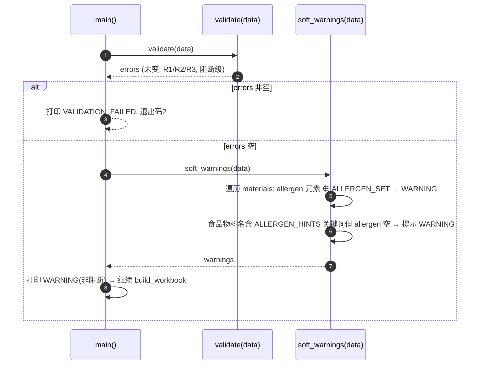
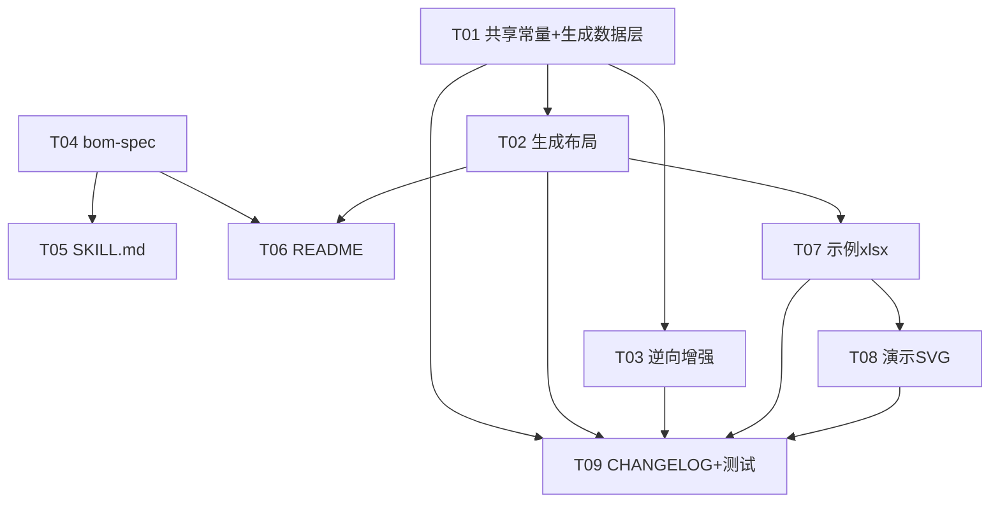

# BOM 智造师 · 增量增强 V3 — 架构设计与任务分解

> 文档类型：架构设计 + 任务分解（增量开发，作用于现有 Skill V2）
> ⚠️ **交付说明（主理人拍板）**：本设计为 9 列（物料区含过敏原列）提案；**实际交付定为 8 列** —— 过敏原仅展示于「配料表」（食品标签视图），物料区不加过敏原列，更简洁且不干扰非食品 BOM，契合"紧实/打磨"目标。未单独建 `bom_constants.py`（八大类枚举在脚本内联，功能等价）。代码与文档以 `bom-spec.md` 及实际脚本为准。
> 作者：软件架构师（高见远）
> 适用范围：`generate_bom.py`（正向）、`import_bom.py`（逆向）、`bom-spec.md`、`SKILL.md`、`README.md`、`bom-demo.svg`、`CHANGELOG.md`、`tests/` 的 V3 增强
> 决策基线：主理人齐活林拍板的 V3 范围（P0×3 + P1×2 + P2×2），已锁定，**不自行增删**；明确排除「成本视图 / 损耗率单列 / 电子专属字段」。

---

## 0. V3 范围速览（主理人锁定，硬性约束）

| 优先级 | 项 | 是否采纳 | 关键约束 |
|--------|----|----------|----------|
| **P0-1** | 配料表新增「用量占比%」列（派生展示列） | ✅ 必做 | `用量 ÷ 配料表食用物料用量合计 × 100`，1 位小数；**末位补差**使整列合计=100.0%；逆向不回写 |
| **P0-2** | 物料区新增「序号」列（首列，全局连续自然数） | ✅ 必做 | 物料区由 7 列扩为 **8 列**；本版再加过敏原→最终 **9 列 A–I**；分组子标题不占号；逆向忽略 |
| **P0-3** | 新增「过敏原」标记（GB 7718-2025 八大类） | ✅ 必做 | 物料对象新增可选 `allergen[]`；物料区 + 配料表各加「过敏原」列；逆向读列→数组回写 |
| **P1-4** | 物料区「合计用量」汇总行 | ✅ 采纳 | 物料区末尾插合计行（序号写「合计」，用量=**所有物料**用量求和）；非食品也提供 |
| **P1-5** | 表头新增可选字段（默认空） | ✅ 采纳 | `审批人`/`生效日期` 与现有并列；新增可选 `执行标准`（食品建议填 `GB 7718-2025`） |
| **P2-6** | 视觉打磨 | ✅ 采纳 | 表头配色统一、列宽优化、分组子标题样式统一、空行节奏、配料表合计行样式 |
| **P2-7** | 配料表排序稳定性 | ✅ 采纳 | 用量相同按「物料名称」稳定排序（避免抖动） |

**明确排除（不做）**：成本视图（单价/金额/币种）、损耗率单列（由出品率派生）、电子专属字段（位号/封装/厂家）。

> 注：全产品出品率保持 V2 已修正的 `130.0%`（带 1 位小数），**不得退回 `130%`**。

---

## 1. 实现方案 + 框架选型

### 1.1 技术难点与方案

| 难点 | 方案 | 理由 |
|------|------|------|
| 物料区 7→9 列（加序号、过敏原）且保持行号/合并区稳定 | 整表统一扩到 **9 列（A–I）**；表头区合并范围拓宽到 A–I；其余区块按各自列序重排 | 列头文本定位已使逆向天然兼容，正向只扩列不破行结构 |
| 序号全局连续（跨工序组不重置） | 在 `write_material_row` 内维护计数器，按**输出顺序**（分组后呈现顺序）递增；分组子标题行不计入 | 序号即「表中可见行序」，最直观、最易对账 |
| 用量占比% 派生 + 末位补差 | 新增纯函数 `compute_usage_pct(ingredients)`，算原始占比→四舍五入 1 位→对最大项补差使合计=100.0 | 消除 99.9/100.1 抖动，满足「合计恰为 100.0」 |
| 过敏原八大类枚举（生成+逆向共用） | 新增共享模块 `scripts/bom_constants.py`，导出 `CATEGORIES`/`EDIBLE`/`ALLERGENS`/`ALLERGEN_HINTS`，两个脚本均 `from bom_constants import ...` | 单一真相源，避免两文件各自复制漂移 |
| 过敏原 soft-check（WARNING 不阻断） | `validate()` 签名与返回不变（仍返回 blocking errors）；新增 `soft_warnings(data)` 返回告警列表，main 中打印 WARNING 放行 | 最小改动、不破坏现有测试；阻断级校验契约不变 |
| 配料表稳定排序 | `derive_ingredients` 排序键改为 `(-usage, name)` | Python 稳定排序 + 显式二级键，彻底消除同用量抖动 |
| 逆向兼容旧 5/7 列 + 跳过合计行 + 忽略序号/占比% | 列头文本映射（沿用 V2）；新增识别首列 `合计` 行跳过；`序号`/`用量占比%` 不属于已知映射→自动忽略；读 `过敏原` 列→数组 | 旧文件逆向零改动可用；新增列无害 |

### 1.2 框架选型（明确结论）

- **语言/运行时**：Python 3（沿用）。
- **依赖库**：仅 `openpyxl`（沿用，缺失自装机制不变）。**不引入任何新依赖**（无 jsonschema/pandas 等）。
- **新增共享模块**：`scripts/bom_constants.py`（纯常量，无第三方依赖）。
- **CLI 接口保持不变**：
  - 正向：`python3 generate_bom.py --data <file.json> --out <file.xlsx>`
  - 逆向：`python3 import_bom.py --in <file.xlsx> [--out <data.json>]`
- **Excel 列数结论**：物料区由 7 列（A–G）扩为 **9 列（A–I）**；配料表由 5 列（A–E）扩为 **7 列（A–G）**；表头区合并拓宽到 A–I。

### 1.3 程序调用流（Mermaid sequenceDiagram）

```mermaid
sequenceDiagram
    autonumber
    participant U as 用户/主理人
    participant SK as SKILL.md(引导)
    participant G as generate_bom.py
    participant I as import_bom.py
    participant X as Excel(.xlsx)

    Note over SK,G: 正向闭环
    U->>SK: 触发 BOM生成
    SK->>SK: 阶段零/一/二采集 → 序列化为 JSON(含 allergen/审批人/...)
    SK->>G: --data bom.json --out BOM.xlsx
    G->>G: load_data → validate()(R1/R2/R3)
    G->>G: soft_warnings()(V8 过敏原 soft-check, WARNING)
    G->>G: derive_ingredients()(R4, 稳定排序)
    G->>G: compute_usage_pct()(末位补差→合计100.0)
    G->>G: build_workbook()(9列+序号+合计行+过敏原+占比%+配料表合计)
    G->>X: save()
    G-->>SK: OK:<path> 或 VALIDATION_FAILED

    Note over SK,I: 逆向 + 重新生成闭环
    U->>SK: 触发 BOM导入
    SK->>I: --in BOM.xlsx [--out back.json]
    I->>X: load_workbook
    I->>I: parse_bom()(列头定位; 读过敏原→数组; 跳过「合计」行; 忽略序号/占比%)
    I-->>SK: OK:<json> (配料表不回写, 序号/占比%不回写)
    SK->>G: --data back.json --out BOM_v3.xlsx
    G-->>SK: OK:<path> (闭环完成)
```

---

## 2. 文件列表及相对路径（本版修改/新增）

| 文件 | 类型 | 本版动作 | 说明 |
|------|------|----------|------|
| `scripts/bom_constants.py` | 新增 | 创建 | 共享常量：`CATEGORIES`、`EDIBLE`、`ALLERGENS`（八大类）、`ALLERGEN_HINTS`（关键词→类）。两脚本均 import |
| `scripts/generate_bom.py` | 修改 | 增强 | ① 改用 `bom_constants`；② `validate` 不变；新增 `soft_warnings`（V8）；③ `derive_ingredients` 稳定排序；新增 `compute_usage_pct`；④ `build_workbook` 9 列 + 序号 + 合计行 + 过敏原列 + 表头新行 + 配料表占比%/过敏原/合计 |
| `scripts/import_bom.py` | 修改 | 增强 | ① 改用 `bom_constants`；② 列头映射加 `过敏原`；③ 解析产品级 `审批人/生效日期/执行标准`；④ 跳过首列=`合计` 行；⑤ `序号`/`用量占比%` 不属映射→自然忽略 |
| `references/bom-spec.md` | 修改 | 重写 | 更新输入 JSON Schema（新增 `allergen`/`审批人`/`生效日期`/`执行标准`）、Excel 9 列结构、配料表 7 列、逆向规则（过敏原回写 + 合计行跳过 + 序号/占比%忽略） |
| `SKILL.md` | 修改 | 更新 | 阶段零加 `审批人/生效日期/执行标准`；阶段一物料加 `过敏原`（八大类下拉）；汇总确认加占比%/过敏原预览；校验加 V8 soft-check 说明 |
| `README.md` | 修改 | 更新 | 字段校验表、Excel 结构（9 列/合计行/占比%/过敏原/新表头字段）、示例、已知限制 |
| `references/bom-demo.svg` | 修改 | 重绘 | 还原 V3 布局（9 列物料区 + 序号 + 过敏原 + 占比% + 合计行 + 表头新行） |
| `examples/sample_bom_v3.json` | 新增 | 创建 | 在 V2 样例基础上加 `allergen`（如基料标「大豆及其制品」）、`审批人/生效日期/执行标准` |
| `examples/sample_bom_v3.xlsx` | 新增 | 生成 | 由 `sample_bom_v3.json` 运行 `generate_bom.py` 产出 |
| `CHANGELOG.md` | 修改 | 追加 | 新增 `[V3.0]` 段，记录全部变更 |
| `tests/test_bom_v3.py` | 新增 | 创建 | 回归 + 增量测试：占比%合计=100.0、末位补差、序号连续、过敏原回写、合计行跳过、旧 5/7 列兼容 |

> 既有 `examples/sample_bom_v2.json` / `sample_bom_v2.xlsx` 保留不动（供回归对照）。

---

## 3. 数据结构和接口

### 3.1 输入 JSON Schema（更新，正向 `--data` 与逆向 `--out` 一致）

```json
{
  "product_name": "芒果果味糖浆",
  "category": "食品",
  "output_rate": 130,
  "version": "V1.0",
  "date": "2026-07-07",
  "approver": "张工",
  "effective_date": "2026-07-10",
  "standard": "GB 7718-2025",
  "materials": [
    {
      "name": "芒果原浆",
      "unit": "kg",
      "usage": 46.3,
      "yield_rate": 55,
      "erp_code": "RM-001",
      "material_type": "原料",
      "process": "S01",
      "allergen": []
    },
    {
      "name": "芒果果味糖浆基料",
      "unit": "kg",
      "usage": 70.0,
      "yield_rate": 98,
      "erp_code": "RM-100",
      "material_type": "原料",
      "process": "S02",
      "allergen": ["大豆及其制品"]
    },
    {
      "name": "PE 瓶",
      "unit": "个",
      "usage": 100,
      "yield_rate": 100,
      "erp_code": "PK-001",
      "material_type": "包材",
      "process": ""
    }
  ],
  "processes": [
    {"step_no":"S01","name":"调配","desc":"混合搅拌","work_hours":30,"note":"常温","output":"芒果果味糖浆基料"},
    {"step_no":"S02","name":"灌装","desc":"无菌灌装","work_hours":20,"note":"","output":"芒果果味糖浆"}
  ]
}
```

### 3.2 字段约束总表（增量部分，沿用字段见 V2 设计）

| JSON 路径 | 类型 | 必填 | 约束 / 默认值 | 说明 | 新增 |
|-----------|------|------|--------------|------|------|
| `approver` | string | 选填 | 默认 `""` | 审批人（P1-5） | **V3** |
| `effective_date` | string | 选填 | 默认 `""` | 生效日期（P1-5） | **V3** |
| `standard` | string | 选填 | 默认 `""`（食品建议 `GB 7718-2025`） | 执行标准（P1-5） | **V3** |
| `materials[].allergen` | string[] | 选填 | 默认 `[]`；元素须 ∈ `ALLERGENS` 八大类，否则 V8 WARNING（不阻断） | 过敏原标记（P0-3） | **V3** |

> 其余 BOM 级/物料级/工序级字段与 V2 完全一致（`product_name`/`category`/`output_rate` 仍必填；`material_type` 枚举不变；`process`/`erp_code` 选填等）。

### 3.3 常量定义（`scripts/bom_constants.py`，共享单一真相源）

```python
# 产品类别枚举（R1 / R4）
CATEGORIES = {"食品", "工业品", "日化化妆品", "医药", "其他"}
# 可食用物料类型（R4 配料表过滤）
EDIBLE = {"原料", "添加剂", "香精香料"}

# GB 7718-2025 八大类强制标示致敏物质（P0-3）
ALLERGENS = [
    "含麸质谷物及其制品",
    "甲壳纲类动物及其制品",
    "鱼类及其制品",
    "蛋类及其制品",
    "花生及其制品",
    "大豆及其制品",
    "乳及其制品",
    "坚果及其果仁类制品",
]
ALLERGEN_SET = set(ALLERGENS)  # 用于 soft-check 成员判定

# 名称关键词 → 疑似过敏原类（用于 V8 提示性 WARNING，不穷尽，仅覆盖常见词）
ALLERGEN_HINTS = {
    "牛奶": "乳及其制品", "乳": "乳及其制品", "奶": "乳及其制品",
    "蛋": "蛋类及其制品",
    "花生": "花生及其制品",
    "大豆": "大豆及其制品", "黄豆": "大豆及其制品", "豆粕": "大豆及其制品",
    "小麦": "含麸质谷物及其制品", "麸质": "含麸质谷物及其制品", "面筋": "含麸质谷物及其制品",
    "鱼": "鱼类及其制品",
    "虾": "甲壳纲类动物及其制品", "蟹": "甲壳纲类动物及其制品", "甲壳": "甲壳纲类动物及其制品",
    "杏仁": "坚果及其果仁类制品", "核桃": "坚果及其果仁类制品",
    "腰果": "坚果及其果仁类制品", "花生?": "坚果及其果仁类制品",
}
```

### 3.4 类图（Mermaid classDiagram）

```mermaid
classDiagram
    class BOM {
        +string product_name «必填非空 R1»
        +enum category «必填,5类 R1/R4»
        +number output_rate «必填,>0 R2»
        +string version «默认V1.0»
        +string date «默认当天»
        +string approver «选填,默认""»  «V3»
        +string effective_date «选填,默认""»  «V3»
        +string standard «选填,默认""»  «V3»
    }
    class Material {
        +string name «必填»
        +string unit «必填»
        +number usage «必填>0»
        +number yield_rate «0<值≤100 R2»
        +string erp_code «选填»
        +enum material_type «选填,5类»
        +string process «选填,引用step_no»
        +string[] allergen «选填,八大类枚举,默认[]»  «V3»
    }
    class Process {
        +string step_no «必填唯»
        +string name «必填»
        +string desc
        +work_hours «≥0»
        +string note
        +string output «必填,产物 R3»
    }
    class BomConstants {
        +set CATEGORIES
        +set EDIBLE
        +list ALLERGENS «八大类»
        +dict ALLERGEN_HINTS «关键词→类»
    }
    class BOMGenerator {
        +validate(data) errors
        +soft_warnings(data) warnings  «V3 V8»
        +derive_ingredients(data) (ingredients, excluded)
        +compute_usage_pct(ingredients) list[float]  «V3»
        +build_workbook(data) wb
    }
    class BOMImporter {
        +parse_bom(path) data
    }
    BOM "1" o-- "0..*" Material : materials[]
    BOM "1" o-- "0..*" Process : processes[]
    Material "..>" Process : process 引用 step_no
    Process "output→下道物料name" Process : 流转链 R3
    BOMGenerator ..> BOM : 读/写
    BOMImporter ..> BOM : 重建
    BOMGenerator ..> BomConstants : 引用枚举
    BOMImporter ..> BomConstants : 引用枚举
```

### 3.5 Excel 列定义（最终列序，硬性）

**物料区（9 列 A–I）**

| 列 | A | B | C | D | E | F | G | H | I |
|----|----|----|----|----|----|----|----|----|----|
| 表头 | 序号 | 物料名称 | 计量单位 | 用量 | 出品率(%) | ERP物料代码 | 物料类型 | 所属工序 | 过敏原 |
| 取值 | 全局连续自然数 | name | unit | usage | yield_rate | erp_code | material_type | process | `、` 连接 allergen[] |

**配料表（仅食品，7 列 A–G）**

| 列 | A | B | C | D | E | F | G |
|----|----|----|----|----|----|----|----|
| 表头 | 物料名称 | 物料类型 | 计量单位 | 用量 | 出品率(%) | 用量占比(%) | 过敏原 |
| 取值 | name | material_type | unit | usage | yield_rate | compute_usage_pct[i] | `、` 连接 allergen[] |

**表头区（行 1–7 固定，合并拓宽到 A–I）**

| 行 | 合并范围 | 内容 |
|----|----------|------|
| 1 | A1:I1 | 标题「BOM表」 |
| 2 | A2:C2 / D2:I2 | 版本号：{version} / 生成日期：{date} |
| 3 | A3:I3 | 产品名称：{product_name} |
| 4 | A4:C4 / D4:I4 | 产品类别：{category} / 全产品出品率：{output_rate:.1f}% |
| 5 | A5:I5 | **新增(P1-5)**：`审批人：{approver}    生效日期：{effective_date}    执行标准：{standard}`（缺省空） |
| 6 | （空行） | — |
| 7 | A7:I7 | 一、物料信息 |

> 物料区表头位于行 8；序号列（A）为新增首列，其余字段右移一列（名称由 A→B、单位由 B→C …… 所属工序由 G→H、过敏原新列 I）。

---

## 4. 程序调用流程（时序图 / 关键函数）

### 4.1 `derive_ingredients` + `compute_usage_pct`（P0-1 占比%、P2-7 稳定排序）

```mermaid
sequenceDiagram
    autonumber
    participant B as build_workbook
    participant D as derive_ingredients
    participant P as compute_usage_pct
    B->>D: derive_ingredients(data)
    D->>D: 过滤 material_type ∈ EDIBLE → ingredients
    D->>D: 仅食品: 稳定排序 key=(-usage, name)
    D-->>B: (ingredients, excluded)
    B->>P: compute_usage_pct(ingredients)
    P->>P: denom = Σ usage (edible)
    loop 每个 ingredient
        P->>P: raw = usage/denom*100; rnd = round(raw,1)
    end
    P->>P: diff = round(100.0 - Σrnd, 1)
    alt diff != 0
        P->>P: idx = argmax(rnd); rnd[idx] += diff
    end
    P-->>B: pct_list  (Σ pct_list == 100.0)
    B->>B: 写配料表行 + 合计行(用量=denom, 占比%=100.0)
```

### 4.2 `validate` 不变 + `soft_warnings`（V8 过敏原 soft-check，WARNING 不阻断）



> `validate()` 返回类型与签名**完全不变**（仍返回 `errors` 列表），确保 V2 回归测试（直接断言 `validate()` 返回）不受影响；V8 为独立非阻断通道。

### 4.3 `import_bom` 跳过合计行 / 读过敏原 / 忽略序号·占比%

```mermaid
sequenceDiagram
    autonumber
    participant I as import_bom.parse_bom
    participant X as Excel
    I->>X: load_workbook
    I->>I: 扫描 版本号/生成日期/产品名称/产品类别/全产品出品率
    I->>I: 扫描 审批人/生效日期/执行标准 (P1-5, 默认"")
    I->>I: _map_header(物料表头) → 列映射(含 过敏原)
    loop 物料数据行 (遇「二、」停止)
        alt 首列 == "合计"
            I->>I: 跳过合计行 (P1-4)
        else 首列以「【」开头
            I->>I: 跳过分组子标题
        else 正常物料行
            I->>I: 取 name/unit/usage/yield_rate/erp_code/material_type/process
            I->>I: 读 过敏原 列 → 按 、/ / , 拆分 trim → allergen[]
            Note over I: 序号(A)/用量占比%(配料表) 不属映射 → 忽略
        end
    end
    I->>I: 定位「三、配料表」即停止(不回写)
    I-->>X: 输出 JSON(allergen/审批人/生效日期/执行标准 含; 序号/占比% 无)
```

---

## 5. 占比% 末位补差算法（共享知识核心，伪代码 + 实例）

**输入**：`ingredients`（已稳定排序的可食用物料列表，含 `usage`）。
**输出**：与 `ingredients` 对齐的占比%列表，Σ = 100.0（1 位小数）。

```python
def compute_usage_pct(ingredients):
    usages = [float(m.get("usage") or 0) for m in ingredients]
    denom = sum(usages)
    if denom <= 0:
        return [0.0] * len(ingredients)          # 防御：无食用物料
    raw = [u / denom * 100 for u in usages]
    rnd = [round(x, 1) for x in raw]             # 四舍五入到 1 位小数
    diff = round(100.0 - sum(rnd), 1)            # 与目标 100.0 的偏差
    if diff != 0:
        # 对占比%最大的一项补差（最大项对应最大用量，偏差吸收后仍在合理区间）
        idx = rnd.index(max(rnd))
        rnd[idx] = round(rnd[idx] + diff, 1)
    return rnd
```

**实例（用户示例：146.8 = 46.3+30.0+70.0+0.5）**

| 物料 | 用量 | raw% | 四舍五入 1 位 |
|------|------|------|---------------|
| 芒果原浆 | 46.3 | 31.54 | 31.5 |
| 白砂糖 | 30.0 | 20.43 | 20.4 |
| 芒果果味糖浆基料 | 70.0 | 47.68 | 47.7 |
| 柠檬酸 | 0.5 | 0.34 | 0.3 |
| **合计** | **146.8** | — | **99.9** |

`diff = 100.0 − 99.9 = 0.1` → 最大项 47.7 + 0.1 = **47.8**。
最终：31.5 + 20.4 + **47.8** + 0.3 = **100.0** ✅

> 边界：`diff` 上界约 ±0.5（4 舍 5 入累积），加到最大项后单值仍合理；`|diff| < 1e-9` 视为 0 不补。

---

## 6. 任务列表（有序、含依赖，T01–T09）

| 任务 | 名称 | 负责文件 | 改什么 | 依赖 | 优先级 |
|------|------|----------|--------|------|--------|
| **T01** | 共享常量 + 生成脚本数据层增强 | `scripts/bom_constants.py`(新)、`scripts/generate_bom.py` | ① 新建 `bom_constants.py`（CATEGORIES/EDIBLE/ALLERGENS/ALLERGEN_HINTS）；② `generate_bom.py` 改 `from bom_constants import ...`；③ `derive_ingredients` 稳定排序 `key=(-usage, name)`；④ 新增 `compute_usage_pct`；⑤ 新增 `soft_warnings`（V8，WARNING 不阻断）；`validate` 签名/返回不变 | — | P0 |
| **T02** | 生成脚本 Excel 布局重构（9 列 + 序号 + 合计 + 过敏原 + 占比% + 表头新行） | `scripts/generate_bom.py` | 重写 `build_workbook`：表头区扩 A–I（行5 新增审批人/生效日期/执行标准合并行）；物料表头 9 列（A 序号→I 过敏原）；`write_material_row` 加序号计数器（输出序连续）+ 过敏原列；物料区末尾插合计行（A=「合计」, D=Σ所有用量）；配料表扩 7 列（加 F 用量占比%、G 过敏原）+ 末行合计（D=denom, F=100.0）；列宽优化（A6/B18/C10/D12/E12/F16/G14/H12/I20）；分组子标题/合计行样式统一 | T01 | P0 |
| **T03** | 逆向导入脚本增强 | `scripts/import_bom.py` | `parse_bom` 改 `from bom_constants import ...`；列头映射加 `过敏原`→数组（按 `、/ / ,` 拆分 trim，空→`[]`）；解析产品级 `审批人/生效日期/执行标准`（扫描 substring，默认 `""`）；物料循环跳过首列 `== "合计"` 行；`序号`/`用量占比%` 不属映射→自然忽略；旧 5/7 列仍兼容 | T01 | P0 |
| **T04** | `bom-spec.md` 规范更新 | `references/bom-spec.md` | 重写输入 JSON Schema（加 `allergen`/`审批人`/`生效日期`/`执行标准`）、Excel 9 列结构（物料区列序表 + 表头行5 + 合计行）、配料表 7 列 + 合计行、逆向规则（过敏原回写 + 合计行跳过 + 序号/占比%忽略 + 新表头字段） | — | P0 |
| **T05** | `SKILL.md` 交互更新 | `SKILL.md` | 阶段零加 `审批人/生效日期/执行标准`（选填）；阶段一物料加 `过敏原`（八大类下拉，选填）；汇总确认加占比%/过敏原预览与排除提示；数据校验补 V8 soft-check 说明（WARNING 不阻断） | T04 | P1 |
| **T06** | `README.md` 更新 | `README.md` | 字段校验表加 `allergen`/审批人/生效日期/执行标准；Excel 结构说明（9 列/合计行/占比%/过敏原/表头新行）；示例、已知限制（过敏原 soft-check 提示） | T04, T02 | P1 |
| **T07** | 示例更新 | `examples/sample_bom_v3.json`(新) + 运行 `generate_bom.py` | 在 V2 样例上加 `allergen`（如基料=「大豆及其制品」）、`审批人/生效日期/执行标准`；生成 `examples/sample_bom_v3.xlsx` | T02 | P1 |
| **T08** | 演示 SVG 更新 | `references/bom-demo.svg` | 重绘 V3 布局（9 列物料区含序号/过敏原、占比%列、合计行、表头行5、配料表占比%/过敏原/合计） | T02, T07 | P2 |
| **T09** | `CHANGELOG.md` + 回归/增量测试 | `CHANGELOG.md`、`tests/test_bom_v3.py`(新) | CHANGELOG 追加 `[V3.0]`；新增 `test_bom_v3.py`：占比%合计=100.0、末位补差、序号连续、过敏原回写、合计行跳过、旧 5/7 列兼容、V8 WARNING 断言；同时跑 `test_bom_v2.py` 确保不回归 | T01–T08 | P1 |

### 6.1 任务依赖图（Mermaid graph）



---

## 7. 依赖包列表

```
- openpyxl  # 唯一第三方依赖，沿用；声明兼容即可（建议 >=3.0），无需 pin；缺失时脚本自动 pip install
- （无新增依赖）本版仅新增 scripts/bom_constants.py（纯 Python 标准库，无第三方依赖）
```

> 不引入任何新依赖（无 jsonschema / pandas / 额外 GUI 库）。演示图继续用 SVG 文本文件。

---

## 8. 共享知识（跨文件约定）

- **JSON 键名（全局统一）**：沿用 V2 全部键；**新增** `approver` / `effective_date` / `standard`（BOM 级，默认 `""`）、`allergen`（物料级，默认 `[]`）。
- **错误/状态前缀（沿用 + 新增）**：
  - `VALIDATION_FAILED`（正向阻断，退出码 2）
  - `PARSE_ERROR`（逆向标记缺失，退出码 2）
  - `FILE_ERROR`（Excel 不可读，退出码 2）
  - `WARNING`（**非阻断**：标题非「BOM表」、配料表排除非食用物料、**V8 过敏原 soft-check**）
  - `OK:<path|json>`（成功）
- **数字格式**：Excel 中 `yield_rate`/`output_rate`/`占比%` 均用 `0.0"%"`；JSON 中存原始数值（如 `130`）。`output_rate` 显示 **`130.0%`**（V2 已修正，勿退回 `130%`）。
- **枚举文案（精确字符串，勿加空格）**：
  - `category` ∈ {`食品`,`工业品`,`日化化妆品`,`医药`,`其他`}
  - `material_type` ∈ {`原料`,`添加剂`,`香精香料`,`包材`,`其他`}
  - `allergen[]` 元素 ∈ `ALLERGENS`（八大类，见 §3.3）
- **占比% 末位补差**：见 §5 伪代码；保证 Σ = 100.0（1 位小数）。
- **序号规则**：按 build_workbook **输出顺序**（分组后呈现顺序）连续 1..N，分组子标题行不占号；逆向**忽略**该列。
- **Excel 列字母映射表**
  - 物料区（A–I）：`A 序号 | B 物料名称 | C 计量单位 | D 用量 | E 出品率(%) | F ERP物料代码 | G 物料类型 | H 所属工序 | I 过敏原`
  - 配料表（A–G，仅食品）：`A 物料名称 | B 物料类型 | C 计量单位 | D 用量 | E 出品率(%) | F 用量占比(%) | G 过敏原`
  - 物料区合计行：`A="合计"`，`D=Σ所有物料用量`，其余空。
  - 配料表合计行：`A="合计"`，`D=denom(食用用量合计)`，`F=100.0`，其余空。
  - 表头区行5（合并 A5:I5）：`审批人：{approver}    生效日期：{effective_date}    执行标准：{standard}`
- **文本约定（精确）**：
  - 物料表头：`序号|物料名称|计量单位|用量|出品率(%)|ERP物料代码|物料类型|所属工序|过敏原`
  - 配料表表头：`物料名称|物料类型|计量单位|用量|出品率(%)|用量占比(%)|过敏原`
  - 过敏原单元格展示：数组以 `、` 连接（如 `大豆及其制品、乳及其制品`）；空→留空。
  - 逆向解析过敏原分隔符：`、` 或 `/` 或 `,`（split 后 trim，过滤空串）。
- **向后兼容默认（R5，扩展）**：旧 Excel/JSON 缺 `allergen`→`[]`；缺 `审批人/生效日期/执行标准`→`""`；缺 `序号`/`用量占比%`→逆向自然忽略（不属映射）；缺 `合计` 行→旧文件无此行，循环正常结束。旧 5 列 / 7 列 Excel 仍可按列头文本定位正常导入。
- **共享常量位置**：`CATEGORIES`/`EDIBLE`/`ALLERGENS`/`ALLERGEN_HINTS` **统一定义于 `scripts/bom_constants.py`**，`generate_bom.py` 与 `import_bom.py` 均 `from bom_constants import ...`。（若日后无法 import，两文件各自定义并加注释「须与 bom_constants.py 保持一致」作为兜底。）

---

## 9. 待明确事项

主理人已锁定 V3 全部范围，以下为**非阻断的实现细节**，工程师按推荐直接实现即可，无需再拍板：

1. **序号基准**：采用「输出顺序（分组呈现后）连续编号」，而非输入 JSON 数组顺序。理由：序号即表中可见行序，最直观、最易对账；分组变化会带动序号变化，属预期。→ 推荐：输出序。
2. **物料区合计行口径**：`用量` 合计 = **所有物料**（含包材/其他）用量求和，而非仅食用物料。理由：物料区合计是对整张物料清单的汇总（示例全量 = 46.3+30.0+70.0+0.5+100 = **246.8**）。PM 草图中的 `146.8` 系复用「食用用量合计」笔误，本设计按「所有物料」实现。→ 推荐：所有物料求和。
3. **配料表合计行**：本版在配料表末行追加合计（用量=denom，占比%=100.0），与 P2-6「配料表合计行样式」呼应，并使「占比%合计=100.0」可视化。→ 推荐：追加。
4. **V8 soft-check 级别**：明确为 **WARNING（非阻断）**；过敏原枚举外的值仅告警不拦截；疑似含致敏物未标仅提示性告警。→ 推荐：WARNING。
5. **空食用物料集**：若 `category==食品` 但无 edible 物料，配料表仅显示表头（不加占比%/合计行，或合计行用量=0、占比%=100.0）。→ 推荐：表头 + 合计行（0.0 / 100.0）。

> 除上述 5 点实现细节外，无阻塞性问题；主理人锁定范围已完整覆盖本期需求，可直接进入工程实现。

---

## 附：V3 与 V2 结构差异速查

| 维度 | V2 | V3 |
|------|----|----|
| 物料区列数 | 7（A–G） | **9（A–I）** |
| 物料区首列 | 物料名称(A) | **序号(A)** → 物料名称右移(B) |
| 物料区末列 | 所属工序(G) | 所属工序(H) + **过敏原(I)** |
| 配料表列数 | 5（A–E） | **7（A–G）**（+用量占比%、+过敏原） |
| 表头区 | 行1–4 | 行1–5（**新增审批人/生效日期/执行标准 行**） |
| 物料区合计行 | 无 | **有**（序号=「合计」，用量=Σ所有） |
| 配料表合计行 | 无 | **有**（用量=denom，占比%=100.0） |
| 占比% | 无 | **有（末位补差→100.0）** |
| 过敏原 | 无 | **有（allergen[] + 物料区/配料表列）** |
| 排序 | 用量降序（稳定但无二级键） | 用量降序 + **名称稳定二级键** |
| 新字段 | — | approver / effective_date / standard / allergen |
| 共享常量 | 两脚本各自定义 CATEGORIES/EDIBLE | **统一 bom_constants.py** |
