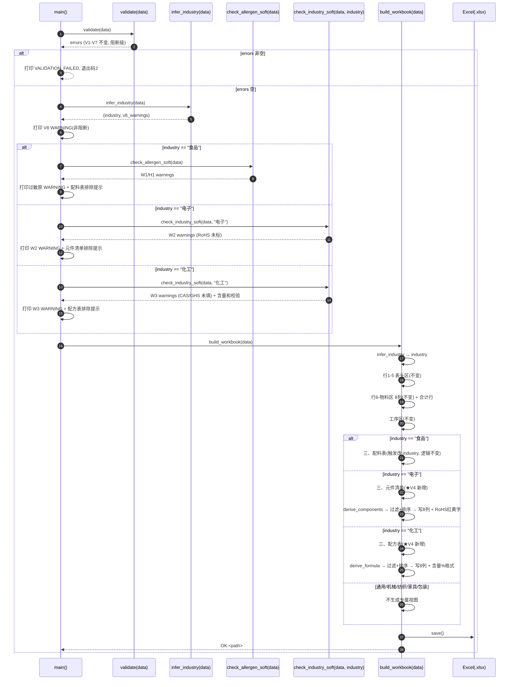
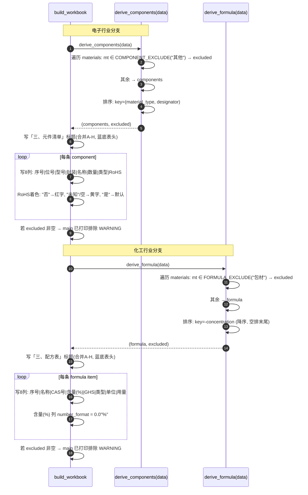
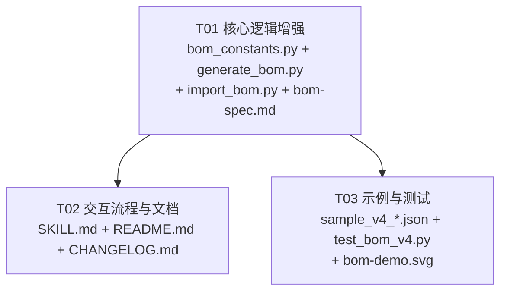

# BOM 智造师 · 增量增强 V4 — 架构设计与任务分解

> 文档类型：架构设计 + 任务分解（增量开发，作用于现有 Skill V2.1/V3）
> 作者：软件架构师（高见远）
> 日期：2026-07-08
> 适用范围：`generate_bom.py`（正向）、`import_bom.py`（逆向）、`bom-spec.md`、`SKILL.md`、`README.md`、`CHANGELOG.md`、`bom_constants.py`（新增）、示例与测试
> 决策基线：主理人齐活林拍板的 V4 范围（P0×6 + P1×2），已锁定，**不自行增删**；明确排除纺织评估 / 位号展开 / P2 全部。

---

## 0. V4 范围速览（主理人锁定，硬性约束）

| 优先级 | 编号 | 项 | 关键约束 |
|--------|------|----|----------|
| **P0-1** | industry 字段 + 推断 | BOM 级 `industry`（8 值枚举，选填）；未填按 `category` 推断（食品→食品，日化/医药→化工，其他→通用）；现有 JSON 行为零变化 |
| **P0-2** | 电子元件清单视图 | industry=="电子" 时，工序区后追加「三、元件清单」派生区块（8 列 A–H）；新增物料级 designator/footprint/part_number/rohs；排除 material_type=="其他"；按类型分组+位号排序；RoHS 红黄字标记 |
| **P0-3** | 化工配方表视图 | industry=="化工" 时，工序区后追加「三、配方表」派生区块（8 列 A–H）；新增物料级 cas_number/concentration/ghs_hazard；排除 material_type=="包材"；按含量降序；含量(%) 格式 0.0"%" |
| **P0-4** | 通用兜底 | industry=="通用"/机械/纺织/家具/包装 → 只输出物料区+工序BOM+合计行，不生成专属视图（与 V3 非食品一致） |
| **P0-5** | 交互流程适配 | 阶段零追加 industry 可选问题（默认推断）；阶段一物料模板按 industry 动态追加专属字段；汇总确认展示专属视图预览 |
| **P0-6** | 逆向导入兼容 | 识别「三、元件清单」/「三、配方表」区块标记；按物料名回收专属字段；解析/推断 industry；旧 Excel 完全兼容 |
| **P1-7** | 行业专属软校验 | W2：电子物料未标 rohs → WARNING；W3：化工物料未填 cas_number/ghs_hazard → WARNING；配方表含量(%) 列和 ≈100%（±5%）→ WARNING |
| **P1-8** | 执行标准行业建议 | 选行业后 standard 建议值：电子→GB/T 39560，化工→GB/T 16483-2008，食品→GB 7718-2025（现有）；仅建议可覆盖 |

**明确排除（不做）**：P1-3 纺织行业评估、P1-4 位号展开（P0 按 usage 原值显示数量）、P2 全部（行业模板预设 / 成本视图 / 多行业混合 BOM）。

> **关键约束**：物料区 8 列**永不变**；专属视图均为工序区后的「三、」派生区块；食品配料表触发条件从 `category == "食品"` 改为 `industry == "食品"`（含推断）；全产品出品率保持 `130.0%`；不引入新依赖。

---

## 1. 实现方案 + 框架选型

### 1.1 技术难点与方案

| 难点 | 方案 | 理由 |
|------|------|------|
| `industry` 推断逻辑需正向/逆向共用 | 新增 `scripts/bom_constants.py`，定义 `INDUSTRIES`/`CATEGORY_TO_INDUSTRY`/`COMPONENT_TYPES`/`FORMULA_TYPES`/`INDUSTRY_STANDARD`；两脚本均 `from bom_constants import ...` | 单一真相源，避免两文件各自复制漂移；纯 Python 标准库无新依赖 |
| 向后兼容：旧 JSON 无 industry → 行为零变化 | `infer_industry(data)` 函数：显式 industry 优先 → 否则按 category 推断 → 非法值 WARNING 回退推断 | 现有食品 JSON 无 industry → 推断"食品" → 配料表照常；现有非食品 → 推断"通用" → 无专属视图 |
| 物料区 8 列不变 + 专属字段仅存 JSON | 仿照 `allergen` 模式：designator/footprint/part_number/rohs/cas_number/concentration/ghs_hazard 存 JSON 但不进物料区 8 列，仅在专属视图展示 | 与 V3 allergen 处理模式完全一致，零结构风险 |
| 电子元件清单派生（过滤+排序+RoHS标记） | 新增 `derive_components(data)` 纯函数：排除 material_type=="其他" → 按物料类型分组+位号字母数字排序 → 返回 (components, excluded) | 与 `derive_ingredients` 同构，工程师易实现 |
| 化工配方表派生（过滤+排序+含量格式） | 新增 `derive_formula(data)` 纯函数：排除 material_type=="包材" → 按浓度降序 → 返回 (formula, excluded) | 与 `derive_ingredients` 同构 |
| RoHS 合规红黄字标记 | build_workbook 中按 rohs 值动态设置 Font color：`"否"`→红色 `"FF0000"`，`"未知"`/空→黄色 `"BF8F00"`；`"是"`→默认 | openpyxl Font 原生支持，无额外依赖 |
| 配料表触发条件 category→industry 切换 | `derive_ingredients(data, industry=None)` 增加可选参数；build_workbook/main 统一先调 `infer_industry` 再传参 | 核心逻辑（过滤/排序/占比）完全不变，仅触发条件改 |
| 逆向识别元件清单/配方表区块 + 回收专属字段 | 仿照现有配料表过敏原回收：`_find_marker_row(ws, "三、元件清单")` → `_map_header` → 按物料名匹配回写 designator/footprint/part_number/rohs | 与现有过敏原回收机制同构，代码模式复用 |
| 逆向推断 industry | 从「三、」区块标记推断（有元件清单→电子，有配方表→化工，有配料表→食品）→ 否则按 category 推断 | 无需在 Excel 表头新增 industry 单元格，零格式变更 |

### 1.2 框架选型（明确结论）

- **语言/运行时**：Python 3（沿用）。
- **依赖库**：仅 `openpyxl`（沿用，缺失自装机制不变）。**不引入任何新依赖**。
- **新增共享模块**：`scripts/bom_constants.py`（纯常量 + 推断映射，无第三方依赖）。
- **CLI 接口保持不变**：
  - 正向：`python3 generate_bom.py --data <file.json> --out <file.xlsx>`
  - 逆向：`python3 import_bom.py --in <file.xlsx> [--out <data.json>]`
- **Excel 列数结论**：物料区 8 列（A–H）**不变**；元件清单 8 列（A–H）**新增**；配方表 8 列（A–H）**新增**；配料表 7 列（A–G）**不变**。

---

## 2. 文件列表及相对路径（本版修改/新增）

| 文件 | 类型 | 本版动作 | 说明 |
|------|------|----------|------|
| `scripts/bom_constants.py` | **新增** | 创建 | V4 共享常量：`INDUSTRIES`、`CATEGORY_TO_INDUSTRY`、`COMPONENT_TYPES`、`FORMULA_TYPES`、`INDUSTRY_STANDARD`。两脚本均 import |
| `scripts/generate_bom.py` | 修改 | 增强 | ① `from bom_constants import ...`；② 新增 `infer_industry(data)`；③ 新增 `derive_components(data)` / `derive_formula(data)`；④ 新增 `check_industry_soft(data, industry)`（W2/W3/含量和校验）；⑤ `validate` 增 V8（industry 枚举软校验）；⑥ `derive_ingredients` 增可选 `industry` 参数；⑦ `build_workbook` 按 industry 分支派生元件清单/配方表区块 + RoHS 红黄字；⑧ `main` 中配料表/过敏原触发改 industry |
| `scripts/import_bom.py` | 修改 | 增强 | ① `from bom_constants import ...`；② 新增 `_infer_industry_from_blocks()`；③ 识别「三、元件清单」/「三、配方表」区块标记 → 按物料名回收专属字段；④ 输出 JSON 增 `industry` 字段；⑤ 物料对象增专属字段默认空串；⑥ 旧 Excel 完全兼容 |
| `references/bom-spec.md` | 修改 | 更新 | 新增 `industry` 字段定义 + 推断逻辑；新增物料级 7 字段 schema；新增元件清单/配方表列定义与区块规则；更新逆向规则；更新向后兼容表 |
| `SKILL.md` | 修改 | 更新 | 阶段零追加 industry 可选问题（8 选 + 默认推断）；阶段一物料模板按 industry 动态追加专属字段；汇总确认展示专属视图预览；执行标准行业建议（P1） |
| `README.md` | 修改 | 更新 | 字段校验表加 industry/专属字段；Excel 结构说明加元件清单/配方表；示例与已知限制更新 |
| `CHANGELOG.md` | 修改 | 追加 | 新增 `[V4.0]` 段，记录全部变更 |
| `examples/sample_bom_v4_electronic.json` | **新增** | 创建 | 电子行业示例 JSON（含 designator/footprint/part_number/rohs，industry="电子"） |
| `examples/sample_bom_v4_chemical.json` | **新增** | 创建 | 化工行业示例 JSON（含 cas_number/concentration/ghs_hazard，industry="化工"） |
| `references/bom-demo.svg` | 修改 | 更绘 | 追加电子元件清单/化工配方表区块示意图 |
| `tests/test_bom_v4.py` | **新增** | 创建 | V4 增量测试：industry 推断、元件清单派生、配方表派生、RoHS 标记、W2/W3 软校验、含量和校验、逆向区块回收、旧 Excel 兼容 |

> 既有 `examples/sample_bom_v3.json` / V2 样例保留不动（供回归对照）。

---

## 3. 数据结构和接口

### 3.1 输入 JSON Schema（V4 增量部分）

```json
{
  "product_name": "STM32 最小系统板",
  "category": "工业品",
  "industry": "电子",
  "output_rate": 100,
  "version": "V1.0",
  "date": "2026-07-08",
  "approver": "李工",
  "effective_date": "2026-07-15",
  "standard": "GB/T 39560",
  "materials": [
    {
      "name": "贴片电阻",
      "unit": "个",
      "usage": 4,
      "yield_rate": 100,
      "erp_code": "R-001",
      "material_type": "电阻",
      "process": "S01",
      "allergen": "",
      "designator": "R1-R4",
      "footprint": "0402",
      "part_number": "10kΩ 1%",
      "rohs": "是"
    }
  ],
  "processes": [
    {"step_no": "S01", "name": "SMT贴片", "desc": "回流焊", "work_hours": 5, "note": "", "output": "贴片完成板"}
  ]
}
```

### 3.2 字段约束总表（V4 增量部分，沿用字段见 bom-spec.md）

| JSON 路径 | 类型 | 必填 | 约束 / 默认值 | 说明 | 新增 |
|-----------|------|------|--------------|------|------|
| `industry` | string(enum) | 选填 | ∈ {食品,电子,化工,机械,纺织,家具,包装,通用}；默认按 `category` 推断 | 决定生成哪个专属派生视图；非法值 V8 WARNING 回退推断 | **V4** |
| `materials[].designator` | string | 选填 | 默认 `""`；多个逗号分隔或区间（R1-R4） | 电子位号；仅元件清单展示 | **V4** |
| `materials[].footprint` | string | 选填 | 默认 `""` | 电子封装（0402/SOT-23 等）；仅元件清单展示 | **V4** |
| `materials[].part_number` | string | 选填 | 默认 `""` | 电子型号/规格；仅元件清单展示 | **V4** |
| `materials[].rohs` | string | 选填 | 默认 `""`；值 ∈ {是, 否, 未知} | RoHS 合规状态；元件清单展示+红黄字标记+W2 软校验 | **V4** |
| `materials[].cas_number` | string | 选填 | 默认 `""` | 化工 CAS 号；仅配方表展示+W3 软校验 | **V4** |
| `materials[].concentration` | number | 选填 | 默认 `""`；0–100 | 化工含量/浓度(%)；配方表展示+列和校验 | **V4** |
| `materials[].ghs_hazard` | string | 选填 | 默认 `""`；逗号分隔 | 化工 GHS 危险标识；配方表展示+W3 软校验 | **V4** |

> **物料区 8 列不变**：以上 7 个专属字段存 JSON 但**不显示在物料区 8 列中**，仅在行业专属派生视图中展示（与 `allergen` 处理模式完全一致）。

### 3.3 industry 推断逻辑（伪代码）

```python
def infer_industry(data):
    """推断 industry：显式 > category 推断。返回 (industry, warnings)。

    - industry 已显式设置且合法 → 使用该值，warnings=[]
    - industry 已显式设置但非法 → V8 WARNING，回退为推断值
    - industry 未设置 → 按 category 推断（食品→食品，日化/医药→化工，其他→通用）
    """
    industry = str(data.get("industry") or "").strip()
    category = str(data.get("category") or "其他").strip()

    if industry:
        if industry in INDUSTRIES:
            return industry, []
        # V8: 非法值 WARNING（非阻断），回退推断
        warning = (
            "WARNING: industry 值『%s』不在枚举内"
            "（食品/电子/化工/机械/纺织/家具/包装/通用），已回退为推断值"
            % industry
        )
        return CATEGORY_TO_INDUSTRY.get(category, "通用"), [warning]

    # 未填 → 按 category 推断
    return CATEGORY_TO_INDUSTRY.get(category, "通用"), []
```

**推断映射表（`CATEGORY_TO_INDUSTRY`）**：

| category | → industry | 说明 |
|----------|-----------|------|
| 食品 | 食品 | 触发配料表（与 V3 一致） |
| 日化化妆品 | 化工 | 日化归化工 |
| 医药 | 化工 | 医药归化工 |
| 工业品 | 通用 | 归通用 |
| 其他 | 通用 | 归通用 |

> **向后兼容核心**：现有食品 JSON 无 `industry` → 推断"食品" → 触发配料表 → 行为与 V3 完全一致。现有非食品 JSON → 推断"通用" → 不生成专属视图 → 行为与 V3 完全一致。

### 3.4 共享常量定义（`scripts/bom_constants.py`）

```python
# === V4 行业枚举 ===
INDUSTRIES = {"食品", "电子", "化工", "机械", "纺织", "家具", "包装", "通用"}

# category → industry 推断映射（向后兼容核心）
CATEGORY_TO_INDUSTRY = {
    "食品": "食品",
    "日化化妆品": "化工",
    "医药": "化工",
    "工业品": "通用",
    "其他": "通用",
}

# === 电子行业 ===
# 元件物料类型建议值（交互引导，非强制枚举）
COMPONENT_TYPES = ["电阻", "电容", "IC", "连接器", "二极管", "三极管", "晶振", "其他"]
# 元件清单过滤排除集（material_type 在此集合内的物料不进元件清单）
COMPONENT_EXCLUDE = {"其他"}

# === 化工行业 ===
# 配方原料物料类型建议值
FORMULA_TYPES = ["主料", "溶剂", "催化剂", "添加剂", "包材", "其他"]
# 配方表过滤排除集
FORMULA_EXCLUDE = {"包材"}

# === 执行标准行业建议（P1） ===
INDUSTRY_STANDARD = {
    "食品": "GB 7718-2025",
    "电子": "GB/T 39560",
    "化工": "GB/T 16483-2008",
}
```

### 3.5 派生函数签名与逻辑

#### `derive_components(data)` — 电子元件清单派生

```python
def derive_components(data):
    """派生元件清单（仅电子行业）。

    返回 (components, excluded)：
    - components: 电子元件物料（排除 material_type ∈ COMPONENT_EXCLUDE，即"其他"类）
    - excluded: 被排除的物料（散热片/外壳/包装等）

    排序：按物料类型分组 → 同类型内按位号(designator)字母数字排序。
    """
    components, excluded = [], []
    for m in data.get("materials", []):
        mt = str(m.get("material_type") or "其他").strip() or "其他"
        if mt in COMPONENT_EXCLUDE:
            excluded.append(m)
        else:
            components.append(m)

    # 排序：物料类型（升序）→ 位号（字母数字升序，空排末尾）
    components.sort(key=lambda x: (
        str(x.get("material_type") or ""),
        str(x.get("designator") or "\uffff"),  # 空位号排末尾
    ))
    return components, excluded
```

#### `derive_formula(data)` — 化工配方表派生

```python
def derive_formula(data):
    """派生配方表（仅化工行业）。

    返回 (formula, excluded)：
    - formula: 配方原料（排除 material_type ∈ FORMULA_EXCLUDE，即"包材"类）
    - excluded: 被排除的物料（瓶子/标签等包材）

    排序：按含量(%) 降序（配方表惯例，主成分在前）。含量为空的排末尾。
    """
    formula, excluded = [], []
    for m in data.get("materials", []):
        mt = str(m.get("material_type") or "其他").strip() or "其他"
        if mt in FORMULA_EXCLUDE:
            excluded.append(m)
        else:
            formula.append(m)

    # 排序：含量(%) 降序，空值排末尾
    formula.sort(key=lambda x: (
        -(float(x.get("concentration") or 0)),  # 降序
    ))
    return formula, excluded
```

#### `derive_ingredients(data, industry=None)` — 配料表派生（V4 微调）

```python
def derive_ingredients(data, industry=None):
    """派生配料表（仅食品行业）。

    V4 变更：触发条件从 category=="食品" 改为 industry=="食品"（含推断）。
    核心逻辑（过滤 EDIBLE / 排序 / 返回）完全不变。

    industry=None 时内部调用 infer_industry 推断（向后兼容旧调用）。
    """
    ingredients, excluded = [], []
    for m in data.get("materials", []):
        mt = str(m.get("material_type") or "其他").strip() or "其他"
        if mt in EDIBLE:
            ingredients.append(m)
        else:
            excluded.append(m)

    if industry is None:
        industry, _ = infer_industry(data)
    if industry != "食品":
        return [], excluded

    ingredients.sort(key=lambda x: float(x.get("usage") or 0), reverse=True)
    return ingredients, excluded
```

#### `check_industry_soft(data, industry)` — 行业专属软校验（W2/W3，非阻断）

```python
def check_industry_soft(data, industry):
    """行业专属软校验（W2/W3，非阻断 WARNING）。

    - W2：industry=="电子" 且物料（未排除的）未标 rohs → WARNING
    - W3：industry=="化工" 且配方原料未填 cas_number 或 ghs_hazard → WARNING
    - 含量(%) 列和校验：所有配方原料均填了 concentration → 校验列和 ≈ 100%（±5%）→ 不达标 WARNING
    """
    warnings = []
    if industry == "电子":
        components, _ = derive_components(data)
        for m in components:
            rohs = str(m.get("rohs") or "").strip()
            if not rohs:
                warnings.append(
                    "WARNING: 物料『%s』未标注 RoHS 合规状态，请确认" % m.get("name", "")
                )
    elif industry == "化工":
        formula, _ = derive_formula(data)
        for m in formula:
            cas = str(m.get("cas_number") or "").strip()
            ghs = str(m.get("ghs_hazard") or "").strip()
            if not cas:
                warnings.append(
                    "WARNING: 物料『%s』未填写 CAS 号，请确认" % m.get("name", "")
                )
            if not ghs:
                warnings.append(
                    "WARNING: 物料『%s』未填写 GHS 危险标识，请确认" % m.get("name", "")
                )
        # 含量(%) 列和校验
        concs = [float(m.get("concentration") or 0) for m in formula]
        if concs and all(c > 0 for c in concs):
            total = sum(concs)
            if abs(total - 100.0) > 5.0:
                warnings.append(
                    "WARNING: 配方表含量(%%) 列和为 %.1f%%，偏离 100%% 超过 ±5%%，请确认" % total
                )
    return warnings
```

### 3.6 类图（Mermaid classDiagram）

```mermaid
classDiagram
    class BOM {
        +string product_name «必填非空 R1»
        +enum category «必填,5类 R1/R4»
        +string industry «选填,8值枚举,默认推断»  «V4»
        +number output_rate «必填,>0 R2»
        +string version «默认V1.0»
        +string date «默认当天»
        +string approver «选填,默认""»
        +string effective_date «选填,默认""»
        +string standard «选填,默认""»
    }
    class Material {
        +string name «必填»
        +string unit «必填»
        +number usage «必填>0»
        +number yield_rate «0<值≤100 R2»
        +string erp_code «选填»
        +string material_type «选填»
        +string process «选填,引用step_no»
        +string allergen «选填,默认""»
        +string designator «选填,默认""»  «V4电子»
        +string footprint «选填,默认""»  «V4电子»
        +string part_number «选填,默认""»  «V4电子»
        +string rohs «选填,是/否/未知»  «V4电子»
        +string cas_number «选填,默认""»  «V4化工»
        +number concentration «选填,0-100»  «V4化工»
        +string ghs_hazard «选填,默认""»  «V4化工»
    }
    class Process {
        +string step_no «必填唯一»
        +string name «必填»
        +string desc
        +work_hours «≥0»
        +string note
        +string output «必填,产物 R3»
    }
    class BomConstants {
        +set INDUSTRIES «8值枚举»
        +dict CATEGORY_TO_INDUSTRY «推断映射»
        +list COMPONENT_TYPES «电子建议值»
        +set COMPONENT_EXCLUDE «排除=其他»
        +list FORMULA_TYPES «化工建议值»
        +set FORMULA_EXCLUDE «排除=包材»
        +dict INDUSTRY_STANDARD «标准建议»
    }
    class BOMGenerator {
        +validate(data) errors
        +infer_industry(data) (industry, warnings)  «V4»
        +derive_ingredients(data, industry) (ingredients, excluded)
        +ingredient_pct(items) (pct_list, total)
        +check_allergen_soft(data) warnings
        +derive_components(data) (components, excluded)  «V4»
        +derive_formula(data) (formula, excluded)  «V4»
        +check_industry_soft(data, industry) warnings  «V4 W2/W3»
        +build_workbook(data) wb
    }
    class BOMImporter {
        +parse_bom(path) data
        -_infer_industry_from_blocks(ws, category) industry  «V4»
        -_recover_special_fields(ws, marker, fields, materials)  «V4»
    }
    BOM "1" o-- "0..*" Material : materials[]
    BOM "1" o-- "0..*" Process : processes[]
    Material "..>" Process : process 引用 step_no
    BOMGenerator ..> BOM : 读/写
    BOMImporter ..> BOM : 重建
    BOMGenerator ..> BomConstants : 引用常量
    BOMImporter ..> BomConstants : 引用常量
```

### 3.7 Excel 列定义（V4 最终列序，硬性）

**物料区（8 列 A–H，不变）**

| 列 | A | B | C | D | E | F | G | H |
|----|---|---|---|---|---|---|---|---|
| 表头 | 序号 | 物料名称 | 单位 | 用量 | 出品率(%) | ERP物料代码 | 物料类型 | 所属工序 |
| 取值 | 1..N | name | unit | usage | yield_rate | erp_code | material_type | process |

> 行业专属字段（designator/footprint/part_number/rohs/cas_number/concentration/ghs_hazard/allergen）**不进物料区**，仅存 JSON。

**配料表（7 列 A–G，仅 industry==食品，不变）**

| 列 | A | B | C | D | E | F | G |
|----|---|---|---|---|---|---|---|
| 表头 | 物料名称 | 物料类型 | 计量单位 | 用量 | 出品率(%) | 用量占比% | 过敏原 |
| 取值 | name | material_type | unit | usage | yield_rate | ingredient_pct[i] | allergen |

**元件清单（8 列 A–H，仅 industry==电子，★V4 新增）**

| 列 | A | B | C | D | E | F | G | H |
|----|---|---|---|---|---|---|---|---|
| 表头 | 序号 | 位号(Designator) | 型号(Part#) | 封装(Footprint) | 物料名称 | 数量 | 物料类型 | RoHS |
| 取值 | 1..N | designator | part_number | footprint | name | usage | material_type | rohs |
| 对齐 | center | center | left | center | left | center | center | center |
| 特殊 | — | — | — | — | — | — | — | rohs=="否"→红字; rohs=="未知"/空→黄字 |

**配方表（8 列 A–H，仅 industry==化工，★V4 新增）**

| 列 | A | B | C | D | E | F | G | H |
|----|---|---|---|---|---|---|---|---|
| 表头 | 序号 | 物料名称 | CAS号 | 含量(%) | GHS标识 | 物料类型 | 计量单位 | 用量 |
| 取值 | 1..N | name | cas_number | concentration | ghs_hazard | material_type | unit | usage |
| 对齐 | center | left | center | center | left | center | center | center |
| 特殊 | — | — | — | 0.0"%" | — | — | — | — |

### 3.8 Excel 列字母映射表（全区块统一参考）

| 区块 | A | B | C | D | E | F | G | H |
|------|---|---|---|---|---|---|---|---|
| 物料区(8列) | 序号 | 物料名称 | 单位 | 用量 | 出品率(%) | ERP物料代码 | 物料类型 | 所属工序 |
| 工序区(6列) | 工序编号 | 工序名称 | 工序说明 | 工时 | 备注 | 产物 | (空) | (空) |
| 配料表(7列) | 物料名称 | 物料类型 | 计量单位 | 用量 | 出品率(%) | 用量占比% | 过敏原 | (空) |
| **元件清单(8列) ★V4** | 序号 | 位号(Designator) | 型号(Part#) | 封装(Footprint) | 物料名称 | 数量 | 物料类型 | RoHS |
| **配方表(8列) ★V4** | 序号 | 物料名称 | CAS号 | 含量(%) | GHS标识 | 物料类型 | 计量单位 | 用量 |

> 列宽沿用 V3（全表共享）：`[6, 18, 10, 10, 13, 16, 13, 12]`（A–H）。元件清单的位号(B=18)与配方表的物料名称(B=18)复用物料名称列宽，足够展示。

---

## 4. 程序调用流程（时序图）

### 4.1 generate_bom 主流程：industry 推断 → 物料区 → 工序区 → 按 industry 分支派生视图



### 4.2 derive_components() / derive_formula() 内部流程



### 4.3 import_bom 区块识别 + 专属字段回收流程

```mermaid
sequenceDiagram
    autonumber
    participant I as import_bom.parse_bom
    participant X as Excel

    I->>X: load_workbook(path)
    I->>I: 扫描表头区: product_name/category/output_rate/版本号/日期/审批人/...
    I->>I: _map_header(物料表头) → 列映射(不变)
    I->>I: 解析物料行(跳过【分组】/合计行, 不变)
    I->>I: 解析工序行(不变)

    Note over I: V4 新增: 推断 industry
    I->>I: _find_marker_row("三、元件清单")?
    alt 找到「三、元件清单」
        I->>I: industry = "电子"
        I->>I: _map_header(元件清单表头) → 列映射
        loop 逐行(到空行止)
            I->>I: 按物料名称匹配 → 回收 designator/footprint/part_number/rohs
        end
    else 找到「三、配方表」
        I->>I: industry = "化工"
        I->>I: _map_header(配方表表头) → 列映射
        loop 逐行(到空行止)
            I->>I: 按物料名称匹配 → 回收 cas_number/concentration/ghs_hazard
        end
    else 找到「三、配料表」
        I->>I: industry = "食品"
        I->>I: 按物料名称回收 allergen(现有逻辑不变)
    else 无「三、」区块
        I->>I: industry = CATEGORY_TO_INDUSTRY.get(category, "通用")
    end

    Note over I: 物料对象补全专属字段默认空串
    I->>I: 每条 material 补 designator/footprint/part_number/rohs/cas_number/concentration/ghs_hazard = ""(未回收的)
    I-->>X: 输出 JSON(含 industry + 专属字段; 旧文件无则默认空/推断)
```

---

## 5. 任务列表（有序、含依赖，T01–T03）

### 任务分解规则说明

本版为**增量增强**（非新建项目），任务按功能模块分组，每个任务包含 ≥3 个相关文件，总计 3 个任务。

| 任务 | 名称 | 负责文件 | 改什么 | 依赖 | 优先级 |
|------|------|----------|--------|------|--------|
| **T01** | 核心逻辑增强 — industry 推断 + 派生视图 + 软校验 + 逆向兼容 | `scripts/bom_constants.py`(新)、`scripts/generate_bom.py`、`scripts/import_bom.py`、`references/bom-spec.md` | ① 新建 `bom_constants.py`（INDUSTRIES/CATEGORY_TO_INDUSTRY/COMPONENT_TYPES/FORMULA_TYPES/INDUSTRY_STANDARD）；② `generate_bom.py`：`from bom_constants import`；新增 `infer_industry()` / `derive_components()` / `derive_formula()` / `check_industry_soft()`；`derive_ingredients` 增 `industry` 可选参数；`validate` 增 V8 软校验（非阻断）；`build_workbook` 按 industry 分支写元件清单/配方表区块 + RoHS 红黄字 + 含量%格式；`main` 中配料表/过敏原触发改 industry + 增 W2/W3 打印；③ `import_bom.py`：`from bom_constants import`；新增 `_infer_industry_from_blocks()`；识别元件清单/配方表区块 → 按物料名回收专属字段；输出 JSON 增 `industry` + 专属字段默认空串；旧 Excel 完全兼容；④ `bom-spec.md`：更新 JSON Schema（industry + 7 专属字段）、Excel 列定义（元件清单/配方表）、推断逻辑、逆向规则、向后兼容表 | — | P0 |
| **T02** | 交互流程与文档适配 | `SKILL.md`、`README.md`、`CHANGELOG.md` | ① `SKILL.md`：阶段零追加 industry 可选问题（8 选 + 默认推断 + 直接回车跳过）；阶段一物料模板按 industry 动态追加专属字段（电子→designator/footprint/part_number/rohs；化工→cas_number/concentration/ghs_hazard）；汇总确认展示对应专属视图预览；执行标准行业建议（P1：电子→GB/T 39560，化工→GB/T 16483-2008，食品→GB 7718-2025）；数据校验补 V8/W2/W3 说明；② `README.md`：字段校验表加 industry/专属字段；Excel 结构说明加元件清单/配方表区块；向后兼容说明；已知限制更新；③ `CHANGELOG.md`：追加 `[V4.0]` 段 | T01 | P0+P1 |
| **T03** | 示例与测试 | `examples/sample_bom_v4_electronic.json`(新)、`examples/sample_bom_v4_chemical.json`(新)、`tests/test_bom_v4.py`(新)、`references/bom-demo.svg` | ① 新建电子行业示例 JSON（含 designator/footprint/part_number/rohs，industry="电子"，含被排除的"其他"类物料验证过滤）；② 新建化工行业示例 JSON（含 cas_number/concentration/ghs_hazard，industry="化工"，含被排除的"包材"类物料验证过滤，含量和=100%）；③ 新建 `test_bom_v4.py`：industry 推断（食品/日化/医药/工业品/其他）、V8 非法值回退、元件清单派生（过滤+排序）、配方表派生（过滤+排序）、RoHS 红黄字标记断言、W2/W3 软校验、含量和校验（±5%）、逆向区块识别+专属字段回收、旧 Excel（无 industry/无专属区块）兼容、食品配料表触发改 industry 后行为不变；同时跑 `test_bom_v2.py`/`test_bom_v3.py` 确保不回归；④ `bom-demo.svg`：追加电子元件清单/化工配方表区块示意图 | T01 | P0+P1 |

### 5.1 任务依赖图（Mermaid graph）



> **依赖说明**：T01 是核心代码与数据契约（bom-spec.md），T02 文档和 T03 示例/测试均依赖 T01 的接口定义。T02 与 T03 之间无依赖，可并行。

---

## 6. 依赖包列表

```
- openpyxl  # 唯一第三方依赖，沿用；缺失时脚本自动 pip install
- （无新增依赖）本版仅新增 scripts/bom_constants.py（纯 Python 标准库，无第三方依赖）
```

> 不引入任何新依赖（无 jsonschema / pandas / 额外 GUI 库）。演示图继续用 SVG 文本文件。

---

## 7. 共享知识（跨文件约定）

### 7.1 industry 枚举常量定义位置

- `INDUSTRIES` / `CATEGORY_TO_INDUSTRY` / `COMPONENT_TYPES` / `COMPONENT_EXCLUDE` / `FORMULA_TYPES` / `FORMULA_EXCLUDE` / `INDUSTRY_STANDARD` **统一定义于 `scripts/bom_constants.py`**。
- `generate_bom.py` 与 `import_bom.py` 均 `from bom_constants import ...`。
- 现有 `CATEGORIES` / `EDIBLE` / `ALLERGEN_SET` / `ALLERGEN_HINTS` 保留在 `generate_bom.py` 内联（不做迁移，避免回归风险）。

### 7.2 推断逻辑（category → industry 映射）

| category | → industry | 配料表/专属视图 |
|----------|-----------|----------------|
| 食品 | 食品 | 配料表（现有，触发改 industry） |
| 日化化妆品 | 化工 | 配方表（V4 新增） |
| 医药 | 化工 | 配方表（V4 新增） |
| 工业品 | 通用 | 无专属视图 |
| 其他 | 通用 | 无专属视图 |

### 7.3 各行业专属视图过滤规则集合

| 行业 | 视图 | 过滤排除集 | 排序规则 | 常量名 |
|------|------|-----------|----------|--------|
| 食品 | 配料表 | material_type ∉ EDIBLE（原料/添加剂/香精香料） | usage 降序 | `EDIBLE`（现有） |
| 电子 | 元件清单 | material_type ∈ {"其他"} | 物料类型升序 → 位号字母数字升序 | `COMPONENT_EXCLUDE` |
| 化工 | 配方表 | material_type ∈ {"包材"} | concentration 降序（空排末尾） | `FORMULA_EXCLUDE` |
| 通用等 | 无 | — | — | — |

### 7.4 列名中文文案统一

| 区块 | 表头文案（精确字符串，勿加空格） |
|------|------|
| 物料区 | `序号\|物料名称\|单位\|用量\|出品率(%)\|ERP物料代码\|物料类型\|所属工序` |
| 工序区 | `工序编号\|工序名称\|工序说明\|工时\|备注\|产物` |
| 配料表 | `物料名称\|物料类型\|计量单位\|用量\|出品率(%)\|用量占比%\|过敏原` |
| **元件清单 ★V4** | `序号\|位号(Designator)\|型号(Part#)\|封装(Footprint)\|物料名称\|数量\|物料类型\|RoHS` |
| **配方表 ★V4** | `序号\|物料名称\|CAS号\|含量(%)\|GHS标识\|物料类型\|计量单位\|用量` |

> 逆向 `_map_header` 时，候选列名需包含中英文括号变体（如 `位号(Designator)` / `位号`、`型号(Part#)` / `型号`、`封装(Footprint)` / `封装`），以兼容用户手动编辑后的表头。

### 7.5 Excel 列字母映射表

| 区块 | A | B | C | D | E | F | G | H |
|------|---|---|---|---|---|---|---|---|
| 物料区(8列,不变) | 序号 | 物料名称 | 单位 | 用量 | 出品率(%) | ERP物料代码 | 物料类型 | 所属工序 |
| 工序区(6列) | 工序编号 | 工序名称 | 工序说明 | 工时 | 备注 | 产物 | (空) | (空) |
| 配料表(7列,不变) | 物料名称 | 物料类型 | 计量单位 | 用量 | 出品率(%) | 用量占比% | 过敏原 | (空) |
| **元件清单(8列) ★V4** | 序号 | 位号(Designator) | 型号(Part#) | 封装(Footprint) | 物料名称 | 数量 | 物料类型 | RoHS |
| **配方表(8列) ★V4** | 序号 | 物料名称 | CAS号 | 含量(%) | GHS标识 | 物料类型 | 计量单位 | 用量 |

- 列宽沿用 V3（全表共享）：`A=6, B=18, C=10, D=10, E=13, F=16, G=13, H=12`。
- 物料区合计行：`A="合计"`, `D=Σ所有物料usage`，其余空（不变）。
- 元件清单/配方表区块标题：合并 A–H，`label_font`（与配料表区块标题样式一致）。
- 元件清单/配方表表头行：蓝底（`head_fill`）+ `head_font` + 居中 + 边框（与物料区/配料表表头样式一致）。

### 7.6 RoHS / GHS 软校验文案

| 校验 | 触发条件 | 文案（精确） |
|------|---------|-------------|
| W2 | industry=="电子" 且物料未标 rohs | `WARNING: 物料『{name}』未标注 RoHS 合规状态，请确认` |
| W3a | industry=="化工" 且物料未填 cas_number | `WARNING: 物料『{name}』未填写 CAS 号，请确认` |
| W3b | industry=="化工" 且物料未填 ghs_hazard | `WARNING: 物料『{name}』未填写 GHS 危险标识，请确认` |
| 含量和 | 化工所有配方原料均填 concentration 且列和偏离 100% 超 ±5% | `WARNING: 配方表含量(%) 列和为 {total:.1f}%，偏离 100% 超过 ±5%，请确认` |
| V8 | industry 非空但不在枚举内 | `WARNING: industry 值『{value}』不在枚举内（食品/电子/化工/机械/纺织/家具/包装/通用），已回退为推断值` |
| 排除提示(电子) | 元件清单排除了"其他"类物料 | `WARNING: 元件清单已排除 {N} 条非元件物料（其他类）：{names}` |
| 排除提示(化工) | 配方表排除了"包材"类物料 | `WARNING: 配方表已排除 {N} 条包材物料：{names}` |

### 7.7 RoHS 着色规则

| rohs 值 | 字体颜色 | 含义 |
|---------|---------|------|
| `"是"` | 默认（`cell_font`，黑色） | 合规 |
| `"否"` | 红色 `"FF0000"` | 不合规 |
| `"未知"` 或 `""`（空） | 黄色 `"BF8F00"` | 待确认 |

> 实现：`Font(name="微软雅黑", size=10, color="FF0000")` / `Font(name="微软雅黑", size=10, color="BF8F00")`。

### 7.8 向后兼容默认值表

| 场景 | 旧 JSON/Excel 缺失项 | V4 默认行为 |
|------|---------------------|-------------|
| 旧 JSON 无 `industry` | — | 按 `category` 推断（食品→食品，日化/医药→化工，其他→通用）→ 行为零变化 |
| 旧 JSON 无专属物料字段 | designator/footprint/part_number/rohs/cas_number/concentration/ghs_hazard | 默认空串 `""` → 专属视图对应列留空 |
| 旧 JSON `industry` 非法值 | 不在 8 值枚举内 | V8 WARNING（非阻断）→ 回退为推断值 |
| 旧 Excel 无「三、元件清单」/「三、配方表」区块 | — | 无区块标记 → 按 category 推断 industry → 完全兼容 |
| 旧 Excel 无 industry 信息 | — | 从「三、」区块标记推断（有元件清单→电子，有配方表→化工，有配料表→食品）→ 否则按 category 推断 |
| 旧 Excel 物料无专属字段列 | — | 回收时未匹配到 → 专属字段默认空串 |
| 现有食品 Excel（有「三、配料表」） | — | 推断 industry=食品 → 配料表照常 → 行为零变化 |

### 7.9 错误/状态前缀（沿用 + V4 新增）

- `VALIDATION_FAILED`（正向阻断，退出码 2）— 不变
- `PARSE_ERROR`（逆向标记缺失，退出码 2）— 不变
- `FILE_ERROR`（Excel 不可读，退出码 2）— 不变
- `WARNING`（**非阻断**）— 沿用现有 + 新增 V8/W2/W3/含量和/排除提示
- `OK:<path|json>`（成功）— 不变

### 7.10 数字格式约定

- `yield_rate` / `output_rate` / `用量占比%` / `含量(%)`：Excel 数字格式 `0.0"%"`（沿用 V3）。
- `output_rate` 显示 **`130.0%`**（V2 已修正，勿退回 `130%`）。
- `concentration`：JSON 存原始数值（如 `70.0`）或空串 `""`；Excel 显示 `70.0%`（`0.0"%"` 格式）或留空。
- 逆向解析 `concentration`：`_to_float()` 转换，空则 `""`。

---

## 8. 待明确事项

主理人已锁定 V4 全部范围（Q1–Q7 已拍板），以下为**非阻断的实现细节**，工程师按推荐直接实现即可：

1. **industry 是否写入 Excel 表头区**：推荐**不写入**。逆向从「三、」区块标记推断（有元件清单→电子，有配方表→化工，有配料表→食品，无→按 category 推断）。理由：零表头格式变更，最大化向后兼容；行业信息已通过专属区块的存在性隐式表达。

2. **元件清单排序中位号为空的处理**：空位号排同类型末尾（排序键用 `"\uffff"` 哨兵）。理由：无位号的物料（如连接器未标位号）不应排在有位号的前面。

3. **配方表含量为空的处理**：空含量排末尾（排序键 concentration 取 0 → 降序排末尾）。Excel 显示留空（不显示 `0.0%`）。理由：未填含量的原料不应显示为 0%。

4. **W2/W3 校验范围**：仅校验**未被过滤排除**的物料（元件清单校验 components，配方表校验 formula）。被排除的"其他"/"包材"类物料不校验。理由：散热片/外壳不需要 RoHS，瓶子/标签不需要 CAS 号。

5. **含量和校验触发条件**：仅当配方表**所有**配方原料均填了 concentration（非空且 > 0）时才校验列和。任一原料未填 → 跳过校验（避免误报）。理由：部分填写时列和无意义。

6. **`derive_ingredients` 签名变更**：增加可选参数 `industry=None`（向后兼容旧调用）。核心逻辑（EDIBLE 过滤 / usage 降序 / 返回 excluded）完全不变。理由：触发条件从 category 改为 industry 需要传入推断值。

7. **bom_constants.py 是否迁移现有常量**：推荐**不迁移**。`CATEGORIES`/`EDIBLE`/`ALLERGEN_SET`/`ALLERGEN_HINTS` 保留在 `generate_bom.py` 内联；`bom_constants.py` 仅放 V4 新增常量。理由：避免对已交付代码做无谓重构，降低回归风险。

> 除上述 7 点实现细节外，无阻塞性问题；主理人锁定范围已完整覆盖本期需求，可直接进入工程实现。

---

## 附：V4 与 V3 结构差异速查

| 维度 | V3（V2.1） | V4 |
|------|----|----|
| BOM 级新字段 | approver / effective_date / standard | **industry**（8 值枚举，选填，默认推断） |
| 物料级新字段 | allergen | **designator / footprint / part_number / rohs**（电子）+ **cas_number / concentration / ghs_hazard**（化工） |
| 物料区列数 | 8（A–H） | **8（A–H，不变）** |
| 专属视图 | 配料表（7 列，仅食品） | 配料表（不变）+ **元件清单（8 列，电子）** + **配方表（8 列，化工）** |
| 配料表触发 | `category == "食品"` | **`industry == "食品"`**（含推断，行为不变） |
| 软校验 | W1（过敏原标签）+ H1（关键词启发式） | W1/H1（不变）+ **W2（RoHS 未标）** + **W3（CAS/GHS 未填）** + **含量和校验** + **V8（industry 枚举）** |
| 逆向区块识别 | 三、配料表 → 回收过敏原 | 三、配料表（不变）+ **三、元件清单 → 回收电子字段** + **三、配方表 → 回收化工字段** |
| 逆向推断 industry | — | **从区块标记推断 + category 推断** |
| 共享模块 | 无（常量内联） | **bom_constants.py**（V4 新增常量） |
| 执行标准建议 | 食品→GB 7718-2025 | + **电子→GB/T 39560** + **化工→GB/T 16483-2008** |
| 向后兼容 | 旧 JSON 缺字段 → 默认空 | 旧 JSON 缺 industry → **推断** → 行为零变化 |
