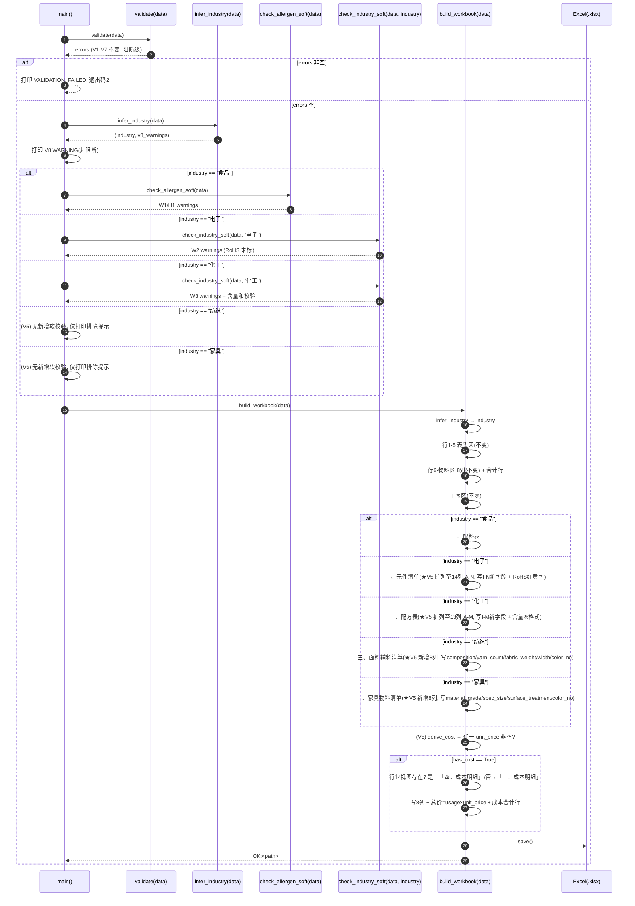
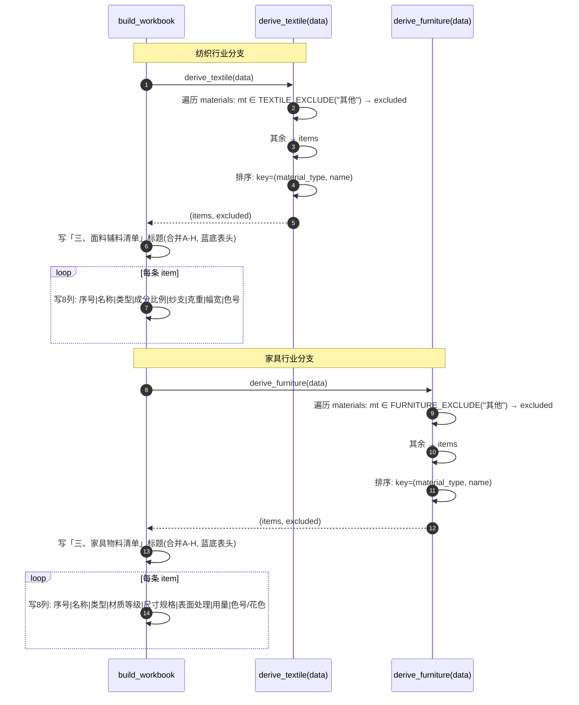
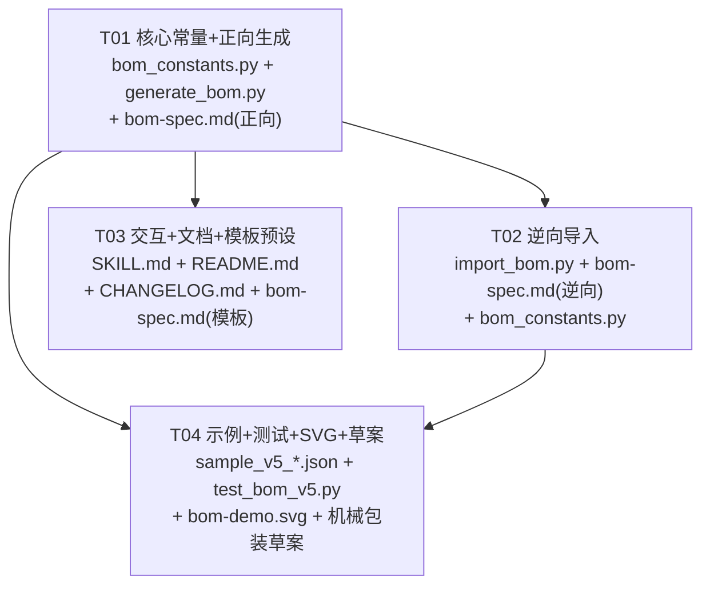

# BOM 智造师 · 增量增强 V5 — 架构设计与任务分解

> 文档类型：架构设计 + 任务分解（增量开发，作用于现有 Skill V4 基线 commit 63a23a9）
> 作者：软件架构师（高见远）
> 日期：2026-07-10
> 适用范围：`generate_bom.py`（正向）、`import_bom.py`（逆向）、`bom_constants.py`（共享常量）、`SKILL.md`/`README.md`/`CHANGELOG.md`/`bom-spec.md`、示例与测试
> 决策基线：主理人齐活林拍板的 V5 范围（P0×4 + P1×2 + P2×2 评估），已锁定，**不自行增删**；明确机械/包装本期仅评估不实现（P2）。V4 契约（物料区 8 列 A–H、industry 8 值枚举与推断逻辑、V8/W1/H1/W2/W3 软校验、逆向「三、」区块推断 industry 等）全部沿用，本文件仅描述**增量变更**。

---

## 0. V5 范围速览（主理人锁定，硬性约束）

| 优先级 | 编号 | 项 | 关键约束 |
|--------|------|----|----------|
| **P0-1** | 纺织专属视图 + 纺织专属字段 | `industry=="纺织"` 时，工序区后追加「三、面料辅料清单」派生区块（8 列 A–H）；新增物料级 `composition/yarn_count/fabric_weight/width/color_no`；排除 `material_type=="其他"`；按物料类型升序→名称升序 | 新增 5 字段（选填默认""，仅 JSON、仅专属视图）；标准建议 FZ/T 80004；逆向从「三、面料辅料清单」marker 回收 |
| **P0-2** | 家具专属视图 + 家具专属字段 | `industry=="家具"` 时追加「三、家具物料清单」派生区块（8 列 A–H）；新增物料级 `material_grade/spec_size/surface_treatment/color_no`；排除 `material_type=="其他"`；按物料类型升序→名称升序 | 新增 4 字段（选填默认""，仅 JSON、仅专属视图）；标准建议 QB/T 1951.1；逆向从 marker 回收 4 字段 |
| **P0-3** | 电子专属字段扩充 | 在 V4 元件清单 8 列基础上向右扩列至 **14 列 A–N**；新增 `manufacturer/tolerance/rated_power/rated_voltage/alternate/reflow_temp` 6 字段 | 并入单区块（三、元件清单），逆向仅识别一个 marker 回收 10 个电子字段（原 4+新 6）；RoHS 红黄字与 W2 校验不变 |
| **P0-4** | 化工专属字段扩充 | 在 V4 配方表 8 列基础上向右扩列至 **13 列 A–M**；新增 `purity/physical_state/flash_point/storage_condition/hazard_class` 5 字段 | 并入单区块（三、配方表），逆向仅识别一个 marker 回收 8 个化工字段（原 3+新 5）；含量(%) 格式与列和校验、W3 不变 |
| **P1-1** | 成本视图（跨行业） | 物料级新增 `unit_price`(number)/`currency`(string enum 默认"人民币(CNY)")；`total_price` 派生展示（=usage×unit_price），**不入库**；Excel 行业视图存在时「四、成本明细」、否则「三、成本明细」，8 列含单价/币种/总价 + 成本合计行 | 任一物料 `unit_price` 非空即生成，全空不生成；逆向以关键字 `成本明细` 识别并回收 `unit_price/currency` |
| **P1-2** | 行业模板预设 | `bom_constants.py` 增 `INDUSTRY_TEMPLATES` 字典（按 industry 预填 material_types/standard/special_fields/preset_processes）；**仅交互引导，不写入新 JSON 字段**；向后兼容旧交互 | 阶段零选 industry 后阶段一按模板动态追加专属字段、material_type 下拉用模板值、standard 自动预填、可选一键载入工序模板 |
| **P2-1/P2-2** | 机械/包装专属视图评估 | 本期**仅评估出草案与"是否需要"结论**，不实现 | 在文档 §8 给出字段草案与结论（建议：暂不需要专属视图，维持通用兜底） |

**明确排除（本期不做）**：机械/包装专属视图实现、位号展开、多行业混合 BOM、任何新第三方依赖。

> **关键约束（沿用 V4）**：物料区 8 列（A–H）**永不变**；所有新字段仅存 JSON、仅在专属视图展示；`industry` 枚举无需扩展（纺织/家具已在 V4 8 值枚举内）；全量向后兼容（旧 JSON/Excel 零变化，新字段默认空）；仅 `openpyxl`，无新依赖。

---

## 1. 实现方案 + 框架选型

### 1.1 技术难点与方案（增量部分）

| 难点 | 方案 | 理由 |
|------|------|------|
| 纺织/家具新增两个同构派生视图 | 新增 `derive_textile(data)` / `derive_furniture(data)` 纯函数：排除 `material_type ∈ {其他}` → 按（物料类型升序→名称升序）排序；返回 (items, excluded)。与 `derive_ingredients`/`derive_components`/`derive_formula` 完全同构 | 复用既有派生范式，工程师零认知负担 |
| 电子/化工专属字段"扩列并入单区块" | 元件清单表头从 8 列扩至 14 列（A–N）、配方表从 8 列扩至 13 列（A–M）；I–N / I–M 为新增列，复用 V4 的 `derive_components`/`derive_formula` 结果，**仅表头与取值列向右扩展** | 主理人拍板 Q2：单区块、逆向只识别一个 marker，闭环最简单；代价是视图更宽，列宽需重新设定（见 §7.5） |
| 成本视图双编号（三/四、） | `build_workbook` 中判定「行业视图是否存在」（`industry ∈ {食品,电子,化工,纺织,家具}` 即存在三、派生块）→ 存在则成本视图为「四、成本明细」，否则「三、成本明细」；逆向以关键字 `成本明细` 识别（兼容前缀） | 主理人拍板 Q3：保证首个派生区块恒为「三、」、成本恒在其后，结构清晰 |
| `total_price` 派生不入库 | `total_price` 不写 JSON（正向输入与逆向输出均不含）；Excel 渲染时按 `usage × unit_price` 实时计算；逆向仅回收 `unit_price`/`currency` | 主理人拍板 Q4：可由用量与单价稳定重算，减少冗余与回写歧义 |
| 跨行业成本块数据来源 | 新增 `derive_cost(data)`：返回所有 `unit_price` 非空（≠"" 且可转 float>0 或 ≥0）的物料（含被行业视图排除的"其他"/"包材"类，因为成本核算面向全物料）；触发：任一物料非空即生成 | 成本核算面向全部物料，不沿用行业视图的过滤集 |
| 行业模板预设仅引导不写入 | `INDUSTRY_TEMPLATES` 仅在 `SKILL.md` 交互层读取，用于动态渲染专属字段行 / material_type 下拉 / standard 预填 / 可选一键载入工序；**JSON Schema 不新增任何结构字段** | 主理人拍板 Q7：仅交互建议，向后兼容旧交互与旧 JSON |
| 逆向回收扩列与新增区块 | 复用 V4 `_recover_block_fields`：纺织/家具/成本新增各自的 `field_col_map`；电子/化工的 `field_col_map` 在 V4 基础上补 I–N / I–M 列映射；`_SPECIAL_FIELDS` 扩至 29 字段用于默认空补全 | 与 V4 回收机制同构，代码模式复用，零格式变更 |
| 逆向 industry 推断扩展 | `_infer_industry_from_blocks` 在 V4 三、元件清单/配方表/配料表 基础上，增「三、面料辅料清单」→纺织、「三、家具物料清单」→家具；成本明细不参与 industry 推断 | 仍从区块标记隐式推断，零表头格式变更 |

### 1.2 框架选型（明确结论，沿用 V4）

- **语言/运行时**：Python 3（沿用）。
- **依赖库**：仅 `openpyxl`（沿用，缺失自装机制不变）。**不引入任何新依赖**。
- **共享模块**：`scripts/bom_constants.py`（V4 已建，V5 增量追加纺织/家具常量 + `INDUSTRY_TEMPLATES` + 扩展 `INDUSTRY_STANDARD`）。
- **CLI 接口保持不变**：
  - 正向：`python3 generate_bom.py --data <file.json> --out <file.xlsx>`
  - 逆向：`python3 import_bom.py --in <file.xlsx> [--out <data.json>]`
- **Excel 列数结论（增量）**：
  - 物料区 8 列（A–H）**不变**。
  - 配料表 7 列（A–G）**不变**。
  - 元件清单 **8→14 列（A–N）**（V5 扩列 I–N）。
  - 配方表 **8→13 列（A–M）**（V5 扩列 I–M）。
  - 新增：面料辅料清单 8 列（A–H）；家具物料清单 8 列（A–H）；成本明细 8 列（A–H）。

---

## 2. 文件列表及相对路径（本版修改/新增）

| 文件 | 类型 | 本版动作 | 说明 |
|------|------|----------|------|
| `scripts/bom_constants.py` | 修改 | 增量增强 | 新增 `TEXTILE_TYPES`/`TEXTILE_EXCLUDE`/`FURNITURE_TYPES`/`FURNITURE_EXCLUDE`；`INDUSTRY_STANDARD` 增 纺织=`FZ/T 80004`、家具=`QB/T 1951.1`；新增 `INDUSTRY_TEMPLATES` 字典（仅交互引导）；`EDIBLE_LIST` 导出（供食品模板 special_fields 引用） |
| `scripts/generate_bom.py` | 修改 | 增量增强 | ① `from bom_constants import ...` 增纺织/家具/模板常量；② 新增 `derive_textile(data)`/`derive_furniture(data)`；③ 新增 `derive_cost(data)`（成本派生）；④ 电子元件清单扩列至 14 列（I–N）、化工配方表扩列至 13 列（I–M），表头与取值向右扩展；⑤ 新增成本视图构建（双编号 三/四、成本明细 + 成本合计行）；⑥ `build_workbook` 按 industry 分支增纺织/家具视图；⑦ `main` 中行业分支增纺织/家具 + 成本视图触发；⑧ 列宽扩展（I–N / I–M / 成本 8 列）；⑨ 不新增阻断/软校验 |
| `scripts/import_bom.py` | 修改 | 增量增强 | ① `_SPECIAL_FIELDS` 扩至 29 字段（含扩列/纺织/家具/成本）；② `_infer_industry_from_blocks` 增纺织/家具 marker；③ 新增纺织/家具/成本 marker 回收（`field_col_map`）；④ 电子/化工 `field_col_map` 补 I–N / I–M；⑤ 工序区停止边界增纺织/家具/cost marker；⑥ 成本以关键字 `成本明细` 识别回收 `unit_price`/`currency` |
| `references/bom-spec.md` | 修改 | 更新 | 新增 V5 物料级 23 字段 + 成本 2 字段（total_price 派生不入库）Schema；字段约束总表增量；Excel 输出结构增纺织/家具视图、电子/化工扩列、成本视图；列宽表增量；区块规则增量；逆向导入章节增量（区块定位、列头映射表、industry 推断扩展、成本回收）；`INDUSTRY_TEMPLATES` 说明章节 |
| `SKILL.md` | 修改 | 更新 | 阶段零 industry 选项增纺织/家具；阶段一物料模板按 `INDUSTRY_TEMPLATES` 动态追加专属字段（纺织 5/家具 4/电子 10/化工 8）；material_type 下拉用模板值；standard 自动预填（可改）；可选「一键载入工序模板」(preset_processes)；汇总确认展示纺织/家具/扩列/成本视图预览；成本字段引导 |
| `README.md` | 修改 | 更新 | 字段校验表增纺织/家具/扩列/成本字段；Excel 结构增纺织/家具视图、电子/化工扩列、成本明细；行业模板预设说明；已知限制更新（机械/包装仅评估） |
| `CHANGELOG.md` | 修改 | 追加 | 新增 `[V5.0]` 段，记录全部变更 |
| `examples/sample_bom_v5_textile.json` | **新增** | 创建 | 纺织行业示例（industry="纺织"，含 composition/yarn_count/fabric_weight/width/color_no，含被排除的"其他"类物料验证过滤） |
| `examples/sample_bom_v5_furniture.json` | **新增** | 创建 | 家具行业示例（industry="家具"，含 material_grade/spec_size/surface_treatment/color_no，含"其他"类验证过滤） |
| `examples/sample_bom_v5_electronic.json` | **新增** | 创建 | 电子行业扩列示例（industry="电子"，含 10 个电子字段，验证 14 列 I–N 展示） |
| `examples/sample_bom_v5_chemical.json` | **新增** | 创建 | 化工行业扩列示例（industry="化工"，含 8 个化工字段，验证 13 列 I–M 展示，含量和=100%） |
| `examples/sample_bom_v5_cost.json` | **新增** | 创建 | 跨行业成本示例（含 unit_price/currency，验证成本明细双编号 + 成本合计行；可叠加在电子/家具 JSON 上验证"四、成本明细"） |
| `tests/test_bom_v5.py` | **新增** | 创建 | V5 增量测试：纺织/家具视图派生（过滤+排序）、电子/化工扩列回收（10/8 字段）、成本视图生成与回收、成本双编号、模板预设结构、旧 Excel 兼容、闭环（正向→逆向→正向字段保全）；同时跑 test_bom_v4.py 确保不回归 |
| `references/bom-demo.svg` | 修改 | 更绘 | 追加纺织面料辅料清单、家具物料清单、电子 14 列扩列、化工 13 列扩列、成本明细示意图 |
| `references/mechanical-packaging-draft-v5.md` | **新增** | 创建 | P2 机械/包装视图字段草案 + "是否需要"评估结论（建议本期不实现） |

> 既有 `examples/sample_bom_v3.json` / `sample_bom_v4_*.json` 与 `tests/test_bom_v2.py`/`test_bom_v3.py`/`test_bom_v4.py` 保留不动（供回归对照）。

---

## 3. 数据结构和接口

### 3.1 输入 JSON Schema（V5 增量部分）

```json
{
  "product_name": "棉麻休闲衬衫",
  "category": "工业品",
  "industry": "纺织",
  "output_rate": 100,
  "version": "V1.0",
  "date": "2026-07-10",
  "approver": "李工",
  "effective_date": "2026-07-15",
  "standard": "FZ/T 80004",
  "materials": [
    {
      "name": "全棉针织布",
      "unit": "米",
      "usage": 2.5,
      "yield_rate": 95,
      "erp_code": "F-001",
      "material_type": "面料",
      "process": "S01",
      "allergen": "",
      "designator": "", "footprint": "", "part_number": "", "rohs": "",
      "cas_number": "", "concentration": "", "ghs_hazard": "",
      "composition": "65%涤35%棉",
      "yarn_count": "32S",
      "fabric_weight": 180,
      "width": "150cm",
      "color_no": "P19-4052"
    }
  ],
  "processes": [
    {"step_no": "S01", "name": "裁剪", "desc": "按版型裁剪", "work_hours": 5, "note": "", "output": "裁片"}
  ]
}
```

> `industry` 枚举**无需扩展**（纺织/家具已在 V4 8 值枚举内）。
> 成本字段示例（可叠加于任意行业物料）：
> `"unit_price": 12.5, "currency": "人民币(CNY)"`（total_price 不写此 JSON，由渲染派生）。

### 3.2 字段约束总表（V5 增量部分，沿用字段见 bom-spec.md）

| JSON 路径 | 类型 | 必填 | 约束 / 默认值 | 说明 | 新增 |
|-----------|------|------|--------------|------|------|
| `industry` | string(enum) | 选填 | ∈ {食品,电子,化工,机械,**纺织**,**家具**,包装,通用}；默认按 `category` 推断 | V4 已含纺织/家具，**V5 无枚举变更** | — |
| `materials[].composition` | string | 选填 | 默认 `""` | 纺织成分比例；仅面料辅料清单展示 | **V5 纺织** |
| `materials[].yarn_count` | string | 选填 | 默认 `""` | 纺织纱支；仅面料辅料清单展示 | **V5 纺织** |
| `materials[].fabric_weight` | number | 选填 | 默认 `""`；展示为数值（如 180） | 纺织克重(g/m²)；仅面料辅料清单展示 | **V5 纺织** |
| `materials[].width` | string | 选填 | 默认 `""` | 纺织幅宽；仅面料辅料清单展示 | **V5 纺织** |
| `materials[].color_no` | string | 选填 | 默认 `""` | 纺织色号；仅面料辅料清单展示 | **V5 纺织** |
| `materials[].material_grade` | string | 选填 | 默认 `""` | 家具材质等级/环保等级；仅家具物料清单展示 | **V5 家具** |
| `materials[].spec_size` | string | 选填 | 默认 `""` | 家具尺寸规格；仅家具物料清单展示 | **V5 家具** |
| `materials[].surface_treatment` | string | 选填 | 默认 `""` | 家具表面处理；仅家具物料清单展示 | **V5 家具** |
| `materials[].color_no`（家具复用同名 key） | string | 选填 | 默认 `""` | 家具色号/花色；仅家具物料清单展示（与纺织同名 JSON key，分属不同行业物料，互不冲突） | **V5 家具** |
| `materials[].manufacturer` | string | 选填 | 默认 `""` | 电子制造商/品牌；仅元件清单 I 列 | **V5 电子** |
| `materials[].tolerance` | string | 选填 | 默认 `""` | 电子容差；仅元件清单 J 列 | **V5 电子** |
| `materials[].rated_power` | string | 选填 | 默认 `""` | 电子额定功率；仅元件清单 K 列 | **V5 电子** |
| `materials[].rated_voltage` | string | 选填 | 默认 `""` | 电子额定电压；仅元件清单 L 列 | **V5 电子** |
| `materials[].alternate` | string | 选填 | 默认 `""` | 电子替代料；仅元件清单 M 列 | **V5 电子** |
| `materials[].reflow_temp` | string | 选填 | 默认 `""` | 电子封装温度/回流焊峰值；仅元件清单 N 列 | **V5 电子** |
| `materials[].purity` | string | 选填 | 默认 `""` | 化工纯度；仅配方表 I 列 | **V5 化工** |
| `materials[].physical_state` | string | 选填 | 默认 `""` | 化工物态；仅配方表 J 列 | **V5 化工** |
| `materials[].flash_point` | string | 选填 | 默认 `""` | 化工闪点；仅配方表 K 列 | **V5 化工** |
| `materials[].storage_condition` | string | 选填 | 默认 `""` | 化工存储条件；仅配方表 L 列 | **V5 化工** |
| `materials[].hazard_class` | string | 选填 | 默认 `""` | 化工危险等级；仅配方表 M 列 | **V5 化工** |
| `materials[].unit_price` | number | 选填 | 默认 `""`；≥0 | 成本单价；仅成本明细 F 列；**入库** | **V5 成本** |
| `materials[].currency` | string(enum) | 选填 | 默认 `"人民币(CNY)"`；∈ {人民币(CNY),美元(USD),欧元(EUR)} | 成本币种；仅成本明细 G 列；**入库** | **V5 成本** |
| `materials[].total_price` | number | 选填（派生） | **不入库**；渲染时 = `usage × unit_price`，保留 2 位小数 | 成本总价；仅成本明细 H 列；逆向跳过 | **V5 成本（派生）** |

> **物料区 8 列不变**：以上 29 个专属字段（23 行业字段 + 2 成本入库字段）存 JSON 但**不显示在物料区 8 列中**，仅在对应专属视图/成本视图展示（与 `allergen` 处理模式完全一致）。`total_price` 不进 JSON。
> **color_no 同名 key 说明**：纺织与家具各用一份 `color_no`，因分属不同 `industry` 的物料对象，JSON 中同一 material 不会同时具备纺织与家具视图字段（行业互斥），无冲突。

### 3.3 共享常量定义（`scripts/bom_constants.py` V5 增量）

```python
# === V5 纺织行业 ===
TEXTILE_TYPES = ["面料", "辅料", "纱线", "印染", "五金", "其他"]
TEXTILE_EXCLUDE = {"其他"}

# === V5 家具行业 ===
FURNITURE_TYPES = ["主材", "板材", "辅材", "五金", "面料", "其他"]
FURNITURE_EXCLUDE = {"其他"}

# === 执行标准行业建议（V4 + V5 增量） ===
INDUSTRY_STANDARD = {
    "食品": "GB 7718-2025",
    "电子": "GB/T 39560",
    "化工": "GB/T 16483-2008",
    "纺织": "FZ/T 80004",      # V5 新增
    "家具": "QB/T 1951.1",     # V5 新增
}

# === V5 食品配料表物料类型列表（供模板 special_fields 引用） ===
EDIBLE_LIST = ["原料", "添加剂", "香精香料"]

# === V5 行业模板预设（仅交互引导，不写入新 JSON 字段） ===
INDUSTRY_TEMPLATES = {
    "电子": {
        "material_types": COMPONENT_TYPES,
        "standard": "GB/T 39560",
        "special_fields": ["designator", "footprint", "part_number", "rohs",
                           "manufacturer", "tolerance", "rated_power",
                           "rated_voltage", "alternate", "reflow_temp"],
        "preset_processes": [
            {"step_no": "S01", "name": "SMT贴片", "desc": "锡膏印刷+贴片", "output": "贴片完成板"},
            {"step_no": "S02", "name": "回流焊", "desc": "回流焊接", "output": "焊接板"},
            {"step_no": "S03", "name": "检测", "desc": "AOI/功能测试", "output": "成品板"},
        ],
    },
    "化工": {
        "material_types": FORMULA_TYPES,
        "standard": "GB/T 16483-2008",
        "special_fields": ["cas_number", "concentration", "ghs_hazard",
                           "purity", "physical_state", "flash_point",
                           "storage_condition", "hazard_class"],
        "preset_processes": [
            {"step_no": "S01", "name": "投料混合", "desc": "按比例投料并搅拌", "output": "混合液"},
            {"step_no": "S02", "name": "灌装", "desc": "灌装入容器", "output": "成品"},
        ],
    },
    "纺织": {
        "material_types": TEXTILE_TYPES,
        "standard": "FZ/T 80004",
        "special_fields": ["composition", "yarn_count", "fabric_weight", "width", "color_no"],
        "preset_processes": [
            {"step_no": "S01", "name": "裁剪", "desc": "按版型裁剪", "output": "裁片"},
            {"step_no": "S02", "name": "缝制", "desc": "缝纫组合", "output": "半成品"},
            {"step_no": "S03", "name": "整烫检验", "desc": "整烫+质检", "output": "成品"},
        ],
    },
    "家具": {
        "material_types": FURNITURE_TYPES,
        "standard": "QB/T 1951.1",
        "special_fields": ["material_grade", "spec_size", "surface_treatment", "color_no"],
        "preset_processes": [
            {"step_no": "S01", "name": "开料", "desc": "板材锯切", "output": "板件"},
            {"step_no": "S02", "name": "封边", "desc": "边部封边", "output": "封边板件"},
            {"step_no": "S03", "name": "组装", "desc": "五金组装", "output": "成品"},
        ],
    },
    "食品": {
        "material_types": EDIBLE_LIST,
        "standard": "GB 7718-2025",
        "special_fields": ["allergen"],
        "preset_processes": [],
    },
    # 通用/机械/包装：空模板（保持通用兜底，不预置专属字段与工序）
    "通用": {"material_types": [], "standard": "", "special_fields": [], "preset_processes": []},
    "机械": {"material_types": [], "standard": "", "special_fields": [], "preset_processes": []},
    "包装": {"material_types": [], "standard": "", "special_fields": [], "preset_processes": []},
}
```

### 3.4 派生函数签名与逻辑（V5 增量）

#### `derive_textile(data)` — 纺织面料辅料清单派生

```python
def derive_textile(data):
    """派生面料辅料清单（仅纺织行业）。

    返回 (items, excluded)：
    - items: 纺织物料（排除 material_type ∈ TEXTILE_EXCLUDE，即"其他"类）
    - excluded: 被排除的物料（包装/其他类）

    排序：物料类型升序 → 物料名称升序（与 V4 电子/化工同构，但升序稳定）。
    """
    items, excluded = [], []
    for m in data.get("materials", []):
        mt = str(m.get("material_type") or "其他").strip() or "其他"
        if mt in TEXTILE_EXCLUDE:
            excluded.append(m)
        else:
            items.append(m)
    items.sort(key=lambda x: (
        str(x.get("material_type") or ""),
        str(x.get("name") or ""),
    ))
    return items, excluded
```

#### `derive_furniture(data)` — 家具物料清单派生

```python
def derive_furniture(data):
    """派生家具物料清单（仅家具行业）。

    返回 (items, excluded)：
    - items: 家具物料（排除 material_type ∈ FURNITURE_EXCLUDE，即"其他"类）
    - excluded: 被排除的物料

    排序：物料类型升序 → 物料名称升序。
    """
    items, excluded = [], []
    for m in data.get("materials", []):
        mt = str(m.get("material_type") or "其他").strip() or "其他"
        if mt in FURNITURE_EXCLUDE:
            excluded.append(m)
        else:
            items.append(m)
    items.sort(key=lambda x: (
        str(x.get("material_type") or ""),
        str(x.get("name") or ""),
    ))
    return items, excluded
```

#### `derive_cost(data)` — 成本明细派生（跨行业）

```python
def derive_cost(data):
    """派生成本明细（跨行业，任一物料 unit_price 非空即纳入）。

    返回 (cost_items, has_cost)：
    - cost_items: unit_price 非空（≠"" 且可转 float）的物料列表（含被行业视图排除的"其他"/"包材"类，成本核算面向全物料）
    - has_cost: 列表非空即为 True（触发生成成本视图）

    注意：total_price 不存 JSON，渲染时按 usage × unit_price 实时计算。
    """
    cost_items = []
    for m in data.get("materials", []):
        up = m.get("unit_price", "")
        if up not in ("", None):
            try:
                if float(up) >= 0:
                    cost_items.append(m)
            except (TypeError, ValueError):
                pass
    return cost_items, bool(cost_items)
```

#### `derive_components(data)` / `derive_formula(data)`（V4 沿用，仅扩列展示，逻辑不变）

V5 **不修改**这两个函数的过滤/排序逻辑；仅在 `build_workbook` 渲染电子/化工视图时，把表头与取值从 8 列扩到 14/13 列（I–N / I–M 补 6/5 新字段）。`rohs` 红黄字、`concentration` 0.0"%" 格式、含量和校验（W3）、RoHS 未标校验（W2）全部沿用 V4，零改动。

### 3.5 类图（Mermaid classDiagram，V5 增量）

```mermaid
classDiagram
    class BOM {
        +string product_name «必填非空 R1»
        +enum category «必填,5类 R1/R4»
        +string industry «选填,8值枚举,默认推断»  «V4»
        +number output_rate «必填,>0 R2»
        +string version «默认V1.0»
        +string date «默认当天»
        +string approver «选填,默认""»
        +string effective_date «选填,默认""»
        +string standard «选填,默认""»
    }
    class Material {
        +string name «必填»
        +string unit «必填»
        +number usage «必填>0»
        +number yield_rate «0<值≤100 R2»
        +string erp_code «选填»
        +string material_type «选填»
        +string process «选填,引用step_no»
        +string allergen «选填,默认""»  «V3食品»
        +string designator «选填,默认""»  «V4电子»
        +string footprint «选填,默认""»  «V4电子»
        +string part_number «选填,默认""»  «V4电子»
        +string rohs «选填,是/否/未知»  «V4电子»
        +string cas_number «选填,默认""»  «V4化工»
        +number concentration «选填,0-100»  «V4化工»
        +string ghs_hazard «选填,默认""»  «V4化工»
        +string composition «选填,默认""»  «V5纺织»
        +string yarn_count «选填,默认""»  «V5纺织»
        +number fabric_weight «选填,默认""»  «V5纺织»
        +string width «选填,默认""»  «V5纺织»
        +string color_no «选填,默认""»  «V5纺织/家具»
        +string material_grade «选填,默认""»  «V5家具»
        +string spec_size «选填,默认""»  «V5家具»
        +string surface_treatment «选填,默认""»  «V5家具»
        +string manufacturer «选填,默认""»  «V5电子»
        +string tolerance «选填,默认""»  «V5电子»
        +string rated_power «选填,默认""»  «V5电子»
        +string rated_voltage «选填,默认""»  «V5电子»
        +string alternate «选填,默认""»  «V5电子»
        +string reflow_temp «选填,默认""»  «V5电子»
        +string purity «选填,默认""»  «V5化工»
        +string physical_state «选填,默认""»  «V5化工»
        +string flash_point «选填,默认""»  «V5化工»
        +string storage_condition «选填,默认""»  «V5化工»
        +string hazard_class «选填,默认""»  «V5化工»
        +number unit_price «选填,默认""»  «V5成本»
        +string currency «选填,默认"人民币(CNY)"»  «V5成本»
    }
    class Process {
        +string step_no «必填唯一»
        +string name «必填»
        +string desc
        +work_hours «≥0»
        +string note
        +string output «必填,产物 R3»
    }
    class BomConstants {
        +set INDUSTRIES «8值枚举»
        +dict CATEGORY_TO_INDUSTRY «推断映射»
        +list COMPONENT_TYPES «电子建议值»
        +set COMPONENT_EXCLUDE «排除=其他»
        +list FORMULA_TYPES «化工建议值»
        +set FORMULA_EXCLUDE «排除=包材»
        +dict INDUSTRY_STANDARD «标准建议,V5增纺织/家具»
        +list TEXTILE_TYPES «V5纺织建议值»
        +set TEXTILE_EXCLUDE «V5排除=其他»
        +list FURNITURE_TYPES «V5家具建议值»
        +set FURNITURE_EXCLUDE «V5排除=其他»
        +dict INDUSTRY_TEMPLATES «V5模板预设,仅交互»
    }
    class BOMGenerator {
        +validate(data) errors
        +infer_industry(data) (industry, warnings)  «V4»
        +derive_ingredients(data, industry) (ingredients, excluded)
        +ingredient_pct(items) (pct_list, total)
        +check_allergen_soft(data) warnings
        +derive_components(data) (components, excluded)  «V4»
        +derive_formula(data) (formula, excluded)  «V4»
        +derive_textile(data) (items, excluded)  «V5»
        +derive_furniture(data) (items, excluded)  «V5»
        +derive_cost(data) (cost_items, has_cost)  «V5»
        +check_industry_soft(data, industry) warnings  «V4 W2/W3»
        +build_workbook(data) wb  «V5扩列+纺织/家具+成本»
    }
    class BOMImporter {
        +parse_bom(path) data
        -_infer_industry_from_blocks(ws, category) industry  «V4+V5纺织/家具»
        -_recover_special_fields(ws, marker, fields, materials)  «V4+V5扩列/纺织/家具/成本»
    }
    BOM "1" o-- "0..*" Material : materials[]
    BOM "1" o-- "0..*" Process : processes[]
    Material "..>" Process : process 引用 step_no
    BOMGenerator ..> BOM : 读/写
    BOMImporter ..> BOM : 重建
    BOMGenerator ..> BomConstants : 引用常量
    BOMImporter ..> BomConstants : 引用常量
```

### 3.6 Excel 列定义（V5 最终列序，硬性）

**物料区（8 列 A–H，不变）**

| 列 | A | B | C | D | E | F | G | H |
|----|---|---|---|---|---|---|---|---|
| 表头 | 序号 | 物料名称 | 单位 | 用量 | 出品率(%) | ERP物料代码 | 物料类型 | 所属工序 |
| 取值 | 1..N | name | unit | usage | yield_rate | erp_code | material_type | process |

> 行业专属字段（designator/footprint/part_number/rohs/cas_number/concentration/ghs_hazard/纺织5/家具4/电子6/化工5/成本2）**不进物料区**，仅存 JSON。

**面料辅料清单（8 列 A–H，仅 industry==纺织，★V5 新增）**

| 列 | A | B | C | D | E | F | G | H |
|----|---|---|---|---|---|---|---|---|
| 表头 | 序号 | 物料名称 | 物料类型 | 成分比例 | 纱支 | 克重(g/m²) | 幅宽 | 色号 |
| 取值 | 1..N | name | material_type | composition | yarn_count | fabric_weight | width | color_no |
| 对齐 | center | left | center | left | center | center | center | center |

**家具物料清单（8 列 A–H，仅 industry==家具，★V5 新增）**

| 列 | A | B | C | D | E | F | G | H |
|----|---|---|---|---|---|---|---|---|
| 表头 | 序号 | 物料名称 | 物料类型 | 材质等级 | 尺寸规格 | 表面处理 | 用量 | 色号/花色 |
| 取值 | 1..N | name | material_type | material_grade | spec_size | surface_treatment | usage | color_no |
| 对齐 | center | left | center | center | left | left | center | center |

> 注：家具视图 G 列「用量」与物料区 D 列「用量」同源（同一 material.usage）；逆向**不**从家具视图回收 usage（已在物料区回收），仅回收 4 个专属字段。

**元件清单（14 列 A–N，仅 industry==电子，★V5 扩列）**

| 列 | A | B | C | D | E | F | G | H | I | J | K | L | M | N |
|----|---|---|---|---|---|---|---|---|---|---|---|---|---|---|
| 表头 | 序号 | 位号(Designator) | 型号(Part#) | 封装(Footprint) | 物料名称 | 数量 | 物料类型 | RoHS | 制造商 | 容差 | 额定功率 | 额定电压 | 替代料 | 封装温度 |
| 取值 | 1..N | designator | part_number | footprint | name | usage | material_type | rohs | manufacturer | tolerance | rated_power | rated_voltage | alternate | reflow_temp |
| 对齐 | center | center | left | center | left | center | center | center | left | center | center | center | left | center |
| 特殊 | — | — | — | — | — | — | — | rohs=="否"→红字; rohs=="未知"/空→黄字 | — | — | — | — | — | — |

**配方表（13 列 A–M，仅 industry==化工，★V5 扩列）**

| 列 | A | B | C | D | E | F | G | H | I | J | K | L | M |
|----|---|---|---|---|---|---|---|---|---|---|---|---|---|
| 表头 | 序号 | 物料名称 | CAS号 | 含量(%) | GHS标识 | 物料类型 | 计量单位 | 用量 | 纯度 | 物态 | 闪点 | 存储条件 | 危险等级 |
| 取值 | 1..N | name | cas_number | concentration | ghs_hazard | material_type | unit | usage | purity | physical_state | flash_point | storage_condition | hazard_class |
| 对齐 | center | left | center | center | left | center | center | center | center | center | center | left | center |
| 特殊 | — | — | — | 0.0"%" | — | — | — | — | — | — | — | — | — |

**成本明细（8 列 A–H，跨行业，★V5 新增；有行业视图时为「四、」、否则「三、」）**

| 列 | A | B | C | D | E | F | G | H |
|----|---|---|---|---|---|---|---|---|
| 表头 | 序号 | 物料名称 | 物料类型 | 用量 | 单位 | 单价 | 币种 | 总价 |
| 取值 | 1..N | name | material_type | usage | unit | unit_price | currency | usage×unit_price |
| 合计行 | 成本合计 | — | — | — | — | — | — | Σ 总价 |

> 成本视图 H 列「总价」= `round(usage × unit_price, 2)`，纯派生展示，**不进 JSON**；合计行 H 列 = Σ总价，逆向跳过。

### 3.7 Excel 列字母映射表（全区块统一参考，V5 增量）

| 区块 | A | B | C | D | E | F | G | H | I | J | K | L | M | N |
|------|---|---|---|---|---|---|---|---|---|---|---|---|---|---|
| 物料区(8列) | 序号 | 物料名称 | 单位 | 用量 | 出品率(%) | ERP物料代码 | 物料类型 | 所属工序 | — | — | — | — | — | — |
| 工序区(6列) | 工序编号 | 工序名称 | 工序说明 | 工时 | 备注 | 产物 | (空) | (空) | — | — | — | — | — | — |
| 配料表(7列) | 物料名称 | 物料类型 | 计量单位 | 用量 | 出品率(%) | 用量占比% | 过敏原 | (空) | — | — | — | — | — | — |
| 元件清单(14列) ★V5 | 序号 | 位号(Designator) | 型号(Part#) | 封装(Footprint) | 物料名称 | 数量 | 物料类型 | RoHS | 制造商 | 容差 | 额定功率 | 额定电压 | 替代料 | 封装温度 |
| 配方表(13列) ★V5 | 序号 | 物料名称 | CAS号 | 含量(%) | GHS标识 | 物料类型 | 计量单位 | 用量 | 纯度 | 物态 | 闪点 | 存储条件 | 危险等级 | (空) |
| 面料辅料清单(8列) ★V5 | 序号 | 物料名称 | 物料类型 | 成分比例 | 纱支 | 克重(g/m²) | 幅宽 | 色号 | — | — | — | — | — | — |
| 家具物料清单(8列) ★V5 | 序号 | 物料名称 | 物料类型 | 材质等级 | 尺寸规格 | 表面处理 | 用量 | 色号/花色 | — | — | — | — | — | — |
| 成本明细(8列) ★V5 | 序号 | 物料名称 | 物料类型 | 用量 | 单位 | 单价 | 币种 | 总价 | — | — | — | — | — | — |

---

## 4. 程序调用流程（时序图）

### 4.1 generate_bom 主流程：industry 推断 → 物料区 → 工序区 → 按 industry 分支派生视图 → 成本视图



### 4.2 derive_textile() / derive_furniture() 内部流程



### 4.3 import_bom 区块识别 + 专属字段回收流程（V5 增量）

```mermaid
sequenceDiagram
    autonumber
    participant I as import_bom.parse_bom
    participant X as Excel

    I->>X: load_workbook(path)
    I->>I: 扫描表头区 + 物料区 + 工序区(不变)
    I->>I: 提前定位所有「三、」区块 marker
    Note over I: V5 新增 marker 识别
    I->>I: _find_marker_row("三、面料辅料清单")?
    I->>I: _find_marker_row("三、家具物料清单")?
    I->>I: _find_marker_row("三、元件清单")?  ← 扩列, 回收10字段
    I->>I: _find_marker_row("三、配方表")?    ← 扩列, 回收8字段
    I->>I: _find_marker_row("成本明细")?      ← 关键字, 回收unit_price/currency

    alt 找到「三、面料辅料清单」
        I->>I: field_col_map={name,composition,yarn_count,fabric_weight,width,color_no}
        I->>I: _recover_block_fields → 回收5字段
    else 找到「三、家具物料清单」
        I->>I: field_col_map={name,material_grade,spec_size,surface_treatment,color_no}
        I->>I: _recover_block_fields → 回收4字段
    else 找到「三、元件清单」(扩列)
        I->>I: field_col_map 增 I-N: manufacturer/tolerance/rated_power/rated_voltage/alternate/reflow_temp
        I->>I: _recover_block_fields → 回收10字段
    else 找到「三、配方表」(扩列)
        I->>I: field_col_map 增 I-M: purity/physical_state/flash_point/storage_condition/hazard_class
        I->>I: _recover_block_fields → 回收8字段
    end
    alt 找到含「成本明细」的区块
        I->>I: field_col_map={name,unit_price(F列),currency(G列)}  ← 不回收总价(H列,派生)
        I->>I: _recover_block_fields → 回收unit_price/currency
    end
    I->>I: 每条 material 补全 29 个专属字段默认空串(未回收到的)
    I->>I: _infer_industry_from_blocks → 增纺织/家具 marker 推断
    I-->>X: 输出 JSON(industry + 全部专属字段; 旧文件无则默认空/推断)
```

---

## 5. 任务列表（有序、含依赖，T01–T04）

### 任务分解规则说明

本版为**增量增强**（非新建项目），任务按功能模块分组，每个任务包含 ≥3 个相关文件，总计 4 个任务（≤5，符合硬上限）。T01 是核心代码与数据契约，T02 逆向、T03 文档/交互、T04 示例/测试均依赖 T01 的接口与常量定义；T04 另依赖 T02 的回收实现。

| 任务 | 名称 | 负责文件 | 改什么 | 依赖 | 优先级 |
|------|------|----------|--------|------|--------|
| **T01** | 核心常量 + 正向生成（视图/扩列/成本/软校验） | `scripts/bom_constants.py`、`scripts/generate_bom.py`、`references/bom-spec.md`（正向 Schema / 视图 / 列宽 章节） | ① `bom_constants.py`：新增 `TEXTILE_TYPES`/`TEXTILE_EXCLUDE`/`FURNITURE_TYPES`/`FURNITURE_EXCLUDE`；`INDUSTRY_STANDARD` 增 纺织=`FZ/T 80004`、家具=`QB/T 1951.1`；新增 `INDUSTRY_TEMPLATES` 字典（仅交互引导）；导出 `EDIBLE_LIST`；② `generate_bom.py`：`from bom_constants import ...` 增新常量；新增 `derive_textile(data)`/`derive_furniture(data)`/`derive_cost(data)`；电子元件清单扩列至 14 列（I–N）、化工配方表扩列至 13 列（I–M）；新增成本视图构建（双编号 三/四、成本明细 + 成本合计行）；`build_workbook` 按 industry 分支增纺织/家具视图；`main` 中行业分支增纺织/家具 + 成本视图触发；列宽扩展（I–N / I–M / 成本 8 列）；**不新增阻断/软校验**；③ `bom-spec.md`：更新输入 JSON Schema（新增 23 行业字段 + 成本 2 字段，total_price 派生不入库）、字段约束总表、Excel 输出结构（纺织/家具视图、电子/化工扩列、成本视图）、列宽表、区块规则 | — | P0+P1 |
| **T02** | 逆向导入（区块识别与字段回收） | `scripts/import_bom.py`、`references/bom-spec.md`（逆向章节 + 列头映射表）、`scripts/bom_constants.py`（共享常量引用） | ① `import_bom.py`：`_SPECIAL_FIELDS` 扩至 29 字段（含扩列/纺织/家具/成本）；`_infer_industry_from_blocks` 增「三、面料辅料清单」→纺织、「三、家具物料清单」→家具；新增纺织/家具 marker 回收（5/4 字段）、电子/化工 `field_col_map` 补 I–N/I–M（回收 10/8 字段）；新增「成本明细」关键字识别回收 `unit_price`/`currency`（不回收总价）；工序区停止边界增纺织/家具/cost marker；② `bom-spec.md`：逆向章节更新（区块定位、列头映射表、industry 推断扩展、成本回收规则）；③ `bom_constants.py`：为逆向提供 V5 新增 EXCLUDE/TYPES 集的引用一致性（注释/可选校验） | T01 | P0+P1 |
| **T03** | 交互流程 + 文档适配 + 模板预设 | `SKILL.md`、`README.md`、`CHANGELOG.md`、`references/bom-spec.md`（模板预设章节） | ① `SKILL.md`：阶段零 industry 选项增纺织/家具；阶段一物料模板按 `INDUSTRY_TEMPLATES` 动态追加专属字段（纺织 5/家具 4/电子 10/化工 8）；`material_type` 下拉用模板 `material_types`；`standard` 自动预填（可改）；可选「一键载入工序模板」(preset_processes)；汇总确认展示纺织/家具/扩列/成本视图预览；成本字段引导（unit_price/currency）；② `README.md`：字段校验表增纺织/家具/扩列/成本字段；Excel 结构增纺织/家具视图、电子/化工扩列、成本明细；行业模板预设说明；已知限制更新（机械/包装仅评估）；③ `CHANGELOG.md`：追加 `[V5.0]` 段；④ `bom-spec.md`：补 `INDUSTRY_TEMPLATES` 说明章节（仅交互引导，不写入 JSON） | T01 | P0+P1+P2(评估) |
| **T04** | 示例 + 测试 + SVG + 机械/包装草案 | `examples/sample_bom_v5_textile.json`、`examples/sample_bom_v5_furniture.json`、`examples/sample_bom_v5_electronic.json`、`examples/sample_bom_v5_chemical.json`、`examples/sample_bom_v5_cost.json`、`tests/test_bom_v5.py`、`references/bom-demo.svg`、`references/mechanical-packaging-draft-v5.md` | ① 新建 5 个示例 JSON（纺织/家具/电子扩列/化工扩列/成本，均含被排除的"其他"类验证过滤；电子/化工示例含量和=100%；成本示例叠加验证"四、成本明细"）；② 由脚本生成对应 .xlsx 验证；③ 新建 `test_bom_v5.py`：纺织/家具视图派生（过滤+排序）、电子/化工扩列回收（10/8 字段）、成本视图生成与回收、成本双编号、模板预设结构、旧 Excel 兼容、闭环（正向→逆向→正向字段保全）；同时跑 `test_bom_v4.py` 确保不回归；④ `bom-demo.svg` 追加纺织/家具/扩列/成本示意图；⑤ `mechanical-packaging-draft-v5.md`：P2 机械/包装视图字段草案 + "是否需要"评估结论（建议本期不实现，维持通用兜底） | T01, T02 | P0+P1+P2 |

### 5.1 任务依赖图（Mermaid graph）



> **依赖说明**：T01 是核心代码与数据契约（bom_constants.py 常量 + generate_bom.py 视图/扩列/成本 + bom-spec.md 正向 Schema），T02 逆向、T03 文档/交互、T04 示例/测试均依赖 T01 的接口与常量定义；T04 另依赖 T02 的回收实现。T02 与 T03 之间无依赖，可并行。

---

## 6. 依赖包列表

```
- openpyxl  # 唯一第三方依赖，沿用；缺失时脚本自动 pip install
- （无新增依赖）本版仅增量增强 scripts/bom_constants.py / generate_bom.py / import_bom.py（纯 Python 标准库，无第三方依赖）
```

> 不引入任何新依赖（无 pandas / jsonschema / 额外 GUI 库）。演示图继续用 SVG 文本文件。机械/包装仅出评估草案文档，不引入实现依赖。

---

## 7. 共享知识（跨文件约定）

### 7.1 常量定义位置（V5 增量）

- V4 既有常量（`INDUSTRIES` / `CATEGORY_TO_INDUSTRY` / `COMPONENT_TYPES` / `COMPONENT_EXCLUDE` / `FORMULA_TYPES` / `FORMULA_EXCLUDE` / `INDUSTRY_STANDARD` / `EDIBLE` / `ALLERGEN_SET` / `ALLERGEN_HINTS`）保留在 `scripts/bom_constants.py`。
- V5 **新增**（`scripts/bom_constants.py`）：`TEXTILE_TYPES` / `TEXTILE_EXCLUDE` / `FURNITURE_TYPES` / `FURNITURE_EXCLUDE` / `EDIBLE_LIST` / `INDUSTRY_TEMPLATES`；`INDUSTRY_STANDARD` 增 纺织/家具。
- `generate_bom.py` 与 `import_bom.py` 均 `from bom_constants import ...`。
- `INDUSTRY_TEMPLATES` **仅被 SKILL.md 交互层读取**，不进入 JSON Schema（不写新结构字段）。

### 7.2 各行业专属视图过滤规则集合（V5 全量）

| 行业 | 视图 | 过滤排除集 | 排序规则 | 常量名 |
|------|------|-----------|----------|--------|
| 食品 | 配料表 | material_type ∉ EDIBLE（原料/添加剂/香精香料） | usage 降序 | `EDIBLE`（现有） |
| 电子 | 元件清单 | material_type ∈ {"其他"} | 物料类型升序 → 位号字母数字升序 | `COMPONENT_EXCLUDE` |
| 化工 | 配方表 | material_type ∈ {"包材"} | concentration 降序（空排末尾） | `FORMULA_EXCLUDE` |
| 纺织 | 面料辅料清单 | material_type ∈ {"其他"} | 物料类型升序 → 名称升序 | `TEXTILE_EXCLUDE` ★V5 |
| 家具 | 家具物料清单 | material_type ∈ {"其他"} | 物料类型升序 → 名称升序 | `FURNITURE_EXCLUDE` ★V5 |
| 成本（跨行业） | 成本明细 | 无过滤（面向全物料，含被行业视图排除的"其他"/"包材"） | 按物料输入顺序 | — ★V5 |
| 通用等 | 无 | — | — | — |

### 7.3 列名中文文案统一（V5 新增区块精确字符串）

| 区块 | 表头文案（精确字符串，勿加空格） |
|------|------|
| 面料辅料清单 ★V5 | `序号\|物料名称\|物料类型\|成分比例\|纱支\|克重(g/m²)\|幅宽\|色号` |
| 家具物料清单 ★V5 | `序号\|物料名称\|物料类型\|材质等级\|尺寸规格\|表面处理\|用量\|色号/花色` |
| 元件清单（扩列）★V5 | `序号\|位号(Designator)\|型号(Part#)\|封装(Footprint)\|物料名称\|数量\|物料类型\|RoHS\|制造商\|容差\|额定功率\|额定电压\|替代料\|封装温度` |
| 配方表（扩列）★V5 | `序号\|物料名称\|CAS号\|含量(%)\|GHS标识\|物料类型\|计量单位\|用量\|纯度\|物态\|闪点\|存储条件\|危险等级` |
| 成本明细 ★V5 | `序号\|物料名称\|物料类型\|用量\|单位\|单价\|币种\|总价` |

> 逆向 `_map_header` 时，候选列名需包含中英文括号变体（如 `位号(Designator)` / `位号`、`型号(Part#)` / `型号`、`封装(Footprint)` / `封装`、`CAS号` / `CAS`、`含量(%)` / `含量`、`GHS标识` / `GHS`），以兼容用户手动编辑后的表头。

### 7.4 Excel 列字母映射表（V5 全量，见 §3.7）

（详见 §3.7，此处强调逆向回收列号）
- 纺织回收：`name=B(2)`、`composition=D(4)`、`yarn_count=E(5)`、`fabric_weight=F(6)`、`width=G(7)`、`color_no=H(8)`。
- 家具回收：`name=B(2)`、`material_grade=D(4)`、`spec_size=E(5)`、`surface_treatment=F(6)`、`color_no=H(8)`；**不回收** `usage`(G 列，已在物料区回收)。
- 电子回收（扩列）：`name=E(5)`、`designator=B(2)`、`part_number=C(3)`、`footprint=D(4)`、`rohs=H(8)`、`manufacturer=I(9)`、`tolerance=J(10)`、`rated_power=K(11)`、`rated_voltage=L(12)`、`alternate=M(13)`、`reflow_temp=N(14)`。
- 化工回收（扩列）：`name=B(2)`、`cas_number=C(3)`、`concentration=D(4)`、`ghs_hazard=E(5)`、`purity=I(9)`、`physical_state=J(10)`、`flash_point=K(11)`、`storage_condition=L(12)`、`hazard_class=M(13)`。
- 成本回收：`name=B(2)`、`unit_price=F(6)`、`currency=G(7)`；**不回收** `总价`(H 列，派生)。

### 7.5 列宽方案（V5 增量，关键）

V4 全表共享列宽（A–H）：`[6, 18, 10, 10, 13, 16, 13, 12]`。V5 扩展列补宽如下：

| 区块 | 完整列宽数组（A 起） | 说明 |
|------|---------------------|------|
| 物料区 / 配料表 / 面料辅料清单 / 家具物料清单 / 成本明细（8 列） | `[6, 18, 10, 10, 13, 16, 13, 12]` | 沿用 V4 基线，无变化 |
| 元件清单（扩列 14 列 A–N） | `[6, 18, 18, 12, 18, 10, 13, 10, 14, 12, 14, 14, 16, 14]` | A–H 沿用；I=制造商14, J=容差12, K=额定功率14, L=额定电压14, M=替代料16, N=封装温度14 |
| 配方表（扩列 13 列 A–M） | `[6, 18, 12, 13, 14, 13, 12, 10, 10, 12, 12, 18, 14]` | A–H 沿用；I=纯度10, J=物态12, K=闪点12, L=存储条件18, M=危险等级14 |

> 实现：`build_workbook` 末尾依据当前 industry 与 has_cost 决定列宽写入范围——电子写 A–N（14 列），化工写 A–M（13 列），其余 8 列（A–H）。成本视图 8 列复用基线宽度。
> 元件清单 B 列（位号）扩为 18 与物料名称同宽，保证位号（如 HC-49S）可读；C 列（型号）扩为 18 容纳型号字符串。

### 7.6 软校验增量（V5 明确"不新增"）

**决策：V5 不为纺织/家具/成本新增任何阻断级或软校验 WARNING，保持最小变更。**

理由：
1. 纺织/家具新增字段（composition/yarn_count/fabric_weight/width/color_no/material_grade/spec_size/surface_treatment/color_no）均为纯展示选填字段，无合规强约束；`color_no` 选填提示无业务价值，新增只会制造噪音。
2. 成本视图 `unit_price`/`currency` 选填，`currency` 枚举默认人民币(CNY)，无强校验需求；`total_price` 为派生值，无需校验。
3. 电子/化工扩列的 6/5 字段同样为纯展示选填，W2/W3/含量和校验沿用 V4，**不扩展**到新字段。

> 既有的 V8（industry 枚举）/ W1/H1（过敏原）/ W2（RoHS 未标）/ W3（CAS/GHS 未填）/ 含量和校验 全部保持不变。纺织/家具的排除提示（"已排除 N 条其他类物料"）沿用 V4 排除提示模式，文案同构。

### 7.7 成本视图双编号与触发规则（V5 关键）

- **触发**：`derive_cost(data)` 返回非空（任一物料 `unit_price` 非空）即生成；全空不生成（不影响现有 BOM）。
- **编号**：`industry ∈ {食品,电子,化工,纺织,家具}`（即存在「三、」行业派生视图）→ 成本视图为「**四、成本明细**」；`industry ∈ {通用,机械,包装}`（无行业视图）→ 成本视图为「**三、成本明细**」。
- **逆向识别**：以关键字 `成本明细` 匹配首列（兼容「三、/四、」前缀），不依赖具体编号数字。
- **合计行**：H 列 = Σ(usage×unit_price)，纯展示，逆向跳过；「成本合计」写在 A 列。
- **数字格式**：单价（F）与总价（H）按数值格式（`0.00` 或默认数值），币种（G）为文本列。
- **total_price 不入库**：正向输入 JSON 与逆向输出 JSON **均不含** `total_price`；闭环时逆向回收 `unit_price`/`currency`，重新正向生成时 H 列由 `usage×unit_price` 重算，确保一致。

### 7.8 RoHS / GHS 着色规则（沿用 V4，扩列不影响）

| rohs 值 | 字体颜色 | 含义 |
|---------|---------|------|
| `"是"` | 默认（`cell_font`，黑色） | 合规 |
| `"否"` | 红色 `"FF0000"` | 不合规 |
| `"未知"` 或 `""`（空） | 黄色 `"BF8F00"` | 待确认 |

> 电子扩列后 RoHS 仍在 H 列，着色逻辑与列号不变。

### 7.9 向后兼容默认值表（V5 增量）

| 场景 | 旧 JSON/Excel 缺失项 | V5 默认行为 |
|------|---------------------|-------------|
| 旧 JSON 无纺织/家具/成本/扩列字段 | composition/yarn_count/.../manufacturer/.../unit_price/currency 等 | 默认空串 `""` → 专属视图对应列留空；成本块不生成 |
| 旧 JSON `industry` 为纺织/家具 | — | V4 无此能力，V5 新生成对应专属视图；其他行业照常 |
| 旧 Excel 无新区块（面料辅料清单/家具物料清单/成本明细） | — | 无 marker → 不回收新字段，全部默认空；完全兼容 |
| 元件清单/配方表扩列 | marker 仍为「三、元件清单/三、配方表」 | 逆向按扩展表头回收全部字段（10/8），超集兼容 V4（仅回收 4/3） |
| 新 JSON industry=纺织/家具 | — | 生成对应专属视图；电子/化工仍走扩列；通用/机械/包装维持通用兜底 |
| 成本块 | marker 关键字 `成本明细` | 回收 `unit_price`/`currency`；总价派生不回收 |
| 现有食品 Excel（有「三、配料表」） | — | 推断 industry=食品 → 配料表照常 → 行为零变化 |

### 7.10 错误/状态前缀（沿用 V4，无新增）

- `VALIDATION_FAILED`（正向阻断，退出码 2）— 不变
- `PARSE_ERROR`（逆向标记缺失，退出码 2）— 不变
- `FILE_ERROR`（Excel 不可读，退出码 2）— 不变
- `WARNING`（**非阻断**）— 沿用现有 + V4（V8/W1/H1/W2/W3/含量和/排除提示）；V5 不新增 WARNING 类型
- `OK:<path|json>`（成功）— 不变

### 7.11 数字格式约定（V5 增量）

- `yield_rate` / `output_rate` / `用量占比%` / `含量(%)`：Excel 数字格式 `0.0"%"`（沿用 V3/V4）。
- `output_rate` 显示 **`130.0%`**（V2 已修正，勿退回 `130%`）。
- `concentration`：JSON 存原始数值（如 `70.0`）或空串 `""`；Excel 显示 `70.0%`（`0.0"%"` 格式）或留空（沿用 V4）。
- `fabric_weight`：JSON 存数值（如 `180`）；Excel 显示纯数值（无 % 格式）。
- `unit_price` / `total_price`：数值，Excel 显示（建议 `0.00` 或默认）；`total_price` 不进 JSON。
- 逆向解析 `concentration`/`unit_price`：`_to_float()` 转换，空则 `""`。

---

## 8. 待明确事项（P2 评估草案 + 非阻断实现细节）

### 8.1 P2 机械/包装专属视图评估草案（本期不实现）

> 落盘文档：`references/mechanical-packaging-draft-v5.md`（T04 产出）。

**机械行业视图草案字段（建议，未采纳）**：
- 图号(drawing_no)、材质(material)、热处理(heat_treatment)、表面处理(surface_treatment)、重量(weight)、单重(unit_weight)。

**包装行业视图草案字段（建议，未采纳）**：
- 材质(material)、克重(basis_weight)、尺寸(size)、印刷工艺(print_process)、环保标识(eco_label)。

**评估结论（建议）**：
- 机械/包装当前样本量低、字段标准化成本高，**本期维持通用兜底（不生成专属视图）**。
- 理由：通用物料区 8 列已能承载基础信息；专属字段可由用户在「物料名称」中临时表述，待后续版本确有高频需求再立项（沿用 V4 的"通用兜底"策略）。
- 若未来实现，复用 `derive_*` + `INDUSTRY_TEMPLATES` 同构范式，无需新架构。

### 8.2 非阻断实现细节（工程师按推荐直接实现）

1. **industry 是否写入 Excel 表头区**：**不写入**（沿用 V4）。逆向从「三、」区块标记推断（含 V5 新增纺织/家具 marker），成本明细不参与 industry 推断。理由：零表头格式变更，最大化向后兼容。

2. **纺织/家具排序空值处理**：按 `(material_type, name)` 升序；空 material_type 视为 "其他" 排末尾（同 V4 哨兵思路），空 name 排末尾。理由：保持与电子/化工同构的稳定排序。

3. **成本视图数据来源**：面向**全物料**（含被行业视图排除的"其他"/"包材"类），因为成本核算不依行业视图过滤。理由：采购成本核算需覆盖所有耗用物料。

4. **成本双编号判定**：以 `industry ∈ {食品,电子,化工,纺织,家具}` 判定"行业视图是否存在"→ 存在则「四、成本明细」，否则「三、成本明细」。理由：首个派生区块恒为「三、」、成本恒在其后，结构清晰；与 V4 电子/化工/食品视图编号一致。

5. **total_price 派生**：`round(float(usage) * float(unit_price), 2)`，仅渲染、不入库、逆向不回收。理由：可由用量与单价稳定重算。

6. **W2/W3/含量和校验范围**：仅校验未被过滤排除的物料（元件清单校验 components，配方表校验 formula）。扩列新字段不纳入 W2/W3。理由：保持 V4 校验边界，不制造新噪音。

7. **bom_constants.py 是否迁移现有常量**：**不迁移**。`CATEGORIES`/`EDIBLE`(generate 内联)/`ALLERGEN_SET`/`ALLERGEN_HINTS` 保留原处；`bom_constants.py` 仅放 V4+V5 共享常量。理由：避免对已交付代码做无谓重构，降低回归风险。

8. **模板预设是否写入 JSON**：**不写入**。仅交互引导（阶段一动态渲染专属字段行、material_type 下拉、standard 预填、可选一键载入工序）。理由：主理人拍板 Q7，向后兼容旧 JSON/旧交互。

> 除上述 P2 评估与 8 点实现细节外，无阻塞性问题；主理人锁定范围已完整覆盖本期需求，可直接进入工程实现。

---

## 附：V5 与 V4 结构差异速查

| 维度 | V4 | V5 |
|------|----|----|
| 行业视图 | 配料表(食品) + 元件清单(电子,8列) + 配方表(化工,8列) | + **面料辅料清单(纺织,8列)** + **家具物料清单(家具,8列)**；元件清单**扩至14列**；配方表**扩至13列** |
| BOM 级字段 | industry(8值枚举) | industry **不变**（纺织/家具已在枚举内） |
| 物料级新增字段 | designator/footprint/part_number/rohs(电子) + cas_number/concentration/ghs_hazard(化工) | + 纺织5 + 家具4 + 电子6(扩列) + 化工5(扩列) + 成本2(unit_price/currency)；`total_price` 派生不入库 |
| 物料区列数 | 8（A–H） | **8（A–H，不变）** |
| 成本视图 | 无 | **新增**（跨行业，双编号 三/四、成本明细，含成本合计行） |
| 行业模板预设 | 无（仅 INDUSTRY_STANDARD 建议） | **新增 INDUSTRY_TEMPLATES**（仅交互引导，不写 JSON） |
| 软校验 | W1/H1/V8/W2/W3/含量和 | **不变**（V5 不新增任何软校验） |
| 逆向区块识别 | 三、元件清单/配方表/配料表 | + 三、面料辅料清单/家具物料清单 + 关键字「成本明细」；电子/化工回收扩至 10/8 字段 |
| 逆向推断 industry | 元件清单→电子/配方表→化工/配料表→食品 | + 面料辅料清单→纺织/家具物料清单→家具 |
| 依赖 | 仅 openpyxl | **仅 openpyxl（无新依赖）** |
| 机械/包装 | 通用兜底 | 通用兜底 + **P2 评估草案（不实现）** |
