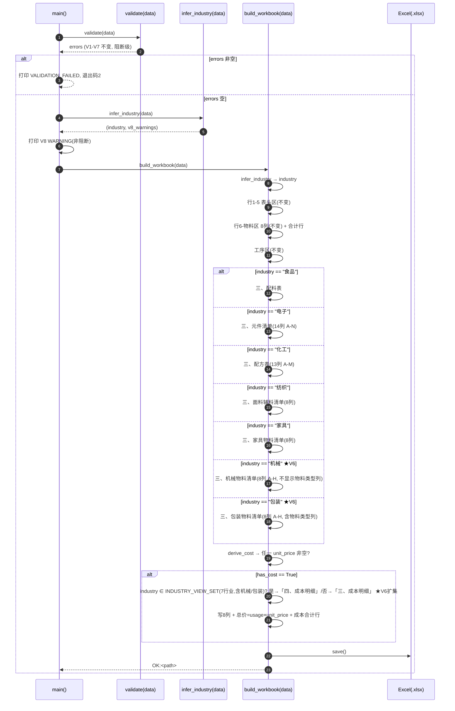
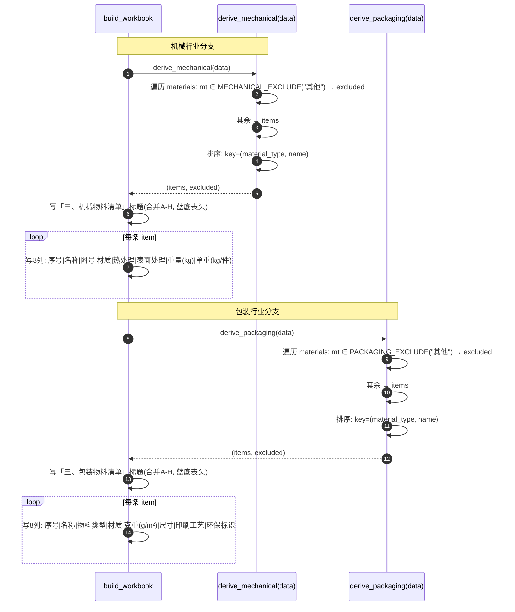
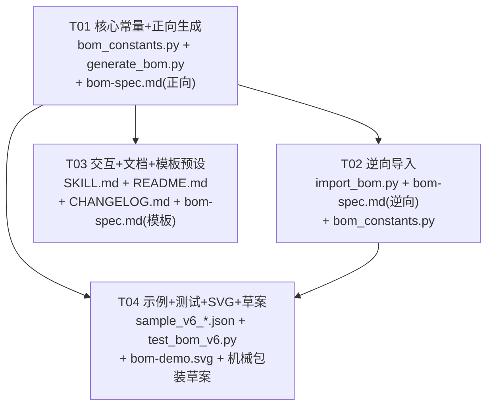

# BOM 智造师 · 增量增强 V6 — 架构设计与任务分解

> 文档类型：架构设计 + 任务分解（增量开发，作用于现有 Skill V5 基线 commit ef35877）
> 作者：软件架构师（高见远）
> 日期：2026-07-13
> 适用范围：`generate_bom.py`（正向）、`import_bom.py`（逆向）、`bom_constants.py`（共享常量）、`SKILL.md`/`README.md`/`CHANGELOG.md`/`bom-spec.md`、`mechanical-packaging-draft-v5.md`、示例与测试
> 决策基线：主理人齐活林拍板的 V6 范围（P0×2 + P1×2 + P2×2 评估），已锁定，**不自行增删**；机械/包装在 V5 仅占位空模板 + 评估草案，V6 正式落地。V5 契约（物料区 8 列 A–H、industry 8 值枚举与推断逻辑、V8/W1/H1/W2/W3/含量和软校验、逆向「三、」区块推断 industry 等）全部沿用，本文件仅描述**增量变更**。

---

## 0. V6 范围速览（主理人锁定，硬性约束）

| 优先级 | 编号 | 项 | 关键约束 |
|--------|------|----|----------|
| **P0-1** | 机械专属视图 + 机械专属字段 | `industry=="机械"` 时，工序区后追加「三、机械物料清单」派生区块（8 列 A–H）；新增物料级 `drawing_no`/`material`/`heat_treatment`/`surface_treatment`/`weight`/`unit_weight` 6 个；排除 `material_type=="其他"`；按物料类型升序→名称升序；**视图不单列「物料类型」展示列**（仅用于过滤/排序，从物料区/JSON 取）；标准建议 `GB/T 1804-2000` | 新增 6 字段（选填默认""，仅 JSON、仅机械视图）；逆向从「三、机械物料清单」marker 回收 6 字段 |
| **P0-2** | 包装专属视图 + 包装专属字段 | `industry=="包装"` 时追加「三、包装物料清单」派生区块（8 列 A–H）；新增物料级 `material`/`basis_weight`/`size`/`print_process`/`eco_label` 5 个；排除 `material_type=="其他"`；按物料类型升序→名称升序；**保留「物料类型」展示列**（与纺织/家具同构）；标准建议 `GB/T 6543-2008` | 新增 5 字段（选填默认""，仅 JSON、仅包装视图）；逆向从 marker 回收 5 字段（`material_type` 已在物料区回收，不重复回写） |
| **P1-1** | 行业模板预设补机械/包装 | `bom_constants.py` 的 `INDUSTRY_TEMPLATES["机械"]`/`["包装"]` 由空模板填实（`material_types`/`standard`/`special_fields`/`preset_processes`，内容见 PRD §8.1）；**仅交互引导，不写入新 JSON 结构**；向后兼容旧交互 | 选"机械"后引导 6 个机械字段 + 工序模板；选"包装"后引导 5 个包装字段 + 工序模板；standard 预填且可改 |
| **P1-2** | 成本视图双编号纳入机械/包装 | 将 `机械`/`包装` 纳入 `INDUSTRY_VIEW_SET`（由 V5 的 5 行业扩为 7 行业）；带成本时生成「四、成本明细」，否则「三、成本明细」；`total_price` 派生不入库（沿用 V5） | 逆向以关键字 `成本明细` 回收 `unit_price`/`currency`（兼容 三/四 前缀） |
| **P2-1/P2-2** | 机械 weight/unit_weight 增强、包装 eco_label 取值建议 | 本期**仅建议，不实现**；不新增任何阻断/软校验 | 维持 V5 软校验集合不变 |

**主理人已拍板的关键决策（硬约束，必须遵守）**：

1. 机械 `weight` 与 `unit_weight` 两个字段**保留不合并**（Q1）。
2. 机械视图维持 8 列 A–H，**不单列「物料类型」展示列**（物料类型仅用于过滤/排序，从物料区/JSON 取）；与纺织/家具/包装同构保持 8 列（Q2）。
3. 采用建议枚举：`MECHANICAL_TYPES=["零部件","标准件","型材","铸件","焊接件","其他"]`、`PACKAGING_TYPES=["纸箱","缓冲","标签","胶带","薄膜","其他"]`；`MECHANICAL_EXCLUDE=PACKAGING_EXCLUDE={"其他"}`（Q3）。
4. 机械 `standard` 默认 `GB/T 1804-2000`、包装 `standard` 默认 `GB/T 6543-2008`（可改）（Q4）。
5. `eco_label` 保持自由文本（不下沉受限枚举，V6 不新增校验）（Q5）。
6. 成本视图双编号：将 `机械`/`包装` 纳入 `INDUSTRY_VIEW_SET`（由 V5 的 {食品,电子,化工,纺织,家具} 扩展为含机械/包装 7 行业）；带成本时生成「四、成本明细」，否则「三、成本明细」。此为**预期行为变更**：V5 中机械/包装带成本生成「三、成本明细」，V6 起变「四、」（数据内容一致，逆向以关键字 `成本明细` 兼容前缀识别，无需迁移）（硬约束①）。
7. P2-1/P2-2 本期**不实现**（仅未来建议，不新增任何阻断/软校验）。
8. **物料区 8 列（A–H）永不变**；机械/包装新字段（机械 6 / 包装 5，其中 `surface_treatment` 与家具同名已存在）仅存 JSON、仅在专属视图展示。
9. **不引入新第三方依赖**（仅 openpyxl）；**不新增任何软校验 WARNING**（最小变更、最低回归风险），沿用 V8/W1/H1/W2/W3/含量和。
10. `_SPECIAL_FIELDS` 由 V5 去重后 **28** 个唯一 JSON 键扩至 V6 **37** 个唯一 JSON 键（最终并集核算见 §3.3 与 §7.11；源文档中"29→39"为概念计数口径，详见 §8.1 差异速查）。

> **关键约束（沿用 V5）**：物料区 8 列（A–H）**永不变**；所有新字段仅存 JSON、仅在专属视图展示；`industry` 枚举无需扩展（机械/包装已在 V4/V5 枚举）；全量向后兼容（旧 JSON/Excel 零变化，新字段默认空）；仅 `openpyxl`，无新依赖。

---

## 1. 实现方案 + 框架选型

### 1.1 技术难点与方案（增量部分）

| 难点 | 方案 | 理由 |
|------|------|------|
| 机械/包装新增两个同构派生视图 | 新增 `derive_mechanical(data)` / `derive_packaging(data)` 纯函数：排除 `material_type ∈ {其他}` → 按（物料类型升序→名称升序）排序；返回 (items, excluded)。与 `derive_textile`/`derive_furniture` 完全同构 | 复用既有派生范式，工程师零认知负担 |
| 机械视图"不单列物料类型列" | 机械视图 8 列已占满（序号+名称+6 专属字段），故表头不含「物料类型」展示列；`material_type` 仍用于过滤/排序（从物料区/JSON 取），与纺织/家具同构仅缺一列展示 | 主理人拍板 Q2：维持 A–H 8 列与既有视图同构最简洁；物料类型已在物料区存在 |
| 成本视图双编号（三/四、）扩集 | `INDUSTRY_VIEW_SET` 由 V5 的 `{食品,电子,化工,纺织,家具}` 扩为 `{食品,电子,化工,纺织,家具,机械,包装}`；`build_workbook` 判定 `industry ∈ INDUSTRY_VIEW_SET` → 成本视图为「四、成本明细」，否则「三、成本明细」；逆向仍以关键字 `成本明细` 识别（兼容前缀） | 主理人拍板硬约束①：机械/包装已有「三、」行业视图，成本须在其后；旧 Excel 仍按关键字回收，无需迁移 |
| 模板预设填实（仅交互引导） | `INDUSTRY_TEMPLATES["机械"]`/`["包装"]` 由空模板填实 `material_types`/`standard`/`special_fields`/`preset_processes`；**JSON Schema 不新增任何结构字段** | 主理人拍板 Q3/Q4：仅交互建议，向后兼容旧交互与旧 JSON |
| 逆向回收扩集与新增区块 | 复用 V5 `_recover_block_fields`：机械/包装各自 `field_col_map`；`_SPECIAL_FIELDS` 扩至 37 唯一键用于默认空补全；`float_fields` 增 `weight`/`unit_weight`/`basis_weight` | 与 V5 回收机制同构，代码模式复用，零格式变更 |
| 逆向 industry 推断扩展 | `_infer_industry_from_blocks` 在 V5 五区块基础上，增「三、机械物料清单」→机械、「三、包装物料清单」→包装；成本明细不参与 industry 推断 | 仍从区块标记隐式推断，零表头格式变更 |

### 1.2 框架选型（明确结论，沿用 V5）

- **语言/运行时**：Python 3（沿用）。
- **依赖库**：仅 `openpyxl`（沿用，缺失自装机制不变）。**不引入任何新依赖**。
- **共享模块**：`scripts/bom_constants.py`（V5 已建，V6 增量追加机械/包装常量 + `INDUSTRY_TEMPLATES` 机械/包装填实）。
- **CLI 接口保持不变**：
  - 正向：`python3 generate_bom.py --data <file.json> --out <file.xlsx>`
  - 逆向：`python3 import_bom.py --in <file.xlsx> [--out <data.json>]`
- **Excel 列数结论（增量）**：
  - 物料区 8 列（A–H）**不变**。
  - 机械/包装视图各 **8 列（A–H）**（V6 新增，无扩列）。
  - 既有视图（配料表 7 列、元件清单 14 列、配方表 13 列、面料辅料清单 8 列、家具物料清单 8 列、成本明细 8 列）**不变**。
  - 行业视图总数由 5（食品/电子/化工/纺织/家具）扩至 **7**（增机械/包装）。

---

## 2. 文件列表及相对路径（本版修改/新增）

| 文件 | 类型 | 本版动作 | 说明 |
|------|------|----------|------|
| `scripts/bom_constants.py` | 修改 | 增量增强 | 新增 `MECHANICAL_TYPES`/`MECHANICAL_EXCLUDE`/`PACKAGING_TYPES`/`PACKAGING_EXCLUDE`；`INDUSTRY_STANDARD` 增 机械=`GB/T 1804-2000`、包装=`GB/T 6543-2008`；`INDUSTRY_TEMPLATES["机械"]`/`["包装"]` 由空模板填实（仅交互引导）；导出供 `generate_bom.py`/`import_bom.py` 引用 |
| `scripts/generate_bom.py` | 修改 | 增量增强 | ① `from bom_constants import ...` 增机械/包装常量；② `INDUSTRY_VIEW_SET` 由 5 行业扩为 7 行业（含机械/包装）；③ 新增 `derive_mechanical(data)`/`derive_packaging(data)`；④ `build_workbook` 按 industry 分支增机械/包装视图（8 列）；⑤ `main` 中行业分支增机械/包装 + 排除提示；⑥ 列宽分支增机械/包装（8 列微调）；⑦ 不新增阻断/软校验 |
| `scripts/import_bom.py` | 修改 | 增量增强 | ① `_SPECIAL_FIELDS` 扩至 37 唯一 JSON 键；② `_infer_industry_from_blocks` 增机械/包装 marker；③ 新增机械/包装 marker 回收（`field_col_map`）；④ 工序区停止边界增机械/包装 marker；⑤ `_recover_block_fields` 的 `float_fields` 增 `weight`/`unit_weight`/`basis_weight`；⑥ 成本以关键字 `成本明细` 识别回收 `unit_price`/`currency`（沿用 V5） |
| `references/bom-spec.md` | 修改 | 更新 | 新增 V6 物料级 11 字段（机械 6 / 包装 5）Schema；字段约束总表增量；Excel 输出结构增机械/包装视图、成本双编号扩集；列宽表增量；区块规则增量；逆向导入章节增量（区块定位、列头映射表、industry 推断扩展） |
| `SKILL.md` | 修改 | 更新 | 阶段零 industry 选项维持 8 类；阶段一物料模板按 `INDUSTRY_TEMPLATES` 动态追加机械 6 / 包装 5 专属字段行；material_type 下拉用模板值（机械/包装）；standard 自动预填（机械 `GB/T 1804-2000` / 包装 `GB/T 6543-2008`，可改）；可选「一键载入工序模板」；汇总确认展示机械/包装视图预览；将"通用/机械/包装→无行业专属视图"改为"通用→无；机械/包装→有专属视图" |
| `README.md` | 修改 | 更新 | 字段校验表增机械/包装字段；Excel 结构增机械/包装视图、成本双编号扩集；行业模板预设说明增机械/包装；已知限制更新（机械/包装已落地，删除"仅评估"表述） |
| `CHANGELOG.md` | 修改 | 追加 | 新增 `[V6.0]` 段，记录全部变更 |
| `examples/sample_bom_v6_mechanical.json` | **新增** | 创建 | 机械行业示例（industry="机械"，含 drawing_no/material/heat_treatment/surface_treatment/weight/unit_weight，含被排除的"其他"类物料验证过滤） |
| `examples/sample_bom_v6_packaging.json` | **新增** | 创建 | 包装行业示例（industry="包装"，含 material/basis_weight/size/print_process/eco_label，含被排除的"其他"类物料验证过滤） |
| `examples/sample_bom_v6_mech_cost.json` | **新增** | 创建 | 机械带成本示例（industry="机械"，含 unit_price/currency，验证「四、成本明细」双编号 + 成本合计行） |
| `tests/test_bom_v6.py` | **新增** | 创建 | V6 增量测试：机械/包装视图派生（过滤+排序）、机械 6 字段写入、包装 5 字段写入、成本双编号纳入机械/包装、模板预设填实结构、逆向回收机械 6 / 包装 5 字段、闭环、旧 Excel 兼容；同时更新 `test_bom_v5.py` 中 `test_v5_t26` 的 `_SPECIAL_FIELDS` 断言（28→37）并跑 `test_bom_v5.py` 确保不回归 |
| `references/bom-demo.svg` | 修改 | 更绘 | 追加机械物料清单、包装物料清单、机械/包装带成本「四、成本明细」示意图 |
| `references/mechanical-packaging-draft-v5.md` | 修改 | 状态更新 | 将文档状态由"评估草案（本期不实现）"更新为"V6 已正式落地（P0-1/P0-2 实现）"，保留原字段草案作为历史佐证，并补充实现落点指针（指向本设计文档与常量定义） |

> 既有 `examples/sample_bom_v3.json` / `sample_bom_v4_*.json` / `sample_bom_v5_*.json` 与 `tests/test_bom_v2.py`/`test_bom_v3.py`/`test_bom_v4.py`/`test_bom_v5.py` 保留不动（供回归对照）。`test_bom_v5.py` 仅微调 `test_v5_t26` 断言值（见 §8.2 / T04）。

---

## 3. 数据结构和接口

### 3.1 输入 JSON Schema（V6 增量部分）

```json
{
  "product_name": "减速机箱体",
  "category": "工业品",
  "industry": "机械",
  "output_rate": 100,
  "version": "V1.0",
  "date": "2026-07-13",
  "approver": "李工",
  "effective_date": "2026-07-15",
  "standard": "GB/T 1804-2000",
  "materials": [
    {
      "name": "主轴箱体",
      "unit": "件",
      "usage": 1,
      "yield_rate": 95,
      "erp_code": "M-001",
      "material_type": "铸件",
      "process": "S01",
      "drawing_no": "DW-001",
      "material": "HT250",
      "heat_treatment": "退火",
      "surface_treatment": "喷塑",
      "weight": 12.5,
      "unit_weight": 12.5
    }
  ],
  "processes": [
    {"step_no": "S01", "name": "下料", "desc": "切割下料", "work_hours": 5, "note": "", "output": "坯料"}
  ]
}
```

> `industry` 枚举**无需扩展**（机械/包装已在 V4 8 值枚举内）。
> 包装行业物料示例（industry="包装"）：
> `"material": "瓦楞纸"`, `"basis_weight": 300`, `"size": "400×300×200mm"`, `"print_process": "胶印"`, `"eco_label": "FSC"`。
> 机械 `material` 与包装 `material` 同名 JSON key（行业互斥，无冲突）；机械 `surface_treatment` 与家具同名 key（行业互斥，无冲突）。
> 成本字段示例（可叠加于任意行业物料）：`"unit_price": 850.0, "currency": "人民币(CNY)"`（`total_price` 不写此 JSON，由渲染派生）。

### 3.2 字段约束总表（V6 增量部分，沿用字段见 bom-spec.md）

| JSON 路径 | 类型 | 必填 | 约束 / 默认值 | 说明 | 新增 |
|-----------|------|------|--------------|------|------|
| `materials[].drawing_no` | string | 选填 | 默认 `""` | 机械图号；仅机械物料清单 C 列 | **V6 机械** |
| `materials[].material`（机械） | string | 选填 | 默认 `""` | 机械材质；仅机械物料清单 D 列 | **V6 机械** |
| `materials[].heat_treatment` | string | 选填 | 默认 `""` | 机械热处理；仅机械物料清单 E 列 | **V6 机械** |
| `materials[].surface_treatment`（机械复用家具同名） | string | 选填 | 默认 `""` | 机械表面处理；仅机械物料清单 F 列（与家具同名 JSON key，行业互斥） | **V6 机械** |
| `materials[].weight` | number | 选填 | 默认 `""`；展示数值（kg） | 机械重量(kg)；仅机械物料清单 G 列 | **V6 机械** |
| `materials[].unit_weight` | number | 选填 | 默认 `""`；展示数值（kg/件） | 机械单重(kg/件)；仅机械物料清单 H 列；保留不合并（Q1） | **V6 机械** |
| `materials[].material`（包装） | string | 选填 | 默认 `""` | 包装材质；仅包装物料清单 D 列（与机械同名 JSON key，行业互斥） | **V6 包装** |
| `materials[].basis_weight` | number | 选填 | 默认 `""`；展示数值（g/m²） | 包装克重(g/m²)；仅包装物料清单 E 列 | **V6 包装** |
| `materials[].size` | string | 选填 | 默认 `""` | 包装尺寸；仅包装物料清单 F 列 | **V6 包装** |
| `materials[].print_process` | string | 选填 | 默认 `""` | 包装印刷工艺；仅包装物料清单 G 列 | **V6 包装** |
| `materials[].eco_label` | string | 选填 | 默认 `""` | 包装环保标识；仅包装物料清单 H 列；**自由文本**（Q5，不下沉枚举） | **V6 包装** |

> **物料区 8 列不变**：以上 11 个专属字段（机械 6 + 包装 5）存 JSON 但**不显示在物料区 8 列中**，仅在对应专属视图展示（与 `allergen` 处理模式完全一致）。`material`/`surface_treatment` 同名 key 分属不同行业物料，互不冲突。
> **软校验增量**：V6 不为机械/包装/扩列新增任何阻断或软校验 WARNING（见 §7.6）。

### 3.3 共享常量定义（`scripts/bom_constants.py` V6 增量）

```python
# === V6 机械行业 ===
MECHANICAL_TYPES = ["零部件", "标准件", "型材", "铸件", "焊接件", "其他"]
MECHANICAL_EXCLUDE = {"其他"}

# === V6 包装行业 ===
PACKAGING_TYPES = ["纸箱", "缓冲", "标签", "胶带", "薄膜", "其他"]
PACKAGING_EXCLUDE = {"其他"}

# === 执行标准行业建议（V5 + V6 增量） ===
INDUSTRY_STANDARD = {
    "食品": "GB 7718-2025",
    "电子": "GB/T 39560",
    "化工": "GB/T 16483-2008",
    "纺织": "FZ/T 80004",      # V5 新增
    "家具": "QB/T 1951.1",     # V5 新增
    "机械": "GB/T 1804-2000",  # V6 新增
    "包装": "GB/T 6543-2008",  # V6 新增
}

# === V6 行业模板预设填实（机械/包装，仅交互引导，不写新 JSON 字段） ===
INDUSTRY_TEMPLATES["机械"] = {
    "material_types": MECHANICAL_TYPES,
    "standard": "GB/T 1804-2000",
    "special_fields": ["drawing_no", "material", "heat_treatment",
                       "surface_treatment", "weight", "unit_weight"],
    "preset_processes": [
        {"step_no": "S01", "name": "下料", "desc": "切割/锯切下料", "output": "坯料"},
        {"step_no": "S02", "name": "机加工", "desc": "车铣钻加工", "output": "加工件"},
        {"step_no": "S03", "name": "热处理", "desc": "淬火/回火等", "output": "热处理件"},
        {"step_no": "S04", "name": "表面处理", "desc": "镀锌/喷塑/阳极氧化", "output": "表面处理件"},
        {"step_no": "S05", "name": "装配", "desc": "零部件组装", "output": "成品"},
    ],
}
INDUSTRY_TEMPLATES["包装"] = {
    "material_types": PACKAGING_TYPES,
    "standard": "GB/T 6543-2008",
    "special_fields": ["material", "basis_weight", "size",
                       "print_process", "eco_label"],
    "preset_processes": [
        {"step_no": "S01", "name": "设计制版", "desc": "版面设计与制版", "output": "印版"},
        {"step_no": "S02", "name": "印刷", "desc": "胶印/柔印/数码印刷", "output": "印刷品"},
        {"step_no": "S03", "name": "模切成型", "desc": "模切与成型", "output": "成型包装件"},
        {"step_no": "S04", "name": "检验", "desc": "外观与性能检验", "output": "成品"},
    ],
}
# 通用：维持空模板（保持通用兜底，不预置专属字段与工序）
```

> 注：`INDUSTRY_TEMPLATES["机械"]`/`["包装"]` 在 V5 中是空模板（占位），V6 填实；加载顺序须在字典定义之后（或直接在模块顶层对这两个键重新赋值）。

#### `_SPECIAL_FIELDS` 最终并集核算（★关键，主理人决策 #10 委托核算）

**V5 现状（代码事实）**：`import_bom.py` 的 `_SPECIAL_FIELDS` 实际为 **28 个唯一 JSON 键**（设计文档按行业叠加计为 29 概念字段，其中 `color_no` 在纺织/家具共用同一 JSON key，故唯一键为 28；现有 `tests/test_bom_v5.py::test_v5_t26` 断言 `len(_SPECIAL_FIELDS) == 28`）。

**V6 新增原始字段（机械 6 + 包装 5 = 11 个）**：
- 机械：`drawing_no` / `material` / `heat_treatment` / `surface_treatment` / `weight` / `unit_weight`
- 包装：`material` / `basis_weight` / `size` / `print_process` / `eco_label`

**去重核算**：
1. `material` 同时出现在机械与包装 → 并集内只计 **1 次**。
2. `surface_treatment` 已存在于 V5（家具）→ **不新增**唯一键。
3. 其余 9 个（drawing_no / material / heat_treatment / weight / unit_weight / basis_weight / size / print_process / eco_label）均为 V5 不存在的新唯一键。

**最终并集 = 28（V5 唯一键） + 9（V6 新唯一键） = 37 个唯一 JSON 键。**

> ⚠️ **与源文档"29→39"口径差异说明**：源 PRD/决策中"V5 的 29 个"为**概念计数**（含 `color_no` 在纺织/家具间重复计 1 次），"净增 10"仅扣除了 `surface_treatment` 与家具同名、未扣机械/包装间 `material` 同 key 的重复；故得到 29+10=39 的近似概念数。按代码实际去重集合核算，**真实 `_SPECIAL_FIELDS` 唯一键数 = 37**。工程师实现以 **37** 为准；`tests/test_bom_v5.py::test_v5_t26` 断言须由 `== 28` 改为 `== 37`（见 §8.2 / T04）。

**V6 最终 `_SPECIAL_FIELDS`（37 个唯一键，按来源分组列出）**：

```
# V4 电子/化工 (7)
designator, footprint, part_number, rohs,
cas_number, concentration, ghs_hazard
# V5 纺织 (5)
composition, yarn_count, fabric_weight, width, color_no
# V5 家具 (4) — color_no 与纺织共用同一 key，surface_treatment 与机械共用
material_grade, spec_size, surface_treatment, color_no
# V5 电子扩列 (6)
manufacturer, tolerance, rated_power, rated_voltage, alternate, reflow_temp
# V5 化工扩列 (5)
purity, physical_state, flash_point, storage_condition, hazard_class
# V5 成本 (2)
unit_price, currency
# V6 机械 (6) — surface_treatment 与家具共用，material 与包装共用
drawing_no, material, heat_treatment, surface_treatment, weight, unit_weight
# V6 包装 (5) — material 与机械共用
material, basis_weight, size, print_process, eco_label
```

> 概念计数（含同名 key 重复计）= 7+5+4+6+5+2+6+5 = 40；去重后唯一键 = 40 − 3（color_no、surface_treatment、material 各重复计 1 次）= **37**。✓

### 3.4 派生函数签名与逻辑（V6 增量）

#### `derive_mechanical(data)` — 机械物料清单派生

```python
def derive_mechanical(data):
    """派生机械物料清单（仅机械行业）。

    返回 (items, excluded)：
    - items: 机械物料（排除 material_type ∈ MECHANICAL_EXCLUDE，即"其他"类）
    - excluded: 被排除的物料

    排序：物料类型升序 → 物料名称升序（与 V5 纺织/家具同构）。
    注意：物料类型不进视图展示列，仅用于过滤/排序（从物料区/JSON 取）。
    """
    items, excluded = [], []
    for m in data.get("materials", []):
        mt = str(m.get("material_type") or "其他").strip() or "其他"
        if mt in MECHANICAL_EXCLUDE:
            excluded.append(m)
        else:
            items.append(m)
    items.sort(key=lambda x: (
        str(x.get("material_type") or ""),
        str(x.get("name") or ""),
    ))
    return items, excluded
```

#### `derive_packaging(data)` — 包装物料清单派生

```python
def derive_packaging(data):
    """派生包装物料清单（仅包装行业）。

    返回 (items, excluded)：
    - items: 包装物料（排除 material_type ∈ PACKAGING_EXCLUDE，即"其他"类）
    - excluded: 被排除的物料

    排序：物料类型升序 → 物料名称升序（与纺织/家具同构）。
    """
    items, excluded = [], []
    for m in data.get("materials", []):
        mt = str(m.get("material_type") or "其他").strip() or "其他"
        if mt in PACKAGING_EXCLUDE:
            excluded.append(m)
        else:
            items.append(m)
    items.sort(key=lambda x: (
        str(x.get("material_type") or ""),
        str(x.get("name") or ""),
    ))
    return items, excluded
```

#### `derive_cost(data)`（V5 沿用，无需改动）

`INDUSTRY_VIEW_SET` 扩展后，`build_workbook` 仅据 `industry ∈ INDUSTRY_VIEW_SET` 决定成本编号为「四、」或「三、」，`derive_cost` 本身逻辑不变（仍纳入全物料中 `unit_price` 非空者）。

#### `derive_components(data)` / `derive_formula(data)` / `derive_textile(data)` / `derive_furniture(data)`（V5 沿用，逻辑不变）

过滤/排序逻辑不变；仅 `build_workbook` 渲染时各自区块表头与取值不变。

### 3.5 类图（Mermaid classDiagram，V6 增量）

```mermaid
classDiagram
    class BOM {
        +string product_name «必填非空 R1»
        +enum category «必填,5类 R1/R4»
        +string industry «选填,8值枚举,默认推断»  «V4»
        +number output_rate «必填,>0 R2»
        +string version «默认V1.0»
        +string date «默认当天»
        +string approver «选填,默认""»
        +string effective_date «选填,默认""»
        +string standard «选填,默认""»
    }
    class Material {
        +string name «必填»
        +string unit «必填»
        +number usage «必填>0»
        +number yield_rate «0<值≤100 R2»
        +string erp_code «选填»
        +string material_type «选填»
        +string process «选填,引用step_no»
        +string allergen «选填,默认""»  «V3食品»
        +string designator «选填,默认""»  «V4电子»
        +string footprint «选填,默认""»  «V4电子»
        +string part_number «选填,默认""»  «V4电子»
        +string rohs «选填,是/否/未知»  «V4电子»
        +string cas_number «选填,默认""»  «V4化工»
        +number concentration «选填,0-100»  «V4化工»
        +string ghs_hazard «选填,默认""»  «V4化工»
        +string composition «选填,默认""»  «V5纺织»
        +string yarn_count «选填,默认""»  «V5纺织»
        +number fabric_weight «选填,默认""»  «V5纺织»
        +string width «选填,默认""»  «V5纺织»
        +string color_no «选填,默认""»  «V5纺织/家具»
        +string material_grade «选填,默认""»  «V5家具»
        +string spec_size «选填,默认""»  «V5家具»
        +string surface_treatment «选填,默认""»  «V5家具/V6机械»
        +string manufacturer «选填,默认""»  «V5电子»
        +string tolerance «选填,默认""»  «V5电子»
        +string rated_power «选填,默认""»  «V5电子»
        +string rated_voltage «选填,默认""»  «V5电子»
        +string alternate «选填,默认""»  «V5电子»
        +string reflow_temp «选填,默认""»  «V5电子»
        +string purity «选填,默认""»  «V5化工»
        +string physical_state «选填,默认""»  «V5化工»
        +string flash_point «选填,默认""»  «V5化工»
        +string storage_condition «选填,默认""»  «V5化工»
        +string hazard_class «选填,默认""»  «V5化工»
        +string drawing_no «选填,默认""»  «V6机械»
        +string material «选填,默认""»  «V6机械/包装»
        +string heat_treatment «选填,默认""»  «V6机械»
        +number weight «选填,默认""»  «V6机械»
        +number unit_weight «选填,默认""»  «V6机械»
        +number basis_weight «选填,默认""»  «V6包装»
        +string size «选填,默认""»  «V6包装»
        +string print_process «选填,默认""»  «V6包装»
        +string eco_label «选填,默认""»  «V6包装»
        +number unit_price «选填,默认""»  «V5成本»
        +string currency «选填,默认"人民币(CNY)"»  «V5成本»
    }
    class Process {
        +string step_no «必填唯一»
        +string name «必填»
        +string desc
        +work_hours «≥0»
        +string note
        +string output «必填,产物 R3»
    }
    class BomConstants {
        +set INDUSTRIES «8值枚举»
        +dict CATEGORY_TO_INDUSTRY «推断映射»
        +list COMPONENT_TYPES «电子建议值»
        +set COMPONENT_EXCLUDE «排除=其他»
        +list FORMULA_TYPES «化工建议值»
        +set FORMULA_EXCLUDE «排除=包材»
        +dict INDUSTRY_STANDARD «标准建议,V5增纺织/家具,V6增机械/包装»
        +list TEXTILE_TYPES «V5纺织建议值»
        +set TEXTILE_EXCLUDE «V5排除=其他»
        +list FURNITURE_TYPES «V5家具建议值»
        +set FURNITURE_EXCLUDE «V5排除=其他»
        +list MECHANICAL_TYPES «V6机械建议值»
        +set MECHANICAL_EXCLUDE «V6排除=其他»
        +list PACKAGING_TYPES «V6包装建议值»
        +set PACKAGING_EXCLUDE «V6排除=其他»
        +dict INDUSTRY_TEMPLATES «V5模板预设,V6填实机械/包装,仅交互»
    }
    class BOMGenerator {
        +validate(data) errors
        +infer_industry(data) (industry, warnings)  «V4»
        +derive_ingredients(data, industry) (ingredients, excluded)
        +ingredient_pct(items) (pct_list, total)
        +check_allergen_soft(data) warnings
        +derive_components(data) (components, excluded)  «V4»
        +derive_formula(data) (formula, excluded)  «V4»
        +derive_textile(data) (items, excluded)  «V5»
        +derive_furniture(data) (items, excluded)  «V5»
        +derive_mechanical(data) (items, excluded)  «V6»
        +derive_packaging(data) (items, excluded)  «V6»
        +derive_cost(data) (cost_items, has_cost)  «V5»
        +check_industry_soft(data, industry) warnings  «V4 W2/W3»
        +build_workbook(data) wb  «V6增机械/包装视图+成本双编号扩集»
    }
    class BOMImporter {
        +parse_bom(path) data
        -_infer_industry_from_blocks(ws, category) industry  «V4+V5纺织/家具+V6机械/包装»
        -_recover_special_fields(ws, marker, fields, materials)  «V4+V5扩列/纺织/家具/成本+V6机械/包装»
    }
    BOM "1" o-- "0..*" Material : materials[]
    BOM "1" o-- "0..*" Process : processes[]
    Material "..>" Process : process 引用 step_no
    BOMGenerator ..> BOM : 读/写
    BOMImporter ..> BOM : 重建
    BOMGenerator ..> BomConstants : 引用常量
    BOMImporter ..> BomConstants : 引用常量
```

### 3.6 Excel 列定义（V6 最终列序，硬性）

**物料区（8 列 A–H，不变）**

| 列 | A | B | C | D | E | F | G | H |
|----|---|---|---|---|---|---|---|---|
| 表头 | 序号 | 物料名称 | 单位 | 用量 | 出品率(%) | ERP物料代码 | 物料类型 | 所属工序 |
| 取值 | 1..N | name | unit | usage | yield_rate | erp_code | material_type | process |

> 行业专属字段（机械 6 / 包装 5 / 电子 10 / 化工 8 / 纺织 5 / 家具 4 / 成本 2）**不进物料区**，仅存 JSON。

**机械物料清单（8 列 A–H，仅 industry==机械，★V6 新增；不含「物料类型」展示列）**

| 列 | A | B | C | D | E | F | G | H |
|----|---|---|---|---|---|---|---|---|
| 表头 | 序号 | 物料名称 | 图号 | 材质 | 热处理 | 表面处理 | 重量(kg) | 单重(kg/件) |
| 取值 | 1..N | name | drawing_no | material | heat_treatment | surface_treatment | weight | unit_weight |
| 对齐 | center | left | center | left | center | center | center | center |

> 物料类型不展示列，仅用于过滤/排序（从物料区/JSON 取）。

**包装物料清单（8 列 A–H，仅 industry==包装，★V6 新增；保留「物料类型」展示列）**

| 列 | A | B | C | D | E | F | G | H |
|----|---|---|---|---|---|---|---|---|
| 表头 | 序号 | 物料名称 | 物料类型 | 材质 | 克重(g/m²) | 尺寸 | 印刷工艺 | 环保标识 |
| 取值 | 1..N | name | material_type | material | basis_weight | size | print_process | eco_label |
| 对齐 | center | left | center | left | center | left | center | center |

> 逆向从包装视图**仅回收 5 个专属字段**（material/basis_weight/size/print_process/eco_label）；`material_type` 已在物料区回收，不重复回写。

**成本明细（8 列 A–H，跨行业，★V5 新增；V6 起机械/包装带成本时为「四、」）**

| 列 | A | B | C | D | E | F | G | H |
|----|---|---|---|---|---|---|---|---|
| 表头 | 序号 | 物料名称 | 物料类型 | 用量 | 单位 | 单价 | 币种 | 总价 |
| 取值 | 1..N | name | material_type | usage | unit | unit_price | currency | usage×unit_price |
| 合计行 | 成本合计 | — | — | — | — | — | — | Σ 总价 |

> 成本视图 H 列「总价」= `round(usage × unit_price, 2)`，纯派生展示，**不进 JSON**；合计行 H 列 = Σ总价，逆向跳过。

### 3.7 Excel 列字母映射表（全区块统一参考，V6 增量）

| 区块 | A | B | C | D | E | F | G | H | I…N |
|------|---|---|---|---|---|---|---|---|------|
| 物料区(8列) | 序号 | 物料名称 | 单位 | 用量 | 出品率(%) | ERP物料代码 | 物料类型 | 所属工序 | — |
| 工序区(6列) | 工序编号 | 工序名称 | 工序说明 | 工时 | 备注 | 产物 | (空) | (空) | — |
| 配料表(7列) | 物料名称 | 物料类型 | 计量单位 | 用量 | 出品率(%) | 用量占比% | 过敏原 | (空) | — |
| 元件清单(14列) ★V5 | 序号 | 位号 | 型号 | 封装 | 物料名称 | 数量 | 物料类型 | RoHS | 制造商…封装温度 |
| 配方表(13列) ★V5 | 序号 | 物料名称 | CAS号 | 含量(%) | GHS标识 | 物料类型 | 计量单位 | 用量 | 纯度…危险等级 |
| 面料辅料清单(8列) ★V5 | 序号 | 物料名称 | 物料类型 | 成分比例 | 纱支 | 克重(g/m²) | 幅宽 | 色号 | — |
| 家具物料清单(8列) ★V5 | 序号 | 物料名称 | 物料类型 | 材质等级 | 尺寸规格 | 表面处理 | 用量 | 色号/花色 | — |
| **机械物料清单(8列) ★V6** | **序号** | **物料名称** | **图号** | **材质** | **热处理** | **表面处理** | **重量(kg)** | **单重(kg/件)** | — |
| **包装物料清单(8列) ★V6** | **序号** | **物料名称** | **物料类型** | **材质** | **克重(g/m²)** | **尺寸** | **印刷工艺** | **环保标识** | — |
| 成本明细(8列) ★V5 | 序号 | 物料名称 | 物料类型 | 用量 | 单位 | 单价 | 币种 | 总价 | — |

---

## 4. 程序调用流程（时序图）

### 4.1 generate_bom 主流程：industry 推断 → 物料区 → 工序区 → 按 industry 分支派生视图 → 成本视图



### 4.2 derive_mechanical() / derive_packaging() 内部流程



### 4.3 import_bom 区块识别 + 专属字段回收流程（V6 增量）

```mermaid
sequenceDiagram
    autonumber
    participant I as import_bom.parse_bom
    participant X as Excel

    I->>X: load_workbook(path)
    I->>I: 扫描表头区 + 物料区 + 工序区(不变)
    I->>I: 提前定位所有「三、」区块 marker
    Note over I: V6 新增 marker 识别
    I->>I: _find_marker_row("三、机械物料清单")?  ★V6
    I->>I: _find_marker_row("三、包装物料清单")?  ★V6
    I->>I: (既有) _find_marker_row("三、面料辅料清单"/家具物料清单/元件清单/配方表/配料表)
    I->>I: _find_marker_row("成本明细")?      ← 关键字, 回收unit_price/currency(沿用V5)

    alt 找到「三、机械物料清单」
        I->>I: field_col_map={name,drawing_no,material,heat_treatment,surface_treatment,weight,unit_weight}  ← 6 字段
        I->>I: _recover_block_fields → 回收6字段(weight/unit_weight转float)
    else 找到「三、包装物料清单」
        I->>I: field_col_map={name,material,basis_weight,size,print_process,eco_label}  ← 5 字段(不含material_type,已在物料区回收)
        I->>I: _recover_block_fields → 回收5字段(basis_weight转float)
    end
    alt 找到含「成本明细」的区块
        I->>I: field_col_map={name,unit_price(F列),currency(G列)}  ← 不回收总价(H列,派生)
        I->>I: _recover_block_fields → 回收unit_price/currency
    end
    I->>I: 每条 material 补全 37 个专属字段默认空串(未回收到的)
    I->>I: _infer_industry_from_blocks → 增机械/包装 marker 推断  ★V6
    I-->>X: 输出 JSON(industry + 全部专属字段; 旧文件无则默认空/推断)
```

---

## 5. 任务列表（有序、含依赖，T01–T04）

### 任务分解规则说明

本版为**增量增强**（非新建项目），任务按功能模块分组，每个任务包含 ≥3 个相关文件，总计 4 个任务（≤5，符合硬上限）。T01 是核心代码与数据契约（bom_constants.py 常量 + generate_bom.py 视图/模板/成本双编号），T02 逆向、T03 文档/交互、T04 示例/测试均依赖 T01 的接口与常量定义；T04 另依赖 T02 的回收实现。

| 任务 | 名称 | 负责文件 | 改什么 | 依赖 | 优先级 |
|------|------|----------|--------|------|--------|
| **T01** | 核心常量 + 正向生成（机械/包装视图 + 模板预设 + 成本双编号集合） | `scripts/bom_constants.py`、`scripts/generate_bom.py`、`references/bom-spec.md`（正向 Schema / 视图 / 列宽 / 成本双编号章节） | ① `bom_constants.py`：新增 `MECHANICAL_TYPES`/`MECHANICAL_EXCLUDE`/`PACKAGING_TYPES`/`PACKAGING_EXCLUDE`；`INDUSTRY_STANDARD` 增 机械=`GB/T 1804-2000`、包装=`GB/T 6543-2008`；`INDUSTRY_TEMPLATES["机械"]`/`["包装"]` 由空模板填实（material_types/standard/special_fields/preset_processes）；② `generate_bom.py`：`from bom_constants import ...` 增新常量；`INDUSTRY_VIEW_SET` 由 5 行业扩为 7 行业（含机械/包装）；新增 `derive_mechanical(data)`/`derive_packaging(data)`；`build_workbook` 按 industry 分支增机械/包装视图（8 列）；`main` 中行业分支增机械/包装 + 排除提示；列宽分支增机械/包装（8 列微调，见 §7.5）；**不新增阻断/软校验**；③ `bom-spec.md`：更新输入 JSON Schema（新增 11 行业字段，total_price 派生不入库）、字段约束总表、Excel 输出结构（机械/包装视图、成本双编号扩集）、列宽表、区块规则 | — | P0+P1 |
| **T02** | 逆向导入（区块识别与字段回收） | `scripts/import_bom.py`、`references/bom-spec.md`（逆向章节 + 列头映射表）、`scripts/bom_constants.py`（共享常量引用） | ① `import_bom.py`：`_SPECIAL_FIELDS` 扩至 37 唯一 JSON 键（含机械 6 / 包装 5）；`_infer_industry_from_blocks` 增「三、机械物料清单」→机械、「三、包装物料清单」→包装；新增机械/包装 marker 回收（`field_col_map`：机械 6 字段 / 包装 5 字段，包装不含 material_type）；`_recover_block_fields` 的 `float_fields` 增 `weight`/`unit_weight`/`basis_weight`；工序区停止边界增机械/包装 marker；② `bom-spec.md`：逆向章节更新（区块定位、列头映射表、industry 推断扩展、成本回收规则）；③ `bom_constants.py`：为逆向提供 V6 新增 EXCLUDE/TYPES 集的引用一致性 | T01 | P0+P1 |
| **T03** | 交互流程 + 文档适配 + 模板预设 | `SKILL.md`、`README.md`、`CHANGELOG.md`、`references/bom-spec.md`（模板预设章节） | ① `SKILL.md`：将"通用/机械/包装→无行业专属视图"改为"通用→无；机械/包装→有专属视图"；阶段一物料模板按 `INDUSTRY_TEMPLATES` 动态追加机械 6 / 包装 5 专属字段行；`material_type` 下拉用模板 `material_types`（机械/包装）；`standard` 自动预填（机械 `GB/T 1804-2000` / 包装 `GB/T 6543-2008`，可改）；可选「一键载入工序模板」(preset_processes)；汇总确认展示机械/包装视图预览；成本字段引导（unit_price/currency，机械/包装带成本预览「四、成本明细」）；② `README.md`：字段校验表增机械/包装字段；Excel 结构增机械/包装视图、成本双编号扩集；行业模板预设说明增机械/包装；已知限制更新（机械/包装已落地）；③ `CHANGELOG.md`：追加 `[V6.0]` 段；④ `bom-spec.md`：补 `INDUSTRY_TEMPLATES` 机械/包装填实说明（仅交互引导，不写入 JSON） | T01 | P0+P1+P2(评估) |
| **T04** | 示例 + 测试 + SVG + 草案更新 | `examples/sample_bom_v6_mechanical.json`、`examples/sample_bom_v6_packaging.json`、`examples/sample_bom_v6_mech_cost.json`、`tests/test_bom_v6.py`、`references/bom-demo.svg`、`references/mechanical-packaging-draft-v5.md` | ① 新建 3 个示例 JSON（机械/包装/机械带成本，均含被排除的"其他"类验证过滤；机械带成本示例验证"四、成本明细"）；② 由脚本生成对应 .xlsx 验证；③ 新建 `test_bom_v6.py`：机械/包装视图派生（过滤+排序）、机械 6 字段/包装 5 字段写入、成本双编号纳入机械/包装（四、）、模板预设填实结构（机械 6 / 包装 5 / 标准预填）、逆向回收机械 6 / 包装 5 字段、闭环（正向→逆向→正向字段保全）、旧 Excel 兼容；**更新 `test_bom_v5.py::test_v5_t26` 的 `_SPECIAL_FIELDS` 断言由 `==28` 改为 `==37`**；同时跑 `test_bom_v5.py`/`test_bom_v4.py` 确保不回归；④ `bom-demo.svg` 追加机械/包装/带成本示意图；⑤ `mechanical-packaging-draft-v5.md`：状态由"评估草案（不实现）"更新为"V6 已正式落地"，保留原草案作佐证并指回本设计文档 | T01, T02 | P0+P1+P2 |

### 5.1 任务依赖图（Mermaid graph）



> **依赖说明**：T01 是核心代码与数据契约（bom_constants.py 常量 + generate_bom.py 视图/模板/成本双编号集 + bom-spec.md 正向 Schema），T02 逆向、T03 文档/交互、T04 示例/测试均依赖 T01 的接口与常量定义；T04 另依赖 T02 的回收实现。T02 与 T03 之间无依赖，可并行。

---

## 6. 依赖包列表

```
- openpyxl  # 唯一第三方依赖，沿用；缺失时脚本自动 pip install
- （无新增依赖）本版仅增量增强 scripts/bom_constants.py / generate_bom.py / import_bom.py（纯 Python 标准库，无第三方依赖）
```

> 不引入任何新依赖（无 pandas / jsonschema / 额外 GUI 库）。演示图继续用 SVG 文本文件。机械/包装已于 V6 正式落地，不再需要评估草案依赖。

---

## 7. 共享知识（跨文件约定）

### 7.1 常量定义位置（V6 增量）

- V4/V5 既有常量保留在 `scripts/bom_constants.py`。
- V6 **新增**（`scripts/bom_constants.py`）：`MECHANICAL_TYPES` / `MECHANICAL_EXCLUDE` / `PACKAGING_TYPES` / `PACKAGING_EXCLUDE`；`INDUSTRY_STANDARD` 增 机械/包装；`INDUSTRY_TEMPLATES["机械"]`/`["包装"]` 填实。
- `generate_bom.py` 与 `import_bom.py` 均 `from bom_constants import ...`。
- `INDUSTRY_TEMPLATES` **仅被 SKILL.md 交互层读取**，不进入 JSON Schema（不写新结构字段）。
- `INDUSTRY_VIEW_SET` 定义在 `generate_bom.py`（非 bom_constants.py），V6 由 `{食品,电子,化工,纺织,家具}` 扩为 `{食品,电子,化工,纺织,家具,机械,包装}`。

### 7.2 各行业专属视图过滤规则集合（V6 全量）

| 行业 | 视图 | 过滤排除集 | 排序规则 | 常量名 |
|------|------|-----------|----------|--------|
| 食品 | 配料表 | material_type ∉ EDIBLE（原料/添加剂/香精香料） | usage 降序 | `EDIBLE`（现有） |
| 电子 | 元件清单 | material_type ∈ {"其他"} | 物料类型升序 → 位号字母数字升序 | `COMPONENT_EXCLUDE` |
| 化工 | 配方表 | material_type ∈ {"包材"} | concentration 降序（空排末尾） | `FORMULA_EXCLUDE` |
| 纺织 | 面料辅料清单 | material_type ∈ {"其他"} | 物料类型升序 → 名称升序 | `TEXTILE_EXCLUDE` ★V5 |
| 家具 | 家具物料清单 | material_type ∈ {"其他"} | 物料类型升序 → 名称升序 | `FURNITURE_EXCLUDE` ★V5 |
| **机械** | **机械物料清单** | material_type ∈ {"其他"} | 物料类型升序 → 名称升序 | `MECHANICAL_EXCLUDE` ★V6 |
| **包装** | **包装物料清单** | material_type ∈ {"其他"} | 物料类型升序 → 名称升序 | `PACKAGING_EXCLUDE` ★V6 |
| 成本（跨行业） | 成本明细 | 无过滤（面向全物料，含被行业视图排除的"其他"/"包材"） | 按物料输入顺序 | — ★V5 |
| 通用 | 无 | — | — | — |

### 7.3 列名中文文案统一（V6 新增区块精确字符串）

| 区块 | 表头文案（精确字符串，勿加空格） |
|------|------|
| 机械物料清单 ★V6 | `序号\|物料名称\|图号\|材质\|热处理\|表面处理\|重量(kg)\|单重(kg/件)` |
| 包装物料清单 ★V6 | `序号\|物料名称\|物料类型\|材质\|克重(g/m²)\|尺寸\|印刷工艺\|环保标识` |
| 面料辅料清单 ★V5 | `序号\|物料名称\|物料类型\|成分比例\|纱支\|克重(g/m²)\|幅宽\|色号` |
| 家具物料清单 ★V5 | `序号\|物料名称\|物料类型\|材质等级\|尺寸规格\|表面处理\|用量\|色号/花色` |
| 元件清单（扩列）★V5 | `序号\|位号(Designator)\|型号(Part#)\|封装(Footprint)\|物料名称\|数量\|物料类型\|RoHS\|制造商\|容差\|额定功率\|额定电压\|替代料\|封装温度` |
| 配方表（扩列）★V5 | `序号\|物料名称\|CAS号\|含量(%)\|GHS标识\|物料类型\|计量单位\|用量\|纯度\|物态\|闪点\|存储条件\|危险等级` |
| 成本明细 ★V5 | `序号\|物料名称\|物料类型\|用量\|单位\|单价\|币种\|总价` |

> 逆向 `_map_header` 时，候选列名需包含中英文括号变体（如 `位号(Designator)` / `位号`、`型号(Part#)` / `型号`、`封装(Footprint)` / `封装`、`CAS号` / `CAS`、`含量(%)` / `含量`、`GHS标识` / `GHS`），以兼容用户手动编辑后的表头。机械/包装表头无括号变体，但同样建议同时兼容 `克重(g/m²)` / `克重`、`重量(kg)` / `重量`、`单重(kg/件)` / `单重` 等候选。

### 7.4 Excel 列字母映射表（V6 全量，见 §3.7）

（详见 §3.7，此处强调逆向回收列号）
- 机械回收：`name=B(2)`、`drawing_no=C(3)`、`material=D(4)`、`heat_treatment=E(5)`、`surface_treatment=F(6)`、`weight=G(7)`、`unit_weight=H(8)`（6 字段）。
- 包装回收：`name=B(2)`、`material=D(4)`、`basis_weight=E(5)`、`size=F(6)`、`print_process=G(7)`、`eco_label=H(8)`（5 字段）；**不回收** `material_type`(C 列，已在物料区回收)。
- 电子回收（扩列）：`name=E(5)`、`designator=B(2)`、`part_number=C(3)`、`footprint=D(4)`、`rohs=H(8)`、`manufacturer=I(9)`…`reflow_temp=N(14)`。
- 化工回收（扩列）：`name=B(2)`、`cas_number=C(3)`、`concentration=D(4)`、`ghs_hazard=E(5)`、`purity=I(9)`…`hazard_class=M(13)`。
- 纺织回收：`name=B(2)`、`composition=D(4)`、`yarn_count=E(5)`、`fabric_weight=F(6)`、`width=G(7)`、`color_no=H(8)`。
- 家具回收：`name=B(2)`、`material_grade=D(4)`、`spec_size=E(5)`、`surface_treatment=F(6)`、`color_no=H(8)`；**不回收** `usage`(G 列，已在物料区回收)。
- 成本回收：`name=B(2)`、`unit_price=F(6)`、`currency=G(7)`；**不回收** `总价`(H 列，派生)。

### 7.5 列宽方案（V6 增量，关键）

V5 全表共享列宽（A–H）：`[6, 18, 10, 10, 13, 16, 13, 12]`。V6 机械/包装均为 8 列，复用基线并按 PRD §6 建议微调 C/G/H 等：

| 区块 | 完整列宽数组（A 起） | 说明 |
|------|---------------------|------|
| 物料区 / 配料表 / 面料辅料清单 / 家具物料清单 / 成本明细（8 列） | `[6, 18, 10, 10, 13, 16, 13, 12]` | 沿用 V5 基线，无变化 |
| **机械物料清单（8 列 A–H）★V6** | `[6, 18, 16, 12, 13, 13, 12, 12]` | A=序号6；B=物料名称18；C=图号16(PRD建议16)；D=材质12；E=热处理13；F=表面处理13；G=重量(kg)12；H=单重(kg/件)12 |
| **包装物料清单（8 列 A–H）★V6** | `[6, 18, 10, 12, 12, 18, 13, 13]` | A=序号6；B=物料名称18；C=物料类型10；D=材质12；E=克重(g/m²)12(PRD建议12)；F=尺寸18(PRD建议18)；G=印刷工艺13；H=环保标识13 |
| 元件清单（扩列 14 列 A–N） | `[6, 18, 18, 12, 18, 10, 13, 10, 14, 12, 14, 14, 16, 14]` | 沿用 V5 |
| 配方表（扩列 13 列 A–M） | `[6, 18, 12, 13, 14, 13, 12, 10, 10, 12, 12, 18, 14]` | 沿用 V5 |

> 实现：`build_workbook` 末尾依据当前 industry 决定列宽写入范围——电子写 A–N（14 列）、化工写 A–M（13 列）、机械写 A–H（8 列微调）、包装写 A–H（8 列微调）、其余 8 列（A–H）沿用基线。机械/包装均为 8 列，无扩列，无需改列数逻辑。

### 7.6 软校验增量（V6 明确"不新增"）

**决策：V6 不为机械/包装/扩列新增任何阻断级或软校验 WARNING，保持最小变更。**

理由：
1. 机械/包装新增字段（drawing_no/material/heat_treatment/surface_treatment/weight/unit_weight/basis_weight/size/print_process/eco_label）均为纯展示选填字段，无合规强约束；`eco_label` 保持自由文本（Q5），新增只会制造噪音。
2. 成本视图 `unit_price`/`currency` 选填，currency 枚举默认人民币(CNY)，无强校验需求；total_price 为派生值，无需校验。
3. 既有的 V8/W1/H1/W2/W3/含量和校验全部保持不变。机械/包装的排除提示（"已排除 N 条其他类物料"）沿用 V4 排除提示模式，文案同构（"机械物料清单已排除…"/"包装物料清单已排除…"）。

> V8（industry 枚举）/ W1/H1（过敏原）/ W2（RoHS 未标）/ W3（CAS/GHS 未填）/ 含量和校验 全部保持不变。机械/包装视图不引入任何新的软校验类型。

### 7.7 成本视图双编号与触发规则（V6 关键，扩集）

- **判定集合扩展**：`INDUSTRY_VIEW_SET` 由 V5 的 `{食品,电子,化工,纺织,家具}` **扩展为** `{食品,电子,化工,纺织,家具,机械,包装}`（generate_bom.py 内定义）。
- **编号规则**：当 `industry ∈ INDUSTRY_VIEW_SET`（即已存在「三、」行业派生视图）→ 成本视图为「**四、成本明细**」；当 `industry ∈ {通用}`（无行业视图）→ 成本视图为「**三、成本明细**」。
  - 机械/包装带成本 → 「**四、成本明细**」（因机械/包装已有「三、机械/包装物料清单」）。
  - 机械/包装不带成本 → 仅「三、机械/包装物料清单」，无成本块。
  - 通用 → 仅「三、成本明细」（如有成本）。
- **触发**：任一物料含非空 `unit_price` 即生成；全空不生成（不影响现有 BOM）。
- **total_price 派生不入库**：沿用 V5，`total_price = round(usage × unit_price, 2)` 实时计算，正向输入 JSON 与逆向输出 JSON **均不含** `total_price`。
- **逆向识别**：以关键字 `成本明细` 匹配首列（兼容「三、/四、」前缀），回收 `unit_price`/`currency`，与 V5 完全一致。
- **成本视图 8 列 A–H 表头**（沿用 V5，不变）：`序号|物料名称|物料类型|用量|单位|单价|币种|总价`。

> 向后兼容说明：V5 中 `industry==机械/包装` 且带成本时生成的是「三、成本明细」（当时机械/包装无行业视图）。V6 起该场景改为「四、成本明细」——这是主理人拍板的**预期行为变更**（因机械/包装新增了「三、」行业视图），数据内容完全一致；逆向以关键字识别，旧 Excel 仍可正确回收，无需迁移。

### 7.8 RoHS / GHS 着色规则（沿用 V4/V5，扩列不影响）

| rohs 值 | 字体颜色 | 含义 |
|---------|---------|------|
| `"是"` | 默认（黑色） | 合规 |
| `"否"` | 红色 `"FF0000"` | 不合规 |
| `"未知"` 或 `""`（空） | 黄色 `"BF8F00"` | 待确认 |

> 机械/包装视图不涉及 RoHS 着色，沿用既有规则于电子元件清单。

### 7.9 向后兼容默认值表（V6 增量）

| 场景 | 旧 JSON/Excel 缺失项 | V6 默认行为 |
|------|---------------------|-------------|
| 旧 JSON 无机械/包装字段 | drawing_no/material/heat_treatment/surface_treatment/weight/unit_weight/basis_weight/size/print_process/eco_label 等 | 默认空串 `""` → 专属视图对应列留空；成本块按新双编号生成 |
| 旧 JSON `industry` 为机械/包装 | — | V5 无此能力（通用兜底），V6 新生成对应专属视图；其他行业照常 |
| 旧 Excel 无新区块（机械/包装物料清单） | — | 无 marker → 不回收新字段，全部默认空；完全兼容 |
| 机械/包装带成本 Excel（V5 生成的「三、成本明细」） | — | V6 逆向仍以关键字 `成本明细` 回收 unit_price/currency；重新正向生成时为「四、成本明细」（数据一致，无需迁移） |
| 新 JSON industry=机械/包装 | — | 生成对应专属视图；成本双编号纳入 |
| 成本块 | marker 关键字 `成本明细` | 回收 `unit_price`/`currency`；总价派生不回收 |
| 现有食品/电子/化工/纺织/家具 Excel | — | 推断与生成行为零变化（V5 测试全绿） |

### 7.10 错误/状态前缀（沿用 V4/V5，无新增）

- `VALIDATION_FAILED`（正向阻断，退出码 2）— 不变
- `PARSE_ERROR`（逆向标记缺失，退出码 2）— 不变
- `FILE_ERROR`（Excel 不可读，退出码 2）— 不变
- `WARNING`（**非阻断**）— 沿用现有 + V4/V5（V8/W1/H1/W2/W3/含量和/排除提示）；V6 不新增 WARNING 类型
- `OK:<path|json>`（成功）— 不变

### 7.11 数字格式约定（V6 增量）

- `yield_rate` / `output_rate` / `用量占比%` / `含量(%)`：Excel 数字格式 `0.0"%"`（沿用 V3/V4/V5）。
- `output_rate` 显示 **`130.0%`**（V2 已修正）。
- `concentration`：JSON 存原始数值或空串；Excel 显示 `70.0%` 或留空。
- `fabric_weight`：JSON 存数值；Excel 显示纯数值（无 % 格式）。
- `weight` / `unit_weight`（机械）/ `basis_weight`（包装）：JSON 存数值；Excel 显示纯数值（无 % 格式）。
- `unit_price` / `total_price`：数值，Excel 显示（建议 `0.00` 或默认）；`total_price` 不进 JSON。
- 逆向解析 `concentration`/`unit_price`/`weight`/`unit_weight`/`basis_weight`：`_to_float()` 转换，空则 `""`。
- `_SPECIAL_FIELDS` 最终并集 = **37 个唯一 JSON 键**（核算见 §3.3）。

---

## 8. 待明确事项（P2 评估 + 非阻断实现细节 + 差异速查）

### 8.1 P2 机械/包装增强建议（本期不实现，仅评估）

| # | 建议 | V6 处理 | 说明 |
|---|------|---------|------|
| P2-1 | 机械 weight/unit_weight 单位与数值增强（合并为单「重量」字段？） | **不实现** | 主理人拍板 Q1 保留两字段；合并需改 JSON 结构与逆向回收，V6 不值得增加回归面 |
| P2-2 | 包装 eco_label 取值建议（FSC/可回收/可降解/食品级 受限枚举？） | **不实现** | 主理人拍板 Q5 保持自由文本；受限枚举易漏，V6 不新增校验 |

> `mechanical-packaging-draft-v5.md` 在 V6 由"评估草案（不实现）"更新为"已正式落地"，原字段草案（§2/§3）作为历史佐证保留并指回本设计文档。

### 8.2 非阻断实现细节（工程师按推荐直接实现）

1. **industry 是否写入 Excel 表头区**：**不写入**（沿用 V4/V5）。逆向从「三、」区块标记推断（含 V6 新增机械/包装 marker），成本明细不参与 industry 推断。
2. **机械/包装排序空值处理**：按 `(material_type, name)` 升序；空 material_type 视为 "其他" 排末尾（同 V4 哨兵思路），空 name 排末尾。
3. **成本视图数据来源**：面向**全物料**（含被行业视图排除的"其他"/"包材"类），因成本核算不依行业视图过滤。
4. **成本双编号判定**：以 `industry ∈ INDUSTRY_VIEW_SET`（现 7 行业，含机械/包装）判定"行业视图是否存在"→ 存在则「四、成本明细」，否则「三、成本明细」。
5. **total_price 派生**：`round(float(usage) * float(unit_price), 2)`，仅渲染、不入库、逆向不回收。
6. **_SPECIAL_FIELDS 最终集合**：按 §3.3 核算为 **37 个唯一 JSON 键**；`tests/test_bom_v5.py::test_v5_t26` 现有断言 `len(_SPECIAL_FIELDS) == 28` **必须改为 `== 37`**（T04 负责），否则既有 V5 测试将在 V6 落地后失败。
7. **逆向包装回收不含 material_type**：包装 `field_col_map` 仅含 `name/material/basis_weight/size/print_process/eco_label` 6 键（material_type 已在物料区回收，不重复回写）；机械 `field_col_map` 含 `name/drawing_no/material/heat_treatment/surface_treatment/weight/unit_weight` 7 键（6 专属字段 + name 匹配键）。
8. **bom_constants.py 是否迁移现有常量**：**不迁移**，仅增量追加机械/包装常量与模板填实。
9. **模板预设是否写入 JSON**：**不写入**，仅交互引导。
10. **V5 测试影响评估**：`tests/test_bom_v5.py` 经核查**不含任何机械/包装用例**（V5 机械/包装无视图，仅占位空模板）。因此 V6 不修改 V5 既有测试逻辑，仅将 `test_v5_t26` 的 `_SPECIAL_FIELDS` 断言由 `28` 改为 `37`（因集合扩至 37），并新增 `test_bom_v6.py` 覆盖机械/包装全部新行为；`test_bom_v5.py` 其余用例（纺织/家具/电子/化工/成本/兼容）预期全绿，确保不回归。

### 8.3 V5 → V6 结构差异速查

| 维度 | V5 | V6 |
|------|----|----|
| 行业视图 | 配料表(食品)+元件清单(电子,14列)+配方表(化工,13列)+面料辅料清单(纺织,8列)+家具物料清单(家具,8列) | + **机械物料清单(机械,8列)** + **包装物料清单(包装,8列)**；其余视图不变 |
| BOM 级字段 | industry(8值枚举) | industry **不变**（机械/包装已在枚举内） |
| 物料级新增字段 | V5：纺织5+家具4+电子6(扩列)+化工5(扩列)+成本2 | **+ 机械6 + 包装5**（共净增 11 原始字段；去重后新增 9 唯一键） |
| 物料区列数 | 8（A–H） | **8（A–H，不变）** |
| 成本视图双编号集合 | INDUSTRY_VIEW_SET = {食品,电子,化工,纺织,家具}（5 行业） | **{食品,电子,化工,纺织,家具,机械,包装}（7 行业）**；机械/包装带成本→「四、成本明细」（V5 旧机械/包装带成本为「三、」，属预期行为变更） |
| 行业模板预设 | 机械/包装为空模板占位 | **机械/包装填实**（material_types/standard/special_fields/preset_processes） |
| 软校验 | W1/H1/V8/W2/W3/含量和 | **不变**（V6 不新增任何软校验） |
| 逆向区块识别 | 三、元件清单/配方表/配料表/面料辅料清单/家具物料清单 + 关键字「成本明细」 | + 三、机械物料清单/三、包装物料清单 |
| 逆向推断 industry | 元件清单→电子/配方表→化工/配料表→食品/面料辅料清单→纺织/家具物料清单→家具 | + 机械物料清单→机械/包装物料清单→包装 |
| `_SPECIAL_FIELDS` 唯一键 | 28 | **37**（核算见 §3.3） |
| 依赖 | 仅 openpyxl | **仅 openpyxl（无新依赖）** |
| 机械/包装 | 通用兜底 + 评估草案（不实现） | **正式落地 P0-1/P0-2** |

> **`_SPECIAL_FIELDS` 计数口径说明**：源文档"29→39"为概念计数（V5 概念 29 含 color_no 重复计；净增 10 仅扣 surface_treatment 与家具同名，未扣机械/包装间 material 同 key）。按代码真实去重集合，V5=28 唯一键，V6 增 9 新唯一键（drawing_no/material/heat_treatment/weight/unit_weight/basis_weight/size/print_process/eco_label），**最终 37 唯一键**。工程师实现与测试断言以 37 为准。
