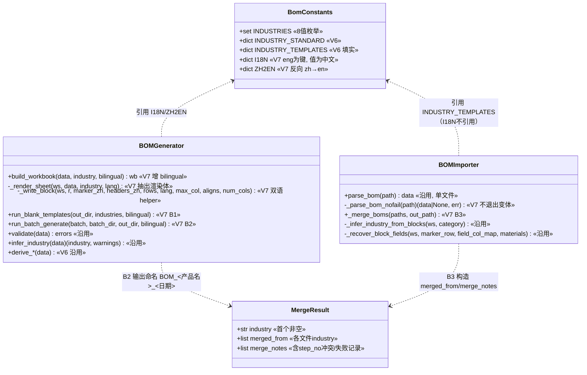
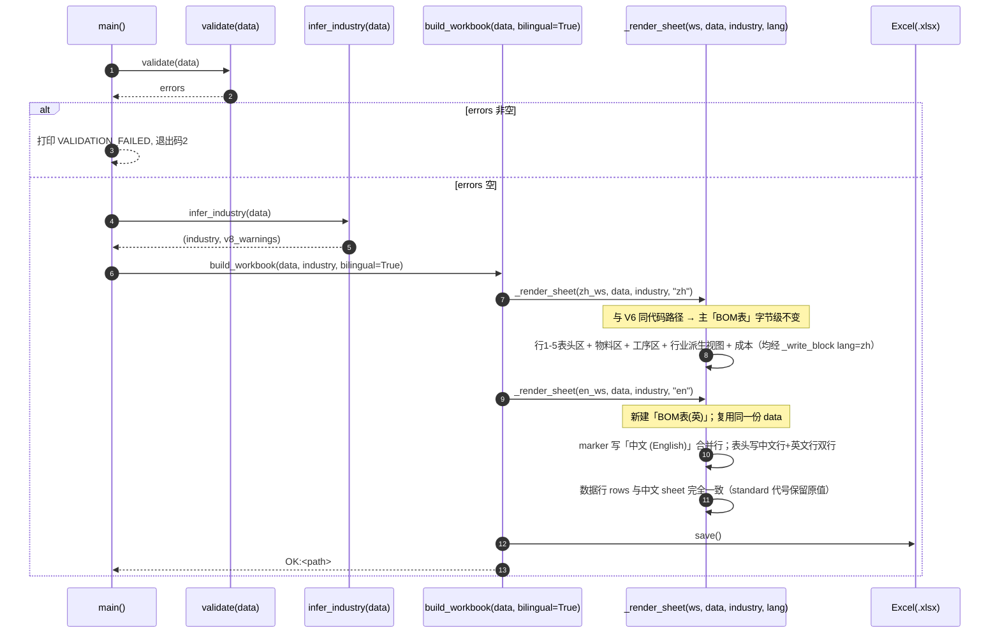
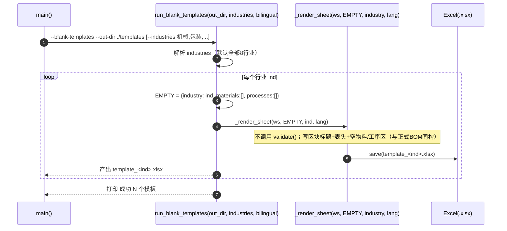
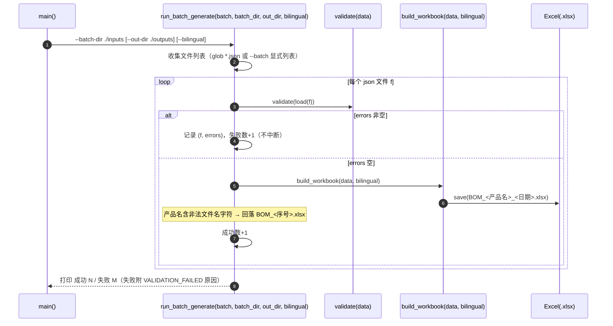
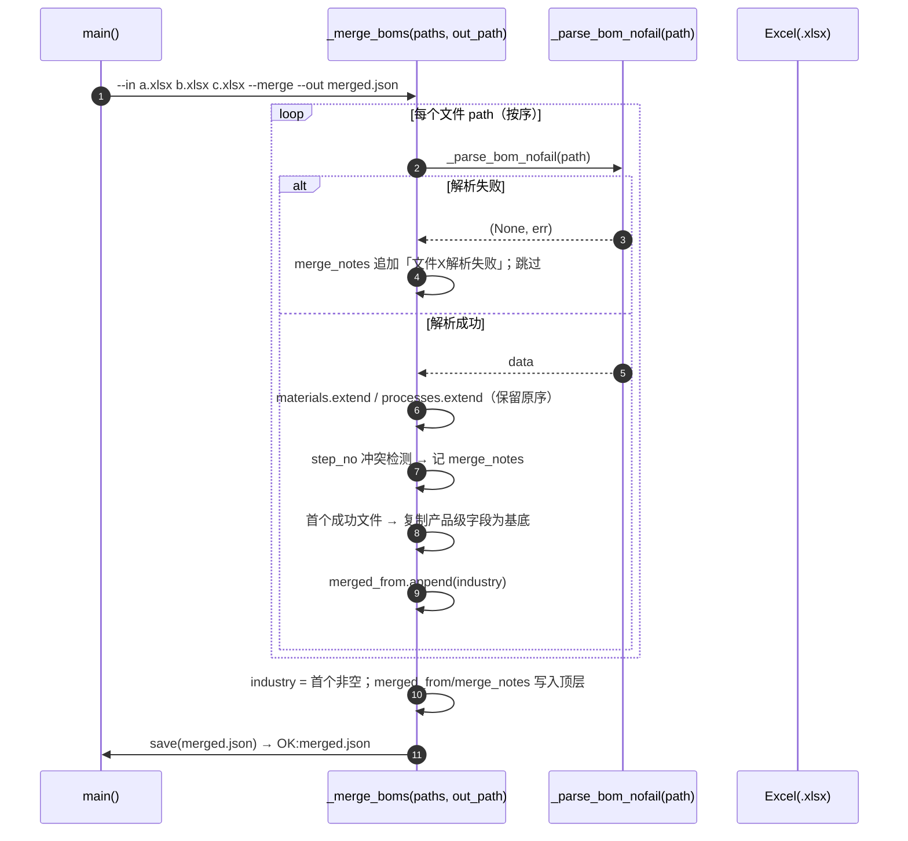
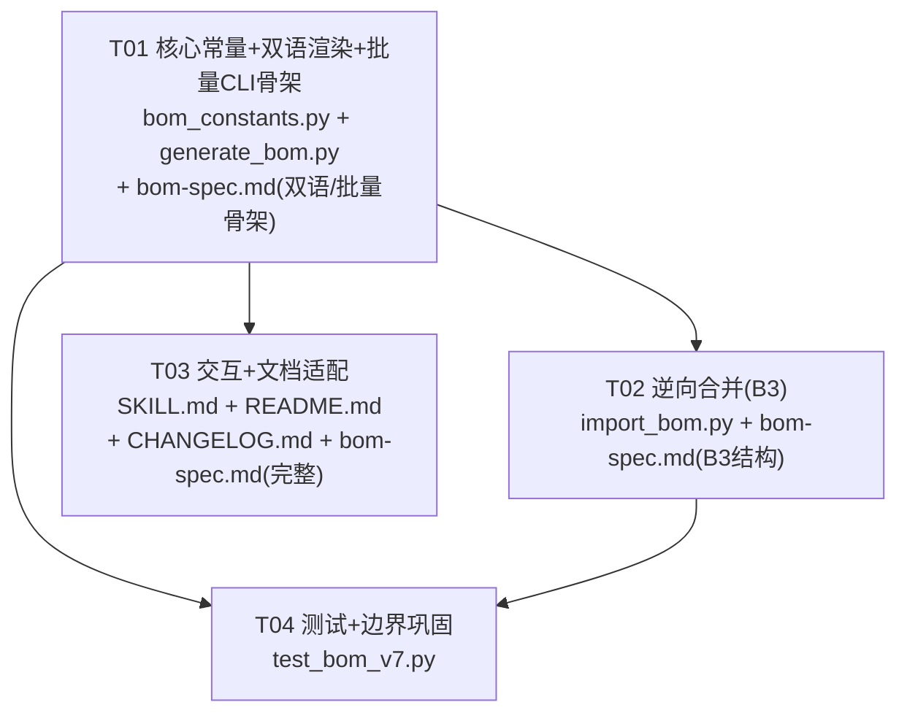

# BOM 智造师 · 增量增强 V7 — 架构设计与任务分解

> 文档类型：架构设计 + 任务分解（增量开发，作用于现有 Skill V6 基线 commit af72a95）
> 作者：软件架构师（高见远）
> 日期：2026-07-15
> 适用范围：`generate_bom.py`（正向，双语 + B1/B2 批量）、`import_bom.py`（逆向，B3 批量合并）、`bom_constants.py`（共享常量，V7 增 I18N）、`SKILL.md`/`README.md`/`CHANGELOG.md`/`references/bom-spec.md`、`tests/test_bom_v7.py`
> 决策基线：主理人齐活林已拍板 V7 PRD §10 的 Q1–Q8 **全部采纳推荐默认**（详见文末「主理人拍板结论速览」），已锁定，**不自行增删**。V6 契约（物料区 8 列 A–H、industry 8 值枚举与推断逻辑、7 大专属视图、成本视图双编号、37 唯一键 `_SPECIAL_FIELDS`、行业模板预设、完整逆向闭环）全部沿用，本文件仅描述**增量变更**（双语对照并列导出 + 三类批量 + 全面巩固）。

---

## 0. V7 范围速览（主理人锁定，硬性约束）

| 优先级 | 编号 | 项 | 关键约束 |
|--------|------|----|----------|
| **P0-A1** | 双语开关 + 双语 sheet 渲染 | `--bilingual`（布尔）；开启时主 sheet「BOM表」保持纯中文（字节级不变），**追加**第二个 sheet「BOM表(英)」，区块标题「中文 (English)」合并行、表头中英双行（中文在上、英文在下）；逆向恒读中文 sheet | 主中文 sheet 零变化；双语 sheet 仅为人工阅读 |
| **P0-A2** | I18N 翻译字典（bom_constants.py） | 新增 `I18N`（**eng 为键**，值为中文）；`ZH2EN = {v:k for k,v in I18N.items()}`；覆盖 11 区块标题 / 物料 8 列 / 工序 6 列 / 各行业视图列名 / 成本列名 / `material_type` 7 行业建议值 / 标题合计标签 | 纯 Python 字典、无新依赖 |
| **P0-B1** | B1 批量空白模板 | `--blank-templates` + `--out-dir <dir>`（+ `--industries`，默认全部 8 行业）；每行业产 `template_<行业>.xlsx`（含区块标题+表头+空物料/工序区，不触发校验） | 默认单条生成零变化 |
| **P0-B2** | B2 批量生成 BOM | `--batch-dir <dir>` 或 `--batch f1,f2,...` + `--out-dir`（默认当前目录）；逐条生成 `BOM_<产品名>_<日期>.xlsx`；单文件失败记录错误继续，结束汇总成功/失败 | 错误隔离，退出码 2 + 汇总；单条 `--data/--out` 零变化 |
| **P0-B3** | B3 批量合并导入 → 单 JSON | `import_bom.py --in f1.xlsx f2.xlsx ...`（nargs="+"）+ `--merge` + `--out merged.json`；materials/processes 顺序拼接不去重；industry 取首个非空；顶层 `merged_from`/`merge_notes` | 单 `--in` 零变化（无 merged_from/merge_notes） |
| **P1-A1** | 交互层双语引导（SKILL.md） | 阶段零采集后提示「是否双语导出」；阶段一 `material_type` 建议值附英文对照 | 仅交互提示，不改 JSON Schema |
| **P1-B1** | B3 合并冲突留痕 | 跨文件 `step_no` 重复**保留原序**拼接，顶层 `merge_notes` 记录冲突清单（如「step_no 'S01' 在文件 2/3 重复」）；无冲突时 `merge_notes=[]` | 不擅自改写 step_no |
| **P0-C1** | 边界用例补强（V2–V6） | 空数据 / 超长字段 / 非法 industry（V8 回退）/ 缺失必填（V1/V2/V3 阻断）/ 异常 JSON / 1000+ 物料大 BOM 性能基线 | 不修改 V6 既有断言 |
| **P0-C2** | 异常输入防御 + 输出一致性 | 保持既有错误前缀（VALIDATION_FAILED/PARSE_ERROR/FILE_ERROR，退出码 2）；双语/批量产物与单语单文件结构一致 | 不新增异常类型 |
| **P1-C1** | 大 BOM 性能基线 | 单文件大 BOM（建议 1000 物料）生成/导入耗时与内存基线（仅测试关注）；代码侧避免全表重复拷贝 | Windows 连跑句柄崩溃属 QA 分批规避，不写入代码 |
| **P1-C2** | SKILL.md 批量命令引导增强 | 阶段零/正向入口补双语开关提示 + B1/B2/B3 命令示例 | 仅文档/交互层 |
| **P2-C1** | 模板含示例行（可选） | V7 不实现、不新增任何校验 | 仅未来增强建议 |

**主理人已拍板的关键决策（硬约束，必须遵守，V7 PRD §10 Q1–Q8 全部采纳推荐默认）**：

1. **Q1**：双语形态 = 主「BOM表」纯中文（逆向唯一目标，零变化）+ **追加**「BOM表(英)」双语 sheet（中英双行表头）；不支持「单 sheet 表头中文(English) 合并」备选。
2. **Q2**：双语开关 = `--bilingual`（布尔）；不支持 `--lang {zh,both}` 及独立英文主 sheet。
3. **Q3**：行业模板 `standard` 执行标准**代号不翻译**（如 `GB/T 1804-2000` 保留原码），双语 sheet 中该单元格保留原代号；仅标签「执行标准」翻译为 Executive Standard。
4. **Q4**：B3 合并 `step_no` 跨文件冲突 = **保留原序 + `merge_notes` 留痕**，不重命名。
5. **Q5**：B3 `industry` = **取首个非空文件**；顶层 `merged_from = [各文件 industry]` 列表追溯。
6. **Q6**：`--out-dir` **默认当前目录**；B2 输出 `BOM_<产品名>_<日期>.xlsx`，B1 输出 `template_<行业>.xlsx`。
7. **Q7**：B2 单文件失败 = **记录错误继续，结束汇总成功/失败**。
8. **Q8**：大 BOM 性能 = **仅作测试基线参照，不在代码硬编码阈值**。

> **关键约束（沿用 V6 并扩展）**：① 物料区 8 列（A–H）**永不变**；② 向后兼容（旧 JSON/Excel 零结构变化，新字段默认空）；③ 不引入新第三方依赖（仅 openpyxl）；④ **不新增任何软校验 WARNING**；⑤ `industry` 枚举无需扩展；⑥ 旧单语导出/单条生成/单文件导入默认行为不变，新增开关/子命令均为**可选项**。

---

## 1. 实现方案 + 框架选型

### 1.1 技术难点与最小变更方案（增量部分）

| 难点 | 方案 | 理由 |
|------|------|------|
| 双语 sheet 如何在不破坏主中文 sheet 前提上产出 | 抽取 **`_render_sheet(ws, data, industry, lang)`** 承载原 `build_workbook` 全部渲染体；`lang="zh"` 走与 V6 完全相同的代码路径（字节级一致），`lang="en"` 仅区块标题/表头双语化，数据行复用同一 `row_vals` | 主 sheet 字节级不变；双语 sheet 仅渲染层差异，逆向恒读「BOM表」零改动 |
| 区块标题/表头的双语化如何复用 | 抽取 **`_write_block(ws, r, marker_zh, headers_zh, rows, lang, max_col, aligns, num_cols)`** helper：① `lang="zh"` 写为单表头行；② `lang="en"` 写「中文 (English)」合并行 + 中文表头行 + 英文表头行；数据行两 sheet 完全一致 | 消除每区块重复的「写 marker + 写表头」样板；双语仅在此一处分支 |
| 翻译字典承载 | `bom_constants.py` 新增 `I18N`（eng 为键，值为中文）+ `ZH2EN`（反向）；`generate_bom.py` 仅正向渲染引用，**`import_bom.py` 恒不引用** | 单一真相源；逆向零回归（不读中文表头→英文的映射） |
| B1 空白模板如何复用正式 BOM 结构 | `generate_bom.py` 新增 `run_blank_templates(out_dir, industries, bilingual)`：对每个行业调用 `_render_sheet(ws, EMPTY_DATA, industry, lang)`（`materials=[], processes=[]`，industry 强制设值），**不调用 `validate()`**；文件名 `template_<行业>.xlsx` | 模板结构与正式 BOM 该行业同构（相同区块/表头/列数），空数据合法可回读 |
| B2 批量生成如何接 CLI | `generate_bom.py` 新增 `run_batch_generate(batch, batch_dir, out_dir, bilingual)`：`--batch-dir` glob `*.json` 或 `--batch "f1,f2"`；逐条 `load→validate`；成功 `build_workbook` 保存 `BOM_<产品名>_<日期>.xlsx`；失败 `record(file, errors)` 继续；结束打印「成功 N / 失败 M」 | 错误隔离；默认单条 `--data/--out` 路径不变 |
| B3 批量合并如何复用 `parse_bom` | `import_bom.py` 新增 `_merge_boms(paths, out_path)`：逐文件 `parse_bom`（失败捕获跳过＋记 `merge_notes`）；顺序 `extend` materials/processes；`industry` 取首个非空；顶层附 `merged_from`/`merge_notes` | 复用既有逐文件逆向，最小变更；合并为纯拼接+留痕 |
| 大 BOM 性能 | 双语 sheet **不拷贝整张工作表**（不用 `wb.copy_worksheet`），而是用同一份源 `data` 重新 `_render_sheet(lang="en")`，数据行 `row_vals` 由源数据即时计算，无全表对象复制 | 1000+ 物料下内存≈单语 2×（非 N×），无拷贝膨胀 |

### 1.2 框架选型（明确结论，沿用 V6）

- **语言/运行时**：Python 3（沿用）。
- **依赖库**：仅 `openpyxl`（沿用，缺失自装机制不变）。**不引入任何新依赖**，I18N 为纯 Python 字典。
- **共享模块**：`scripts/bom_constants.py`（V7 增量追加 `I18N`/`ZH2EN`）。
- **CLI 接口向后兼容**：
  - 正向单条：`python3 generate_bom.py --data <f.json> --out <f.xlsx>`（V6 行为零变化）
  - 逆向单条：`python3 import_bom.py --in <f.xlsx> [--out <d.json>]`（V6 行为零变化）
  - 新增（均为**可选开关/子命令**）：`--bilingual` / `--blank-templates` / `--out-dir` / `--industries` / `--batch-dir` / `--batch` / 逆向 `--in nargs="+"` + `--merge`
- **Excel 列数结论（增量）**：所有双语 sheet 列数/区块顺序/数据内容与中文 sheet **完全一致**（含电子 14 列 A–N、化工 13 列 A–M、其余 8 列 A–H）；仅区块标题与表头文案双语化。

---

## 2. 文件列表及相对路径（本版修改/新增）

| 文件 | 类型 | 本版动作 | 说明 |
|------|------|----------|------|
| `scripts/bom_constants.py` | 修改 | 增量增强 | 新增 `I18N`（eng 为键，值为中文，覆盖 11 区块标题/物料 8 列/工序 6 列/各行业视图列名/成本列名/标题合计标签/`material_type` 7 行业建议值）+ `ZH2EN = {v:k for k,v in I18N.items()}`（反向映射，渲染双语用）；导出供 `generate_bom.py` 引用。**`import_bom.py` 不引用 I18N。** |
| `scripts/generate_bom.py` | 修改 | 增量增强 | ① `from bom_constants import I18N, ZH2EN`；② 抽取 `_render_sheet(ws, data, industry, lang)` 承载原 `build_workbook` 渲染体；③ 新增 `_write_block(ws, r, marker_zh, headers_zh, rows, lang, max_col=8, aligns=None, num_cols=None)` 双语 helper；④ `build_workbook(data, industry=None, bilingual=False)` 重构：先 `_render_sheet(zh_ws,"zh")`（字节级不变），`bilingual=True` 时 `create_sheet("BOM表(英)")` + `_render_sheet(en_ws,"en")`；⑤ 新增 `run_blank_templates(...)`（B1）、`run_batch_generate(...)`（B2）；⑥ `main` 增 argparse 子模式（`--bilingual`/`--blank-templates`/`--out-dir`/`--industries`/`--batch-dir`/`--batch`） |
| `scripts/import_bom.py` | 修改 | 增量增强 | ① `main` 的 `--in` 改为 `nargs="+"` 必填；新增 `--merge` 开关；② 新增 `_merge_boms(paths, out_path)`：逐文件 `parse_bom`（捕获 PARSE_ERROR/FILE_ERROR 跳过＋记 merge_notes）、顺序 `extend` materials/processes、industry 取首个非空、构造 `merged_from`/`merge_notes`（含 step_no 跨文件冲突留痕）；③ 单 `--in` 且无 `--merge` 维持 V6 输出（无 merged_from/merge_notes）；④ 不引用 `I18N` |
| `tests/test_bom_v7.py` | **新增** | 创建 | V7 增量测试：双语 sheet 结构一致性（主中文 sheet 字节级一致、双语 sheet 中英双行表头、区块标题「中文(English)」、standard 代号不翻译、material_type 英文对照）、B1 模板结构、B2 批量错误隔离与命名、B3 合并拼接/industry 取首个非空/merged_from/merge_notes/step_no 冲突留痕/单文件失败跳过、边界用例（空数据/超长字段/非法 industry/缺失必填/异常 JSON/1000+ 大 BOM 性能基线）。不修改 V6 既有断言。 |
| `references/bom-spec.md` | 修改 | 更新 | 新增 V7 章节：双语导出（I18N 承载、双语 sheet 形态、standard 代号不翻译）、批量命令（B1/B2/B3 CLI 与输出命名）、B3 合并 JSON 顶层结构（`merged_from`/`merge_notes`）与合并规则、性能注意 |
| `SKILL.md` | 修改 | 更新 | 阶段零采集后新增「是否双语导出」提示（P1-A1）；阶段一 `material_type` 下拉在开启双语时附英文对照；正向入口补 B1/B2/B3 命令示例与适用场景（P1-C2）；仅交互提示，不改 JSON Schema |
| `README.md` | 修改 | 更新 | 字段/命令表增双语开关与三类批量命令；已知限制更新（双语/批量已落地） |
| `CHANGELOG.md` | 修改 | 追加 | 新增 `[V7.0]` 段，记录全部变更（双语导出、B1/B2/B3 批量、边界巩固） |

> 既有 `examples/sample_bom_v*.json` 与 `tests/test_bom_v2~v6.py` 保留不动（供回归对照）。`test_bom_v7.py` 为新增独立套件，不改动既有断言。

---

## 3. 数据结构和接口

### 3.1 I18N 字典承载（bom_constants.py 增量）

> **承载约定**：`I18N` 以**英文为键、中文为值**（与 V6 设计 §5.3 推荐一致，便于从英文反查时唯一）。`generate_bom.py` 渲染双语 sheet 时，用 `ZH2EN = {zh: en}` 由中文表头/区块标题查英文（`ZH2EN.get(zh, "")`）；查不到的保留中文（不影响中文 sheet）。`import_bom.py` **永不引用** `I18N`/`ZH2EN`（逆向恒读中文 sheet，零回归）。

```python
# === V7 双语导出 I18N 字典（eng 为键，值为中文） ===
I18N = {
    # —— 标题 ——
    "BOM Table": "BOM表",
    # —— 11 个区块标题 ——
    "I. Material Information": "一、物料信息",
    "II. Process / Manufacturing Process": "二、工艺工序",
    "III. Ingredients List": "三、配料表",
    "III. Components List": "三、元件清单",
    "III. Formula List": "三、配方表",
    "III. Fabric & Trims List": "三、面料辅料清单",
    "III. Furniture BOM List": "三、家具物料清单",
    "III. Mechanical BOM List": "三、机械物料清单",
    "III. Packaging BOM List": "三、包装物料清单",
    "III. Cost Detail": "三、成本明细",
    "IV. Cost Detail": "四、成本明细",
    # —— 物料区 8 列 ——
    "No.": "序号", "Material Name": "物料名称", "Unit": "单位",
    "Qty": "用量", "Yield(%)": "出品率(%)", "ERP Code": "ERP物料代码",
    "Material Type": "物料类型", "Process": "所属工序",
    # —— 工序区 6 列 ——
    "Step No.": "工序编号", "Step Name": "工序名称",
    "Description": "工序说明", "Work Hours": "工时",
    "Note": "备注", "Output": "产物",
    # —— 标题/合计标签（行 2–5 + 合计行） ——
    "Product Name": "产品名称", "Category": "产品类别",
    "Overall Yield": "全产品出品率", "Version": "版本号",
    "Date": "生成日期", "Approver": "审批人",
    "Effective Date": "生效日期", "Executive Standard": "执行标准",
    "Total": "合计", "Cost Total": "成本合计",
    # —— 配料表 7 列 ——
    "Measuring Unit": "计量单位", "Usage Ratio(%)": "用量占比%", "Allergen": "过敏原",
    # —— 元件清单 14 列 ——
    "Designator": "位号(Designator)", "Part#": "型号(Part#)", "Footprint": "封装(Footprint)",
    "RoHS": "RoHS", "Manufacturer": "制造商", "Tolerance": "容差",
    "Rated Power": "额定功率", "Rated Voltage": "额定电压",
    "Alternate": "替代料", "Reflow Temp": "封装温度",
    # —— 配方表 13 列 ——
    "CAS No.": "CAS号", "Content(%)": "含量(%)", "GHS": "GHS标识",
    "Purity": "纯度", "Physical State": "物态", "Flash Point": "闪点",
    "Storage Condition": "存储条件", "Hazard Class": "危险等级",
    # —— 面料辅料清单 8 列 ——
    "Composition Ratio": "成分比例", "Yarn Count": "纱支",
    "Basis Weight(g/m²)": "克重(g/m²)", "Width": "幅宽", "Color No.": "色号",
    # —— 家具物料清单 8 列 ——
    "Material Grade": "材质等级", "Spec Size": "尺寸规格",
    "Surface Treatment": "表面处理", "Color/Pattern": "色号/花色",
    # —— 机械物料清单 8 列 ——
    "Drawing No.": "图号", "Material": "材质",
    "Heat Treatment": "热处理", "Weight(kg)": "重量(kg)",
    "Unit Weight(kg/pc)": "单重(kg/件)",
    # —— 包装物料清单 8 列（Material/克重/Basis Weight 复用其上） ——
    "Size": "尺寸", "Print Process": "印刷工艺", "Eco Label": "环保标识",
    # —— 成本明细 8 列（No./Material Name/Material Type/Qty/Unit 复用其上） ——
    "Unit Price": "单价", "Currency": "币种", "Total Price": "总价",
    # —— material_type 7 行业建议值（zh→en，同值跨行业一致） ——
    # 食品
    "Raw": "原料", "Additive": "添加剂", "Flavoring": "香精香料",
    # 电子
    "Resistor": "电阻", "Capacitor": "电容", "IC": "IC", "Connector": "连接器",
    "Diode": "二极管", "Transistor": "三极管", "Crystal": "晶振", "Other": "其他",
    # 化工
    "Main Agent": "主料", "Solvent": "溶剂", "Catalyst": "催化剂", "Packaging": "包材",
    # 纺织
    "Fabric": "面料", "Trim": "辅料", "Yarn": "纱线", "Dyeing": "印染", "Hardware": "五金",
    # 家具
    "Main Material": "主材", "Board": "板材", "Auxiliary": "辅材",
    # 机械
    "Part": "零部件", "Std Part": "标准件", "Profile": "型材",
    "Casting": "铸件", "Welded Assy": "焊接件",
    # 包装
    "Carton": "纸箱", "Cushion": "缓冲", "Label": "标签", "Tape": "胶带", "Film": "薄膜",
}
# 反向映射：中文表头/区块标题 → 英文（渲染双语 sheet 时使用）
ZH2EN = {v: k for k, v in I18N.items()}
```

> 注：重复中文表头（如 序号/物料名称/物料类型/用量 跨多个区块）在 `ZH2EN` 中各自只映射一次且英文一致，**无歧义丢失**。
> `material_type` 建议值「其他/Other」跨行业复用同一英文，双语 sheet 中一致显示为 `Other`。
> **`standard` 执行标准代号（如 `GB/T 1804-2000`）不进 I18N**，双语 sheet 该单元格保留原代号；仅标签「执行标准」经 I18N 译为 Executive Standard。

### 3.2 双语渲染核心 helper（generate_bom.py 增量）

```python
def _write_block(ws, r, marker_zh, headers_zh, rows, lang,
                 max_col=8, aligns=None, num_cols=None, marker_range=None):
    """渲染一个区块：块标题行 + 表头行（中文 / 或中英双行） + 数据行。

    Args:
        ws: openpyxl Worksheet（中文 sheet 或 双语 sheet）。
        r: 区块起始行号（1-based）。
        marker_zh: 区块中文标题，如 "一、物料信息" / "三、机械物料清单"。
        headers_zh: 表头中文列表（已按列序，长度=max_col）。
        rows: 数据行列表，每行 = list（已按列序计算好的取值，与中文 sheet 完全一致）。
        lang: "zh" → 单表头行；"en" → 块标题「中文 (English)」合并行 + 中文表头行 + 英文表头行。
        max_col: 列数（电子 14 / 化工 13 / 其余 8），用于表头与 marker 合并范围。
        aligns: 对齐列表（center/left…），逐列。
        num_cols: 需数字格式（如 pct_fmt / "0.00"）的列号集合。
        marker_range: marker 合并范围如 "A:H" / "A:N" / "A:M"；缺省自动按 max_col 推导。

    Returns:
        下一空白行号（数据行之后）。

    关键：rows（数据行）在 zh/en 两 sheet 完全一致；仅 marker/表头文案按 lang 分支。
    """
    en_marker = ZH2EN.get(marker_zh, "")
    mrange = marker_range or ("A:%s" % chr(64 + max_col))
    if lang == "en":
        ws.merge_cells("%s%d" % (mrange, r))
        ws.cell(r, 1, "%s (%s)" % (marker_zh, en_marker)).font = label_font
        r += 1
        # 中文表头行
        for col, h in enumerate(headers_zh, 1):
            _write_head_cell(ws, r, col, h)
        r += 1
        # 英文表头行
        for col, h in enumerate(headers_zh, 1):
            _write_head_cell(ws, r, col, ZH2EN.get(h, h))
        r += 1
    else:
        ws.merge_cells("%s%d" % (mrange, r))
        ws.cell(r, 1, marker_zh).font = label_font
        r += 1
        for col, h in enumerate(headers_zh, 1):
            _write_head_cell(ws, r, col, h)
        r += 1
    # 数据行（两 sheet 同一 rows）
    for row_vals in rows:
        for col, val in enumerate(row_vals, 1):
            cell = ws.cell(r, col, val)
            cell.font = cell_font
            cell.border = border
            if aligns:
                cell.alignment = aligns[col - 1]
            if num_cols and col in num_cols:
                cell.number_format = ...
        r += 1
    return r
```

> `build_workbook` 重构后不再内联写 marker/表头，所有区块（物料区/工序区/各派生视图/成本）统一经 `_write_block`；`_render_sheet` 内每个区块先 `compute headers_zh + rows`（沿用 V6 派生函数与取值逻辑），再调用 `_write_block(..., lang)`。
> 电子（14 列）传 `max_col=14, marker_range="A:N"`；化工（13 列）传 `max_col=13, marker_range="A:M"`；其余 `max_col=8`。

### 3.3 双语 sheet 渲染调用点（build_workbook 重构）

```python
def build_workbook(data, industry=None, bilingual=False):
    """构建 BOM 表 Workbook。

    - bilingual=False（默认）：单 sheet「BOM表」（与 V6 字节级一致）。
    - bilingual=True：追加「BOM表(英)」双语 sheet（中英双行表头，结构同中文）。
    """
    from openpyxl import Workbook
    if industry is None:
        industry, _ = infer_industry(data)

    wb = Workbook()
    zh_ws = wb.active
    zh_ws.title = "BOM表"
    _render_sheet(zh_ws, data, industry, lang="zh")   # 与 V6 同代码路径 → 字节级不变

    if bilingual:
        en_ws = wb.create_sheet("BOM表(英)")
        _render_sheet(en_ws, data, industry, lang="en")  # 复用同一份 data，仅表头双语化
    return wb


def _render_sheet(ws, data, industry, lang):
    """承载原 build_workbook 全部渲染体（抽出，按 lang 分支表头/marker）。

    行 1 标题：lang="en" 时写 "BOM表 (BOM Table)"，否则 "BOM表"。
    行 2–5 表头区：标签（版本号/生成日期/产品名称/产品类别/全产品出品率/
        审批人/生效日期/执行标准）在 lang="en" 时翻译标签词（Executive Standard 等），
        但 standard 单元格**值保留原代号**（不翻译）。
    物料区/工序区/各派生视图/成本：均经 _write_block(..., lang) 渲染。
    """
    ...
```

### 3.4 批量 CLI 参数表

**`generate_bom.py`（V7 增量）**

| 参数 | 类型 | 默认 | 说明 | 触发模式 |
|------|------|------|------|----------|
| `--data` | str | 无 | 单条输入 JSON（原有） | 单条生成 |
| `--out` | str | 无 | 单条输出 xlsx（原有） | 单条生成 |
| `--bilingual` | flag(bool) | False | 追加「BOM表(英)」双语 sheet | 单条 / B1 / B2 均适用 |
| `--blank-templates` | flag(bool) | False | 进入 B1 批量空白模板模式 | B1 |
| `--out-dir` | str | `.`（当前目录） | 批量产物输出目录（B1/B2） | B1 / B2 |
| `--industries` | str(逗号) | 全部 8 行业 | B1 限定行业子集（机械,包装,电子,化工,纺织,家具,食品,通用） | B1 |
| `--batch-dir` | str | 无 | 读取目录下 `*.json` 批量生成 | B2 |
| `--batch` | str(逗号) | 无 | 显式逗号分隔文件列表批量生成 | B2 |

> 模式判定（`main`）：`--blank-templates` → B1；`--batch-dir` 或 `--batch` → B2；否则走原有 `--data/--out` 单条。三者互斥，后两者缺省即单条。

**`import_bom.py`（V7 增量）**

| 参数 | 类型 | 默认 | 说明 | 触发模式 |
|------|------|------|------|----------|
| `--in` | nargs="+"（≥1） | 必填 | 一个或多个 BOM xlsx | 单文件 / 多文件 |
| `--merge` | flag(bool) | False | 多文件合并为单 JSON（写入 `merged_from`/`merge_notes`） | B3 |
| `--out` | str | None | 输出 JSON 路径（无则打印 stdout） | 单文件 / 合并 |

> 模式判定：`--in` 多个 + `--merge` → B3 合并；单 `--in` 或 多 `--in` 无 `--merge` → 按单文件处理（取首个并 `WARNING: 多输入须配合 --merge`，向后兼容 V6）。

### 3.5 B3 合并函数签名与数据流（import_bom.py 增量）

```python
def _merge_boms(paths, out_path):
    """多 Excel 逆向解析后合并为单 JSON（B3）。

    Args:
        paths: 输入 xlsx 路径列表（按 CLI 输入顺序）。
        out_path: 合并输出 JSON 路径。

    Returns:
        无（直接写文件 + 打印 OK:<out_path>）；失败文件记入 merge_notes 不中断。

    合并规则（最小变更）：
        1. 逐文件 parse_bom(path)；PARSE_ERROR/FILE_ERROR → 捕获，记
           merge_notes「文件 X 解析失败：<原因>」，跳过该文件继续。
        2. materials/processes：按文件顺序 extend（不去重、保留原序）。
        3. step_no 跨文件冲突：维护全局 {step_no: 首次出现文件序号}；
           若某文件 process.step_no 已在更早文件出现过 → merge_notes 追加
           「step_no 'S01' 在文件 2/3 重复」（保留原序，不重命名）。
        4. industry：取首个非空文件 industry；merged_from = [各文件 industry]。
        5. 产品级字段：取首个成功文件的值；merge_notes 注明「产品级字段采用首个文件」。
        6. 顶层结构：
           { ...产品级字段, industry, merged_from, materials, processes, merge_notes }
    """
    merged = None
    merged_from = []
    merge_notes = []
    step_no_owner = {}   # step_no -> 首次出现文件序号
    for idx, path in enumerate(paths, 1):
        try:
            data = parse_bom(path)
        except SystemExit:
            # parse_bom 内部会在 PARSE_ERROR/FILE_ERROR 时 sys.exit(2)；
            # 为支持错误隔离，_merge_boms 内改用内部 parse（不 exit）变体，
            # 或包裹 parse_bom 进程级调用（见 §8 待明确事项#3）。
            merge_notes.append("文件 %d（%s）解析失败，已跳过" % (idx, path))
            continue
        merged_from.append(data.get("industry", ""))
        # step_no 冲突留痕
        for p in data.get("processes", []):
            sn = str(p.get("step_no") or "").strip()
            if not sn:
                continue
            if sn in step_no_owner and step_no_owner[sn] != idx:
                merge_notes.append(
                    "step_no '%s' 在文件 %d/%d 重复" % (sn, step_no_owner[sn], idx))
            else:
                step_no_owner[sn] = idx
        if merged is None:
            merged = data        # 复制首个文件全部字段作基底
        else:
            merged["materials"].extend(data.get("materials", []))
            merged["processes"].extend(data.get("processes", []))
    if merged is None:
        print("MERGE_FAILED: 所有输入文件均解析失败")
        sys.exit(2)
    # industry 取首个非空
    industry = next((x for x in merged_from if x), merged.get("industry", "通用"))
    merged["industry"] = industry
    merged["merged_from"] = merged_from
    merged["merge_notes"] = merge_notes
    with open(out_path, "w", encoding="utf-8") as f:
        json.dump(merged, f, ensure_ascii=False, indent=2)
    print("OK:" + out_path)
```

> **错误隔离实现要点**：`parse_bom` 当前在 `PARSE_ERROR`/`FILE_ERROR` 时 `sys.exit(2)`。为支持「单文件失败继续」，B3 需一个**不退出**的内部解析变体（如 `_parse_bom_nofail(path) -> (data|None, err)`），由 `_merge_boms` 调用；详见 §8 待明确事项#3。单 `--in`（无 `--merge`）仍走原 `parse_bom`（保持 V6 退出码语义）。

### 3.6 类图（Mermaid classDiagram，V7 增量）



---

## 4. 程序调用流程（时序图）

### 4.1 双语导出（中文 sheet + 双语 sheet 双写）



### 4.2 B1 批量空白模板生成



### 4.3 B2 批量生成 BOM（错误隔离）



### 4.4 B3 批量合并导入



---

## 5. 任务列表（有序、含依赖，T01–T04）

### 任务分解规则说明

本版为**增量增强**，任务按功能模块分组，每个任务包含 ≥3 个相关文件，总计 4 个任务（≤5，符合硬上限）。T01 是核心（I18N 常量 + 双语 helper + 批量 CLI 骨架），T02 逆向合并、T03 文档/交互、T04 测试均依赖 T01 的 I18N 与 `_render_sheet`/`_write_block` 接口；T04 另依赖 T02 的 `_merge_boms` 实现。

| 任务 | 名称 | 负责文件 | 改什么 | 依赖 | 优先级 |
|------|------|----------|--------|------|--------|
| **T01** | 核心常量 + 双语渲染 + 批量 CLI 骨架 | `scripts/bom_constants.py`、`scripts/generate_bom.py`、`references/bom-spec.md`（双语/批量章节占位） | ① `bom_constants.py`：新增 `I18N`（eng 为键，覆盖全量映射，见 §3.1）+ `ZH2EN` 反向；② `generate_bom.py`：`from bom_constants import I18N, ZH2EN`；抽取 `_render_sheet(ws, data, industry, lang)` 承载原 `build_workbook` 渲染体；新增 `_write_block(...)` 双语 helper；`build_workbook` 重构为 `build_workbook(data, industry=None, bilingual=False)`（zh 路径字节级不变，bilingual 时追加「BOM表(英)」）；行 1 标题与行 2–5 标签在 `lang="en"` 时双语化（`standard` 代号保留原值）；新增 `run_blank_templates(...)`（B1）、`run_batch_generate(...)`（B2）；`main` 增 argparse 子模式（`--bilingual`/`--blank-templates`/`--out-dir`/`--industries`/`--batch-dir`/`--batch`）；**不新增阻断/软校验**；③ `bom-spec.md`：补 V7 双语导出/批量命令章节骨架 | — | P0+P1 |
| **T02** | 逆向合并（B3 批量导入） | `scripts/import_bom.py`、`references/bom-spec.md`（B3 合并 JSON 结构章节） | ① `import_bom.py`：`--in` 改 `nargs="+"`；新增 `--merge` 开关；新增 `_parse_bom_nofail(path)`（不退出变体，错误隔离用）；新增 `_merge_boms(paths, out_path)`（顺序拼接 materials/processes、industry 取首个非空、`merged_from`/`merge_notes` 构造、step_no 冲突留痕、失败文件跳过）；单 `--in` 无 `--merge` 维持 V6 输出；② `bom-spec.md`：补 B3 合并 JSON 顶层结构（`merged_from`/`merge_notes`）与合并规则 | T01 | P0+P1 |
| **T03** | 交互流程 + 文档适配 | `SKILL.md`、`README.md`、`CHANGELOG.md`、`references/bom-spec.md`（双语/批量完整章节） | ① `SKILL.md`：阶段零采集后新增「是否双语导出」提示（P1-A1）；阶段一 `material_type` 下拉在开启双语时附英文对照；正向入口补 B1/B2/B3 命令示例与适用场景（P1-C2）；仅交互提示，不改 JSON Schema；② `README.md`：命令/字段表增双语开关与三类批量；已知限制更新；③ `CHANGELOG.md`：追加 `[V7.0]` 段；④ `bom-spec.md`：补 V7 完整章节（I18N 承载、双语 sheet 形态、standard 代号不翻译、B1/B2/B3 CLI 与输出命名、B3 合并规则、性能注意） | T01 | P0+P1+P2 |
| **T04** | 测试 + 边界巩固 | `tests/test_bom_v7.py` | ① 新建 `test_bom_v7.py`（独立套件，不改动 V6 断言）：双语 sheet 结构一致性（主中文 sheet 字节级一致、双语 sheet 中英双行表头、区块标题「中文(English)」、standard 代号不翻译、material_type 英文对照、数据行与中文一致）；B1 模板结构（每行业 `template_<行业>.xlsx`、区块/表头/列数与正式 BOM 同构、空数据可回读）；B2 批量错误隔离与命名（`BOM_<产品名>_<日期>.xlsx`、单失败继续、结束汇总成功/失败、非法文件名回落序号）；B3 合并（拼接不去重、industry 取首个非空、`merged_from` 列表、`merge_notes` 含 step_no 冲突与失败文件、单 `--in` 无 merged_from/merge_notes）；边界用例（空数据 JSON、超长字段、非法 industry V8 回退、缺失必填 V1/V2/V3 阻断、异常/循环 JSON、1000+ 物料大 BOM 性能基线）；② 跑 `test_bom_v2~v6.py` 确保不回归 | T01, T02 | P0+P1 |

### 5.1 任务依赖图（Mermaid graph）



> **依赖说明**：T01 是核心（I18N 常量 + `_render_sheet`/`_write_block` 双语渲染 + B1/B2 批量 CLI），T02 逆向合并、T03 文档/交互、T04 测试均依赖 T01 的接口与常量定义；T04 另依赖 T02 的 `_merge_boms` 实现。T02 与 T03 之间无依赖，可并行。

---

## 6. 依赖包列表

```
- openpyxl  # 唯一第三方依赖，沿用；缺失时脚本自动 pip install
- （无新增依赖）本版仅增量增强 scripts/bom_constants.py / generate_bom.py / import_bom.py（纯 Python 标准库，无第三方依赖）
- I18N / ZH2EN 为纯 Python 字典（bom_constants.py 内），无新依赖
```

> 不引入任何新依赖（无 pandas / jsonschema / 翻译 API）。双语翻译为静态字典，离线可用。

---

## 7. 共享知识（跨文件约定）

### 7.1 I18N 承载位置与导入方式

- `I18N`/`ZH2EN` 定义在 `scripts/bom_constants.py`（单一真相源）。
- **仅 `generate_bom.py` 导入引用**（用于双语 sheet 渲染）：`from bom_constants import I18N, ZH2EN`。
- **`import_bom.py` 永不引用 `I18N`/`ZH2EN`**（逆向恒读中文「BOM表」sheet，按中文表头 `_map_header` 回收，零回归）。
- `ZH2EN.get(zh, "")` 由中文查英文；查不到（如非受管文案）保留中文，不影响中文 sheet。

### 7.2 双语 helper 在 generate/import 间的复用边界

- `_write_block` / `_render_sheet` 是 `generate_bom.py` **私有**渲染函数，不跨模块导出。
- `import_bom.py` 不参与双语渲染，也不写双语 sheet；双语 sheet 仅为人工阅读，逆向目标恒为「BOM表」中文 sheet（与 V6 完全一致）。
- 逆向回收列号/表头映射逻辑（V6 既有）**完全不变**，不感知 I18N。

### 7.3 批量 CLI 的错误隔离约定

- **B2（正向批量）**：单文件 `validate` 失败 → 记录 `(文件, VALIDATION_FAILED 原因列表)` 并继续下一个；全部处理完打印「成功 N / 失败 M」（失败项附原因）。退出码：整批以 **2** 退出当存在任意失败（便于 CI 判定），成功全绿为 0。（如主理人要求「结束汇总」即可、退出码语义可议，见 §8 待明确事项#4）
- **B3（逆向合并）**：单文件 `PARSE_ERROR`/`FILE_ERROR` → 经 `_parse_bom_nofail` 捕获，记 `merge_notes`「文件 X 解析失败：原因」并跳过，不中断其余；若**全部**文件失败 → 打印 `MERGE_FAILED` 并以退出码 2 结束。
- **既有错误前缀不变**：`VALIDATION_FAILED` / `PARSE_ERROR` / `FILE_ERROR`（均退出码 2）、`WARNING`（非阻断）、`OK:<path|json>`（成功）。V7 不新增任何错误前缀类型。

### 7.4 输出文件名与默认路径约定

- `--out-dir` 默认当前目录 `.`（Q6）。
- B1：`template_<行业>.xlsx`（行业名取 `INDUSTRIES` 中文值，如 `template_机械.xlsx` / `template_通用.xlsx`）。
- B2：`BOM_<产品名>_<日期>.xlsx`（日期取 `data.date` 或当天 `isoformat`）；产品名含 `\ / : * ? " < > |` 等非法文件名字符 → 替换为 `_` 或回落 `BOM_<序号>.xlsx`。
- B3：`--out` 指定合并 JSON；缺省打印 stdout（与 V6 单文件一致）。

### 7.5 双语 sheet 内容约束（渲染层）

- 双语 sheet 的**列数 / 区块顺序 / 数据内容**与中文 sheet **完全一致**（含电子 14 列 A–N、化工 13 列 A–M）。
- 区块标题：中文在上、英文在下合并为一行，格式 `中文 (English)`（如 `一、物料信息 (I. Material Information)`、`三、机械物料清单 (III. Mechanical BOM List)`）。
- 表头：中文行在上、英文行在下（双行）。
- `standard` 执行标准**代号不翻译**（如 `GB/T 1804-2000`），双语 sheet 该单元格保留原代号；仅标签「执行标准」译为 Executive Standard（Q3）。
- `material_type` 建议值在双语 sheet 中按 `ZH2EN` 显示英文（如 `型材`→`Profile`）；用户自填非常规值查不到则保留中文。

### 7.6 性能注意（大 BOM）

- 双语导出**不拷贝整张工作表**（不用 `wb.copy_worksheet`），而是用同一份源 `data` 重新 `_render_sheet(lang="en")`，数据行 `row_vals` 由源数据即时计算 → 无全表对象复制，内存≈单语 2×（非 N×）。
- 大 BOM（建议 1000 物料）性能基线仅作测试关注（P1-C1）；代码侧不硬编码阈值（Q8）。
- Windows 连跑 100+ subprocess 测试句柄累积崩溃属 QA 分批跑规避项，**非功能缺陷**，不写入代码需求。

---

## 8. 待明确事项（设计层需工程师注意）

1. **`_render_sheet` 抽出的回归保障**：重构后务必用 `test_bom_v6.py` + 新增 V7 用例双向校验——`bilingual=False` 时产出的「BOM表」单 sheet 须与 V6 字节级一致（建议用既有 V6 生成的 xlsx 做结构/单元格级 diff，确保 `_render_sheet` 抽出未改变任何样式/合并/取值）。
2. **双语 sheet 的 marker 合并范围**：电子（14 列）传 `marker_range="A:N"`、化工（13 列）传 `marker_range="A:M"`，不可写死 `A:H`；`_write_block` 的 `max_col`/`marker_range` 须随行业视图正确传入。
3. **B3 错误隔离实现**：`parse_bom` 当前在 `PARSE_ERROR`/`FILE_ERROR` 时 `sys.exit(2)`。B3 需提供**不退出**的内部解析变体（建议 `_parse_bom_nofail(path) -> (data|None, err_msg)`），由 `_merge_boms` 调用以实现「单文件失败继续」；单 `--in`（无 `--merge`）仍走原 `parse_bom` 保持 V6 退出码语义。
4. **B2 整批退出码语义**：本设计建议「存在任意失败则整批退出码 2，全成功为 0」，便于 CI 判定。若主理人倾向「始终退出 0 仅打印汇总」，可在 T01 实现时由工程师依约定调整（不影响产物）。
5. **多 `--in` 无 `--merge` 的处理**：本设计建议「按单文件处理首个并 `WARNING: 多输入须配合 --merge`」（向后兼容 V6 单文件输出，无 `merged_from`/`merge_notes`）；如主理人要求强制报错，可改为 `MERGE_USAGE_ERROR` 退出码 2，T02 实现时确认。
6. **B1 模板是否支持双语**：本设计让 B1 跟随 `--bilingual` 开关（即 `--blank-templates --bilingual` 产 `template_<行业>.xlsx` 含双语 sheet）。若限定模板仅中文，T01 中 `run_blank_templates` 忽略 `--bilingual` 即可（不影响结构）。
7. **`material_type` 英文对照仅在双语 sheet 显示**，不影响 JSON/中文 sheet；SKILL.md 交互层在阶段一开启双语时附英文建议值（读 `INDUSTRY_TEMPLATES[industry]["material_types"]` + `ZH2EN` 映射），不写新 JSON 结构。
8. **`industry` 枚举无需扩展**：B3 合并的 `merged_from` 仅做列表追溯，不新增枚举值；输出 `industry` 取首个非空（兼容单文件 Schema，可直接回灌正向）。

---

> **附：主理人拍板结论速览（V7 PRD §10 Q1–Q8，全部采纳推荐默认）**
> - Q1 追加「BOM表(英)」双语 sheet（中英双行表头），主中文 sheet 字节级不变
> - Q2 双语开关 `--bilingual`（布尔），不支持独立英文主 sheet
> - Q3 standard 执行标准代号不翻译，仅标签「执行标准」翻译
> - Q4 B3 step_no 冲突保留原序 + merge_notes 留痕，不重命名
> - Q5 B3 industry 取首个非空文件 + 顶层 merged_from 列表追溯
> - Q6 --out-dir 默认当前目录；B2 命名 BOM_<产品名>_<日期>.xlsx，B1 命名 template_<行业>.xlsx
> - Q7 B2 单文件失败记录错误继续，结束汇总成功/失败
> - Q8 大 BOM 性能仅作测试基线参照，不在代码硬编码阈值
