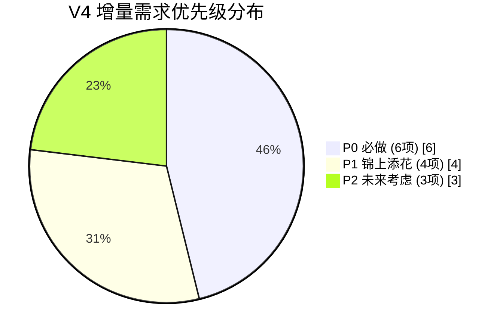

# BOM 智造师 V4 增量 PRD — 多行业扩展

> 作者：许清楚（产品经理）
> 日期：2026-07-08
> 版本：V4 增量 PRD（基于 V2.1/V3 现状）
> 目的：将 BOM 工具从"食品专属"扩展为"多行业通用 + 行业专属视图"，在不臃肿的前提下服务电子、化工等高频行业。

---

## 1. 项目信息

| 项 | 内容 |
|----|------|
| Language | 中文 |
| Project Name | bom-zhizao-shi (V4 增量) |
| 原始需求 | 用户原话："BOM 不要只盯着食品，要扩充一下用途"。核心诉求：让工具能服务于更多行业，而非只有食品才有专属视图（配料表）和合规字段（过敏原）。 |
| 基线版本 | V2.1 / V3（物料区 8 列 + 工序 BOM + 食品配料表 + 过敏原 + 合计行 + 逆向导入） |
| 核心约束 | ① 不臃肿——核心物料区 8 列不变；② 向后兼容——现有食品功能 100% 保留；③ 实用优先——聚焦 2-3 个高频行业 + 通用兜底 |

---

## 2. 产品定义

### 2.1 产品目标

> **V4 目标：通过 `industry` 字段 + 行业专属派生视图，让 BOM 工具在保持核心物料区通用 8 列不变的前提下，为电子（元件清单）、化工（配方表）等高频行业提供行业专属视图与合规字段，同时通用行业零负担使用。**

三个正交子目标：
1. **多行业专属视图**：电子→元件清单视图（位号/封装/型号/RoHS），化工→配方表视图（CAS号/含量/GHS），食品→配料表（已有，保留）
2. **零负担通用模式**：industry=="通用"时只输出物料区+工序BOM+合计行，不生成任何专属视图，与 V3 非食品行为完全一致
3. **100% 向后兼容**：现有食品 BOM JSON 不加 `industry` 字段时自动识别为"食品"，行为不变；其他类别自动归"通用"

### 2.2 用户故事

| # | 角色 | 故事 |
|---|------|------|
| US-1 | 电子工程师 | 作为一名 PCB 设计工程师，我想在 BOM 中记录每个元件的位号(Designator)、封装(Footprint)和型号(Part#)，并生成元件清单视图，以便直接发给嘉立创/JLCPCB 做 SMT 贴片，不用再手动整理 Altium 导出的 BOM。 |
| US-2 | 化工配方师 | 作为一名日化/医药配方师，我想在 BOM 中记录每种原料的 CAS 号、含量(%)和 GHS 危险标识，并生成配方表视图，以便配方追溯和合规审查，不用在通用 Excel 里手动拼凑。 |
| US-3 | 机械设计师 | 作为一名机械设计师，我想用 BOM 工具管理零件清单（图号填入 ERP 代码列、规格并入名称），工序流转链帮我校验装配顺序，不需要行业专属视图——通用 8 列就够用了。 |
| US-4 | 食品研发（现有用户） | 作为一名食品研发人员，我已有的食品 BOM 不做任何修改，升级后配料表和过敏原功能完全不变，我无感知。 |
| US-5 | 多行业采购 | 作为一名跨行业采购人员，我想用同一个工具分别管理电子元件采购清单和化工原料采购清单，各自的专属视图帮我快速核对关键参数（位号 vs CAS号），不用学两套工具。 |

---

## 3. 行业扩展方案（核心设计）

### 3.1 设计原则

```
核心物料区（8 列）= 通用基底，永不变
     │
     ├── industry == 食品 → 追加「配料表」视图（已有，保留）
     ├── industry == 电子 → 追加「元件清单」视图（新增）
     ├── industry == 化工 → 追加「配方表」视图（新增）
     ├── industry == 机械 → 不追加视图（8 列已够用）
     ├── industry == 纺织 → 不追加视图（P1 评估）
     ├── industry == 家具 → 不追加视图（8 列已够用）
     ├── industry == 包装 → 不追加视图（8 列已够用）
     └── industry == 通用 → 不追加视图（零负担兜底）
```

**关键决策：哪些行业需要专属视图？**

基于调研分析，只有当某行业存在**①法规/标准强制要求的结构化展示**且**②无法用通用 8 列承载**时，才设计专属视图：

| 行业 | 是否需专属视图 | 理由 |
|------|--------------|------|
| 食品 | ✅ 已有 | GB 7718-2025 强制配料表 + 八大类过敏原标示 |
| 电子 | ✅ 新增 | JLC/Altium 标准 BOM 格式强制位号/封装/型号；RoHS 合规强制 |
| 化工 | ✅ 新增 | GHS/SDS 强制 CAS 号 + 危险标识；配方浓度需结构化展示 |
| 机械 | ❌ 不需要 | 图号→ERP代码列，规格→并入名称，8 列已覆盖；无强制结构化视图 |
| 纺织 | ❌ 暂不做 | 纤维成分/克重有合规需求但结构化程度低，P1 再评估 |
| 家具 | ❌ 不需要 | 板材/五金规格可并入名称，8 列已覆盖 |
| 包装 | ❌ 不需要 | 材料/规格/工艺可并入现有字段，8 列已覆盖 |
| 通用 | ❌ 不需要 | 零负担兜底模式 |

### 3.2 `industry` 字段设计

**新增 BOM 级字段**：

| JSON 路径 | 类型 | 必填 | 约束 / 默认值 | 说明 |
|-----------|------|------|--------------|------|
| `industry` | string(enum) | **选填（V4 新增）** | ∈ {食品, 电子, 化工, 机械, 纺织, 家具, 包装, 通用}；**默认根据 `category` 推断** | 决定生成哪个专属派生视图；不填时不改变现有行为 |

**推断逻辑（向后兼容核心）**：

```
if industry 已显式设置:
    使用 industry 值
elif industry 未设置:
    if category == "食品":    industry = "食品"    ← 触发配料表（与 V3 行为一致）
    elif category == "日化化妆品": industry = "化工"  ← 日化归化工
    elif category == "医药":     industry = "化工"    ← 医药归化工
    else:                      industry = "通用"    ← 工业品/其他归通用
```

> **关键**：现有食品 BOM JSON 无 `industry` 字段 → 推断为"食品" → 触发配料表 → **行为与 V3 完全一致**。现有非食品 BOM → 推断为"通用" → 不生成专属视图 → **行为与 V3 完全一致**。

**`category` vs `industry` 关系**：
- `category`（现有，5 值）：粗粒度产品分类，保留用于向后兼容和 V2 校验
- `industry`（新增，8 值）：细粒度行业分类，驱动专属视图生成
- 两者并存，互不冲突；`industry` 优先级高于 `category` 的推断

### 3.3 行业专属物料字段（物料级，仅专属视图使用）

类比食品的 `materials[].allergen`（存于 JSON、仅配料表展示、物料区 8 列不显示），为电子和化工新增物料级可选字段：

| JSON 路径 | 类型 | 默认 | 适用行业 | 说明 |
|-----------|------|------|---------|------|
| `materials[].designator` | string | `""` | 电子 | 位号（如 R201, C100, U1）；多个用逗号分隔（R1,R2,R3）或区间（R1-4） |
| `materials[].footprint` | string | `""` | 电子 | 封装（如 0402, 0805, SOT-23, SSOP-8） |
| `materials[].part_number` | string | `""` | 电子 | 型号/规格（如 100nF 50V, STM32F103C8T6） |
| `materials[].rohs` | string | `""` | 电子 | RoHS 合规状态：是/否/未知；空则留空 |
| `materials[].cas_number` | string | `""` | 化工 | CAS 号（如 64-17-5 乙醇, 7732-18-5 水） |
| `materials[].concentration` | number | `""` | 化工 | 含量/浓度(%)，0-100 |
| `materials[].ghs_hazard` | string | `""` | 化工 | GHS 危险标识，逗号分隔（如 易燃,有毒,腐蚀,刺激） |

> **物料区 8 列不变**：这些字段存于 JSON 但**不显示在物料区 8 列中**，仅在行业专属派生视图中展示（与 `allergen` 的处理模式完全一致）。

### 3.4 物料类型(material_type)的行业建议值

`material_type` 字段保持自由文本（非食品不强制枚举），但交互模板中按行业提供**建议下拉值**：

| 行业 | 建议 material_type 下拉值 | 配料/配方/元件视图过滤规则 |
|------|--------------------------|--------------------------|
| 食品 | 原料/添加剂/香精香料/包材/其他（现有） | 仅 原料/添加剂/香精香料 进配料表（现有 EDIBLE 集合） |
| 电子 | 电阻/电容/IC/连接器/二极管/三极管/晶振/其他 | 排除"其他"类（如散热片/外壳）进元件清单 |
| 化工 | 主料/溶剂/催化剂/添加剂/包材/其他 | 排除"包材"进配方表 |
| 通用 | （自由文本，默认"其他"） | 无过滤（不生成派生视图） |

> 物料类型建议值仅为交互引导，**不纳入 JSON Schema 强制枚举校验**（除食品外），避免限制灵活性。

### 3.5 交互流程变更

**阶段零变更**（最小改动）：

现有流程：产品名称 → 产品类别(5选) → 全产品出品率 → 版本号/日期 → 审批人/生效日期/执行标准

V4 新增：在产品类别后，追加一个可选问题——

```
请选择行业（决定是否生成专属视图，可留空跳过）：
  [1] 食品（配料表 + 过敏原）
  [2] 电子（元件清单 + RoHS）
  [3] 化工（配方表 + GHS）
  [4] 机械 / [5] 纺织 / [6] 家具 / [7] 包装（通用物料区，无专属视图）
  [8] 通用（默认，无专属视图）
  （默认根据产品类别推断：食品→食品，日化/医药→化工，其他→通用）
```

- 用户直接回车 → 使用推断值（零摩擦）
- 用户选择具体行业 → 记录 `industry`

**阶段一（物料采集）变更**：

根据 `industry` 值，物料录入模板动态追加行业专属可选字段：

- `industry == 食品`：追加 `过敏原`（现有，不变）
- `industry == 电子`：追加 `位号(Designator)` / `封装(Footprint)` / `型号(Part#)` / `RoHS`（均可选）
- `industry == 化工`：追加 `CAS号` / `含量(%)` / `GHS标识`（均可选）
- 其他：不追加（保持现有 7 字段模板）

**汇总确认变更**：

- `industry == 食品`：展示配料表预览（现有，不变）
- `industry == 电子`：展示元件清单预览
- `industry == 化工`：展示配方表预览
- 其他：不展示专属视图预览

---

## 4. 需求池

### P0（必做 — 核心扩展）

| 编号 | 需求 | 说明 |
|------|------|------|
| P0-1 | **`industry` 字段 + 向后兼容推断** | 新增 BOM 级 `industry` 字段（8 值枚举，选填）；未填时按 `category` 推断（食品→食品，日化/医药→化工，其他→通用）；推断逻辑确保现有 JSON 行为零变化 |
| P0-2 | **电子行业 — 元件清单视图** | industry=="电子"时，在工序区后追加「三、元件清单」派生区块；含位号/封装/型号/RoHS 等专属列；新增物料级字段 designator/footprint/part_number/rohs |
| P0-3 | **化工行业 — 配方表视图** | industry=="化工"时，在工序区后追加「三、配方表」派生区块；含 CAS号/含量(%)/GHS标识 等专属列；新增物料级字段 cas_number/concentration/ghs_hazard |
| P0-4 | **通用兜底** | industry=="通用"时，只输出物料区+工序BOM+合计行，不生成任何专属视图（与 V3 非食品行为完全一致） |
| P0-5 | **交互流程适配** | 阶段零追加 industry 可选问题（默认推断）；阶段一物料模板按 industry 动态追加专属字段；汇总确认展示对应专属视图预览 |
| P0-6 | **逆向导入兼容** | import_bom.py 识别 industry 字段；逆向回收电子/化工专属字段（按物料名匹配，类比食品过敏原回收） |

### P1（锦上添花）

| 编号 | 需求 | 说明 |
|------|------|------|
| P1-1 | **行业专属软校验** | 电子：物料未标 RoHS → WARNING（非阻断，类比食品 W1）；化工：物料未填 CAS号/GHS → WARNING |
| P1-2 | **执行标准行业建议** | 阶段零选行业后，standard 字段提供建议值：电子→"RoHS/GB/T 39560"，化工→"GB/T 16483-2008 / GB 30000"，食品→"GB 7718-2025"（现有） |
| P1-3 | **纺织行业评估** | 调研纺织 BOM 的纤维成分/克重结构化需求，评估是否需要面料辅料清单视图 |
| P1-4 | **元件清单位号展开** | 元件清单视图中，位号区间（R1-4）自动展开为 R1,R2,R3,R4（遵循 JLC 规范）；合计数量按展开后计数 |

### P2（未来考虑）

| 编号 | 需求 | 说明 |
|------|------|------|
| P2-1 | **行业模板预设** | 选定行业后，预填常见物料类型和工序模板（如电子预设"贴片→回流焊→检测"工序） |
| P2-2 | **成本视图（跨行业）** | 物料区加可选"单价/金额"列，适用于所有行业的成本核算 BOM（上次调研 P1-1 未落地项） |
| P2-3 | **多行业混合 BOM** | 单个 BOM 同时含电子元件 + 化工原料（如带电池的日化产品），支持多视图并存 |

---

## 5. 各行业专属视图设计

### 5.1 总览表

| 行业 | 视图名称 | 触发条件 | 列定义 | 合规字段 | 数据来源 | 软校验 |
|------|---------|---------|--------|---------|---------|--------|
| 食品 | 三、配料表 | industry==食品 | 物料名称\|物料类型\|计量单位\|用量\|出品率(%)\|用量占比%\|过敏原 | 过敏原(GB 7718-2025 八大类) | `derive_ingredients()`（现有） | W1 标签合法 + H1 关键词启发式（现有） |
| 电子 | 三、元件清单 | industry==电子 | 序号\|位号(Designator)\|型号(Part#)\|封装(Footprint)\|物料名称\|数量\|物料类型\|RoHS | RoHS 合规标识 | `derive_components()`（新增） | W2 RoHS 未标注告警（P1） |
| 化工 | 三、配方表 | industry==化工 | 序号\|物料名称\|CAS号\|含量(%)\|GHS标识\|物料类型\|计量单位\|用量 | GHS 危险品标识 | `derive_formula()`（新增） | W3 CAS/GHS 未填告警（P1） |
| 机械 | —（无） | industry==机械 | — | — | — | — |
| 纺织 | —（暂无） | industry==纺织 | — | — | — | P1 评估 |
| 家具 | —（无） | industry==家具 | — | — | — | — |
| 包装 | —（无） | industry==包装 | — | — | — | — |
| 通用 | —（无） | industry==通用 | — | — | — | — |

### 5.2 电子 — 元件清单视图（新增）

**触发**：`industry == "电子"`（或 `category == "工业品"` 且用户显式选电子）

**Excel 区块**：工序区后空行起，标题「三、元件清单」（合并 A–H），表头蓝底。

**列定义（8 列 A–H）**：

| 列 | 表头 | 数据来源 | 说明 |
|----|------|---------|------|
| A | 序号 | 派生（1..N） | 全局连续，纯展示 |
| B | 位号(Designator) | materials[].designator | 如 R201, C100, U1；多个逗号分隔或区间表达 |
| C | 型号(Part#) | materials[].part_number | 如 100nF 50V, STM32F103C8T6 |
| D | 封装(Footprint) | materials[].footprint | 如 0402, 0805, SOT-23 |
| E | 物料名称 | materials[].name | 如 贴片电阻、贴片电容 |
| F | 数量 | materials[].usage | 用料数量 |
| G | 物料类型 | materials[].material_type | 电阻/电容/IC/... |
| H | RoHS | materials[].rohs | 是/否/未知；空则留空 |

**过滤规则**：排除 material_type == "其他"的物料（如散热片、外壳、包装），仅保留电子元件类。

**排序**：按物料类型分组 → 同类型内按位号字母数字排序（R 开头在前，C 次之，U 最后，符合 PCB 惯例）。

**RoHS 合规标记**：
- `rohs == "是"` → 正常显示
- `rohs == "否"` → 红色字体标注（⚠ 不合规）
- `rohs == "未知"` 或空 → 黄色字体标注（待确认）
- P1 软校验 W2：industry==电子 且物料未标 RoHS → WARNING（非阻断）

**数据来源调研依据**：
- 嘉立创 JLC BOM 格式：Comment(型号) → Description(名称) → Designator(位号) → Footprint(封装) → Quantity
- Altium Designer 默认 BOM 输出格式兼容
- RoHS 指令（EU 2011/65/EU）+ GB/T 39560 系列 — 电子电气产品有害物质限制

### 5.3 化工 — 配方表视图（新增）

**触发**：`industry == "化工"`（或 `category == "日化化妆品"/"医药"` 且用户确认归化工）

**Excel 区块**：工序区后空行起，标题「三、配方表」（合并 A–H），表头蓝底。

**列定义（8 列 A–H）**：

| 列 | 表头 | 数据来源 | 说明 |
|----|------|---------|------|
| A | 序号 | 派生（1..N） | 全局连续，纯展示 |
| B | 物料名称 | materials[].name | 如 乙醇、去离子水、甘油 |
| C | CAS号 | materials[].cas_number | 如 64-17-5, 7732-18-5；空则留空 |
| D | 含量(%) | materials[].concentration | 数值，0-100；数字格式 0.0"%" |
| E | GHS标识 | materials[].ghs_hazard | 逗号分隔：易燃/有毒/腐蚀/刺激/氧化/环境危害等 |
| F | 物料类型 | materials[].material_type | 主料/溶剂/催化剂/添加剂/... |
| G | 计量单位 | materials[].unit | kg/L/mol |
| H | 用量 | materials[].usage | 配方用量 |

**过滤规则**：排除 material_type == "包材"的物料（如瓶子、标签），仅保留配方原料类。

**排序**：按含量(%)降序（配方表惯例，主成分在前）。

**GHS 危险标识**：
- 逗号分隔标签，支持常见类别：易燃/有毒/腐蚀/刺激/氧化/环境危害/高压气体/自反应/健康危害
- P1 软校验 W3：industry==化工 且物料未填 CAS号 → WARNING；未填 GHS → WARNING（均非阻断）

**含量(%) 占比校验**（可选，P1）：
- 若所有配方原料均填写了 concentration，可校验列和是否 ≈ 100%（允许 ±5% 误差，考虑损耗）
- 不达标 → WARNING（非阻断）

**数据来源调研依据**：
- GHS（全球化学品统一分类和标签制度）— 联合国强制标准
- SDS/MSDS 安全数据表第 3 部分「成分/组成信息」— 含 CAS 号、浓度、GHS 分类
- GB/T 16483-2008《化学品安全技术说明书 内容和项目顺序》
- GB 30000 系列（中国 GHS 国家标准）

### 5.4 食品 — 配料表视图（已有，保留不变）

**触发**：`industry == "食品"`（向后兼容：无 industry 字段 + category=="食品" → 推断为食品）

**现有 7 列不变**：物料名称|物料类型|计量单位|用量|出品率(%)|用量占比%|过敏原

**现有功能 100% 保留**：derive_ingredients()、ingredient_pct()、check_allergen_soft()（W1+H1）、EDIBLE 集合过滤。

**唯一代码改动**：触发条件从 `category == "食品"` 改为 `industry == "食品"`（含推断逻辑）。

---

## 6. 向后兼容方案

### 6.1 JSON 向后兼容

| 场景 | V4 行为 | 与 V3 对比 |
|------|---------|-----------|
| 现有食品 JSON（无 industry，category=食品） | 推断 industry=食品 → 生成配料表 | ✅ 完全一致 |
| 现有非食品 JSON（无 industry，category=工业品/日化/医药/其他） | 推断 industry=通用 → 不生成专属视图 | ✅ 完全一致 |
| 新 JSON 显式 industry=电子 | 生成元件清单 | V3 无此能力（新功能） |
| 新 JSON 显式 industry=化工 | 生成配方表 | V3 无此能力（新功能） |
| 新 JSON 显式 industry=通用 | 不生成专属视图 | ✅ 与 V3 非食品一致 |
| 旧 JSON 缺 industry 专属物料字段（designator/cas_number 等） | 默认空串，专属视图对应列留空 | V3 无此字段，无影响 |

### 6.2 Excel 向后兼容

- 物料区 8 列（A–H）**结构不变**——所有行业的物料区完全一致
- 专属视图（配料表/元件清单/配方表）均为工序区后的「三、」派生区块，不改变行 1-物料区-工序区的固定结构
- 逆向导入（import_bom.py）：
  - 现有食品 Excel（有「三、配料表」）→ 正常解析，industry 推断为食品
  - 新电子 Excel（有「三、元件清单」）→ 识别区块标记，回收 designator/footprint/part_number/rohs（按物料名匹配，类比过敏原回收）
  - 新化工 Excel（有「三、配方表」）→ 识别区块标记，回收 cas_number/concentration/ghs_hazard
  - 通用 Excel（无「三、」区块）→ 正常解析，industry 推断为通用

### 6.3 交互流程向后兼容

- 阶段零的 `industry` 问题是**可选的**，用户直接回车即使用推断值
- 阶段一的物料模板**默认不追加**行业专属字段（仅当 industry 为电子/化工时才追加）
- 现有食品用户的操作流程**完全不变**（选"食品"→ 自动推断 industry=食品 → 追加过敏原字段 → 生成配料表）

---

## 7. JSON Schema 变更摘要

### 7.1 新增 BOM 级字段

```json
{
  "industry": "电子"    // 选填，8 值枚举，默认按 category 推断
}
```

### 7.2 新增物料级字段（按行业可选）

```json
{
  "materials": [
    {
      // === 现有 8 字段（不变） ===
      "name": "贴片电阻",
      "unit": "个",
      "usage": 100,
      "yield_rate": 100,
      "erp_code": "R-001",
      "material_type": "电阻",
      "process": "S01",
      // === 食品专属（现有，不变） ===
      "allergen": "",
      // === 电子专属（V4 新增，仅 industry==电子 时有意义） ===
      "designator": "R1-R4,R10",
      "footprint": "0402",
      "part_number": "10kΩ 1% 1/16W",
      "rohs": "是",
      // === 化工专属（V4 新增，仅 industry==化工 时有意义） ===
      "cas_number": "",
      "concentration": "",
      "ghs_hazard": ""
    }
  ]
}
```

> 所有新增字段均为**选填，默认空串**，不影响现有校验逻辑（V1–V7）。

### 7.3 校验规则变更

| 校验项 | 变更 |
|--------|------|
| V2（category 枚举） | **不变**，仍为 {食品,工业品,日化化妆品,医药,其他} |
| V1–V7 现有校验 | **不变** |
| 新增 V8（industry 枚举，选填） | 若 `industry` 非空，须 ∈ {食品,电子,化工,机械,纺织,家具,包装,通用}；非法值 → 告警（非阻断），回退为推断值 |
| 配料表触发条件 | 从 `category == "食品"` 改为 `industry == "食品"`（含推断） |
| W1/H1（食品过敏原软校验） | **不变**，仅 industry==食品 时触发 |
| W2（电子 RoHS 软校验，P1） | industry==电子 且物料未标 rohs → WARNING（非阻断） |
| W3（化工 GHS 软校验，P1） | industry==化工 且物料未填 cas_number/ghs_hazard → WARNING（非阻断） |

---

## 8. 各行业专属视图 ASCII 草图

### 8.1 电子 — 元件清单（industry==电子）

```
行N  ┌─────────────────────────────────────────────────────────────────────┐
     │ 三、元件清单 (A:H 合并, label_font)                                  │
行N+1├────┬──────────┬─────────────┬──────────┬──────────┬──────┬────────┬──────┤
     │序号│位号      │型号(Part#)  │封装      │物料名称  │数量  │物料类型│RoHS  │  ← 表头(蓝底)
     ├────┼──────────┼─────────────┼──────────┼──────────┼──────┼────────┼──────┤
     │ 1  │R1-R4     │10kΩ 1% 1/16W│0402      │贴片电阻  │4     │电阻    │是    │
     │ 2  │C1,C2     │100nF 50V    │0402      │贴片电容  │2     │电容    │是    │
     │ 3  │U1        │STM32F103C8T6│LQFP-48   │主控芯片  │1     │IC      │是    │
     │ 4  │D1        │1N4148       │SOD-323   │开关二极管│1     │二极管  │未知  │  ← 黄色(待确认)
     │ 5  │J1        │5pin 2.54mm  │KF128-2.54│连接器    │1     │连接器  │是    │
     └────┴──────────┴─────────────┴──────────┴──────────┴──────┴────────┴──────┘
```

### 8.2 化工 — 配方表（industry==化工）

```
行N  ┌─────────────────────────────────────────────────────────────────────┐
     │ 三、配方表 (A:H 合并, label_font)                                   │
行N+1├────┬──────────┬──────────┬────────┬──────────┬────────┬────────┬──────┤
     │序号│物料名称  │CAS号     │含量(%) │GHS标识   │物料类型│计量单位│用量  │  ← 表头(蓝底)
     ├────┼──────────┼──────────┼────────┼──────────┼────────┼────────┼──────┤
     │ 1  │去离子水  │7732-18-5 │70.0%   │          │溶剂    │kg     │70.0  │
     │ 2  │乙醇      │64-17-5   │20.0%   │易燃      │主料    │kg     │20.0  │
     │ 3  │甘油      │56-81-5   │8.0%    │          │添加剂  │kg     │8.0   │
     │ 4  │香精      │          │2.0%    │刺激      │添加剂  │kg     │2.0   │
     └────┴──────────┴──────────┴────────┴──────────┴────────┴────────┴──────┘
     （含量% 列和 = 100.0%；按含量降序排列）
```

---

## 9. 待确认问题

| # | 问题 | 推荐默认 | 理由 |
|---|------|----------|------|
| Q1 | `category` 和 `industry` 是否合并为一个字段？ | **不合并，两者并存** | category 保留向后兼容（V2 校验/现有 JSON）；industry 驱动新视图；合并需迁移逻辑，风险高 |
| Q2 | 电子元件清单的"数量"是否需要按位号展开计算？（如 R1-R4 = 4 个） | **P1 实现**，P0 先按 usage 原值显示 | 位号展开是 JLC 规范，但增加复杂度；P0 先保证视图可用 |
| Q3 | 化工配方表含量(%)是否校验列和 ≈ 100%？ | **P1 软校验**（非阻断 WARNING），允许 ±5% 误差 | 考虑损耗/挥发，强制 100% 不现实；软校验提示即可 |
| Q4 | 机械/纺织/家具/包装是否真的不需要专属视图？ | **是**，P0 不做 | 调研表明 8 列已覆盖这些行业的核心需求；纺织有 P1 评估空间 |
| Q5 | 行业专属物料字段（designator/cas_number 等）是否需要在逆向导入时回收？ | **是**，P0-6 | 类比食品过敏原回收，确保闭环可回写；按物料名匹配回写 |
| Q6 | `standard` 字段是否按行业提供预设建议值？ | **P1**，P0 保持现有（默认空，食品建议 GB 7718-2025） | 预设值提升体验但不影响核心功能 |
| Q7 | 非食品/电子/化工行业（如机械）选了 industry 后，物料模板是否需要变化？ | **不变**，保持 7 字段通用模板 | 机械等行业无专属字段，模板变化反而增加认知负担 |

---

## 10. 优先级分布（Mermaid）



## 11. 扩展后结构总览（Mermaid）

```mermaid
flowchart TD
    H[表头区<br/>版本号/日期/产品名称/类别/出品率<br/>★industry V4 / 审批人/生效日期/执行标准] --> M
    M[一、物料信息 8列<br/>序号|名称|单位|用量|出品率|ERP代码|物料类型|所属工序<br/>合计用量行<br/>★行业专属字段存JSON不显示]
    M --> P[二、工艺工序<br/>编号|名称|说明|工时|备注|产物]
    P --> I{industry?}
    I -->|食品| F[三、配料表<br/>名称|类型|单位|用量|出品率|用量占比%|过敏原<br/>GB 7718-2025]
    I -->|电子| E[三、元件清单 ★V4<br/>序号|位号|型号|封装|名称|数量|类型|RoHS<br/>JLC/Altium兼容]
    I -->|化工| C[三、配方表 ★V4<br/>序号|名称|CAS号|含量%|GHS|类型|单位|用量<br/>GHS/SDS合规]
    I -->|通用/机械/纺织/家具/包装| X[不生成专属视图<br/>仅物料区+工序BOM+合计行]
```

---

## 12. 调研来源

| 行业 | 来源 | 关键字段依据 |
|------|------|-------------|
| 电子/PCB | 嘉立创 JLC BOM 格式规范（jlc.com/portal/server_guide_4070.html）；JLCPCB BOM 指南；Altium Designer 默认 BOM 输出 | Comment(型号)/Description(名称)/Designator(位号)/Footprint(封装)/Quantity |
| 电子合规 | RoHS 指令（EU 2011/65/EU）；GB/T 39560 系列；REACH 法规 | RoHS 十项有害物质限制 |
| 化工/日化/医药 | GHS（全球化学品统一分类和标签制度）；GB/T 16483-2008（SDS）；GB 30000 系列；ChemicalBook GHS 标签 | CAS号/浓度含量/GHS危险标识 |
| 机械/装配 | 机械设计BOM清单指南（b2bwiki.baidu.com）；Siemens 工业机械 BOM 101；工程图BOM材料明细表 | 层级结构/物料编码/图号/规格/材料 |
| 纺织/服装 | 服装厂面料辅料采购材料清单（76hw.com）；服装BOM应用分析（百度文库） | 主料(面料)/辅料/纤维成分/克重(GSM)/幅宽/颜色尺码 |
| 家具/木工 | 家具BOM标准（百度文库）；家具厂BOM成本表格 | 板材/五金/油漆/规格尺寸/利用率 |
| 通用/跨行业 | Odoo 18.0 BoM 文档；知乎《物料清单(BOM)完整指南》；标准采购BOM单整理规范（博客园） | 序号/数量/单位/损耗率/版本/审批 |
| 食品（现有） | GB 7718-2025《预包装食品标签通则》 | 八大类致敏物质/配料表/食品添加剂标示 |
